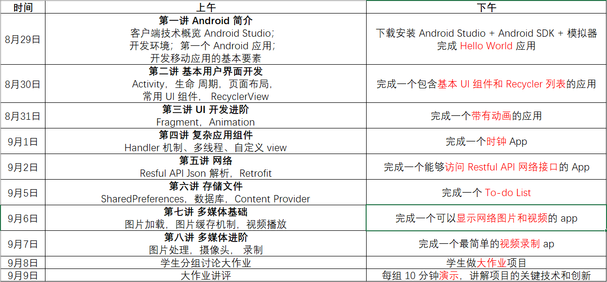
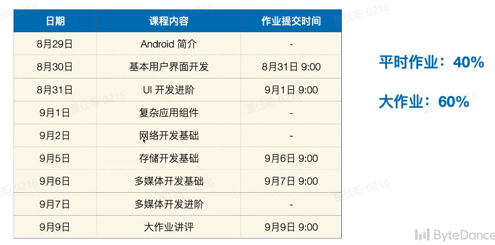
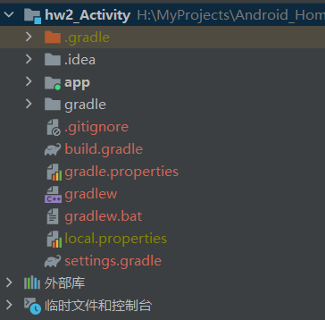
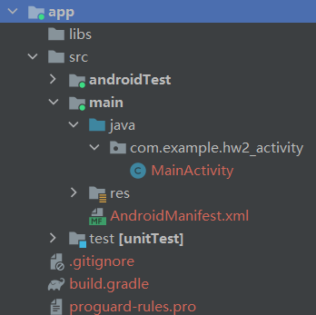
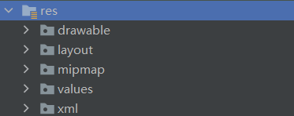
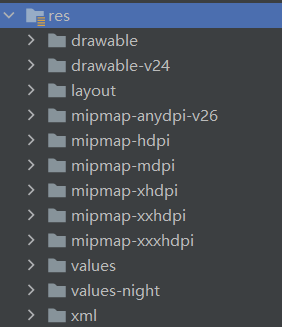
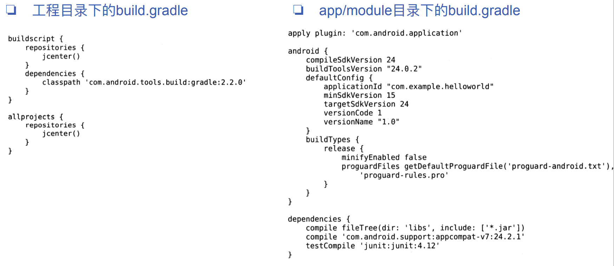
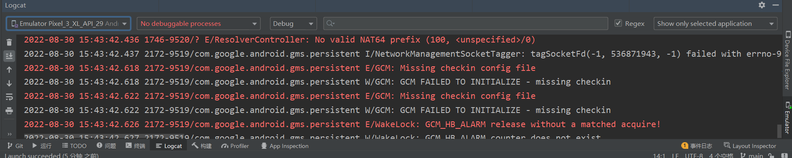
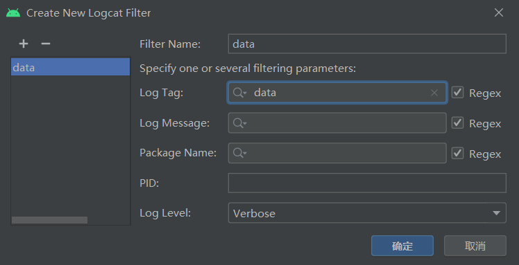
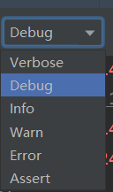

# 目录

[TOC]

# 课程安排

## 课程大纲





# 快捷键

## 运行

1.   运行：**Shift+F10**
2.   终止：**Ctrl+F2**

## 日志

1.   生成**TAG**常量：**在方法外输入logt + TAB**
2.   打印不同级别的日志：**在方法内输入logd/logi/logw/loge + TAB**

# 第一章	开始启程--你的第一行Android代码

## 1.1	Android的四大组件

1.   活动(**Activity**) ：
     1.   活动是所有Android应用程序的门面，凡是在应用中你看得到的东西 ， 都是放在活动中的
2.   服务(**Service**)：
     1.   你无法看到它，但它会一自在后台默默地运行
     2.   即使用户退出了应用，服务仍然是可以继续运行的。
3.   广播接收器(**BroadcastReceiver**) ：
     1.   广播接收器允许你的应用接收来自 各处的广播消息， 比如电话、短信等
     2.   当然你的应用同样也可以向外发出广播消息
4.   内容提供器(**ContentProvider**)：
     1.   内容提供器则为应用程序之间共享数据提供了可能
     2.   比如你想要读取系统电话部中的联系人，就需要通过内容提供器来实现。

## 1.2	项目目录



### 1.2.1	.gradle和idea

1.   这两个目录下放置的都是Android Studio自动生成的一些文件
2.   我们无须关心、 也不要去手动编辑

### 1.2.2	app

1.   项目中的**代码、资源**等内容几乎都是放置在这个目录下的、 我们后面的开发工作也基本都是在这个目录下进行的， 待会儿还会对这个目录单独展开进行讲解

### 1.2.3	build

1.   这个目录你也不需要过多关心， 它主要包含了一些在编译时自动生成的文件

### 1.2.4	gradle

1.   这个目录下包含了**gradle wrapper**的配置文件 
2.   使用gradle wrapper的方式不需要提前将gradle下载好，而是会自动根据本地的缓存情况决定是否需要联网下载gradle
3.   Android Studio默认没有启用gradle wrapper的方式，如果需要打开，可以点击**Android Studio导航栏|File|Settings|Build, Execution, Deployment | Gradle**，进行配置更改。

### 1.2.5	. gitignore

1.   这个文件是用来将指定的目录或文件排除在版本控制之外的

### 1.2.6	build.gradle

1.   这是项目全局的**gradle构建脚本** ， 通常这个义件中的内容是不需要修改的

### 1.2.7	gradle.properties

1.   这个文件是全局的**gradle配置文件** ，存这里配置的屈性将会影响到项目中所有的gradle编译脚本

### 1.2.8	gradlew和gradlew.bat

1.   这两个文件是用来在命令行界面中执行gradle命令的
2.   其中gradlew是在Linux或Mac系统中使用时，gradJew.bat是在Windows系统中使用的

### 1.2.9	HelloWorld.iml

1.   iml文件是所有lntelliJ IDEA项目都会自动生成的一个文件(Android Studio是基T lntelliJ IDEA开发的）
2.   用于标识这是一个lntelliJ IDEA顶目
3.   我们不需要修改这个文件中的任何内容

### 1.2.10	local.properties

1.   这个文件用于指定**本机中的Android SDK路径**
2.   通常内容都是自动生成的， 我们并不需要修改，除非你本机中的Android SOK位置发生了变化 ，那么就将这个文件中的路径改成新的位置即可

### 1.2.11	settings.gradle

1.   这个文件用于指定项目中**所有引入的模块**
2.   由于HelloWorld项目中就只有一个app模块，因此该文件中也就只引入了app这一个模块
3.   通常情况下模块的引入都是自动完成的，需要我们手动去修改这个文件的场景可能比较少

## 1.3	app目录



### 1.3.1	build

1.   这个目录和外层的build目录类似，主要也是包含了一些在编译时自动生成的文件，不过它里面的内容会更多更杂，我们不需要过多关心

### 1.3.2	libs

1.   如果你的项目中使用到了**第三方jar包**，就需要把这些jar包都放在libs目录下
2.   放在这个目录下的jar包都会被自动添加到构建路径里去。

### 1.3.3	androidTest

1.   此处是用来编写**Android Test测试用例**的， 可以对项目进行一些**自动化测试**

### 1.3.4	java

1.   毫无疑问，java目录是放置我们**所有Java代码**的地方
2.   展开该目录，你将看到我们刚才创建的HelloWorldActivity文件就在里面。

### 1.3.5	res

Android布局下的res文件夹：

项目目录下的res文件夹：

1.   项目中使用到的所有**图片、布局 、字符串等资源**都要存放在这个目录下。 
2.   当然这个目录下还有很多子目录，所以你不用担心会把整个res目录弄得乱糟糟的
     1.   **drawable**目录：图片，多个文件夹用于适用不同设备的分辨率
     2.   **layout**目录：布局
     3.   **mipmap**目录：应用图标，多个文件夹用于适用不同设备的分辨率
     4.   **values**目录：字符串、样式、颜色等配置

###  1.3.6	AndroidManifest.xml

1.   这是你**整个Android项目的配置文件**
2.   你在程序中定义的所有四大组件都需要在这个文件里注册，另外还可以在这个文件中给应用程序添加权限声明。
3.   由于这个文件以后会经常用到，我们用到的时候再做详细说明

### 1.3.7	test

1.   此处是用来编写**Unit Test测试用例**的，是对项目进行自动化测试的另一种方式

### 1.3.8	.gitignore

1.   这个文件用于将app 模块内的指定的目录或文件排除在版本控制之外，作用和外层的．gitignore文件类似

### 1.3.9	app.iml

1.   IntelliJ IDEA项目自动生成的文件， 我们不需要关心或修改这个文件中的内容。

### 1.3.10	build.gradle

1.   这是**app模块的gradle构建脚本**，这个文件中会指定很多项目构建相关的配置

### 1.3.11	proguard-rules.pro

1.   这个文件用于指定**项目代码的混淆规则**
2.   当代码开发完成后打成安装包文件，如果不希望代码被别入破解， 通常会将代码进行混淆， 从而让破解者难以阅读

## 1.4	项目的运行

### 1.4.1	AndroidManifest.xml：注册活动

```xml
<?xml version="1.0" encoding="utf-8"?>
<manifest xmlns:android="http://schemas.android.com/apk/res/android"
    xmlns:tools="http://schemas.android.com/tools"
    package="com.example.hw2_activity">

    <application
        android:allowBackup="true"
        android:dataExtractionRules="@xml/data_extraction_rules"
        android:fullBackupContent="@xml/backup_rules"
        android:icon="@mipmap/ic_launcher"
        android:label="@string/app_name"
        android:roundIcon="@mipmap/ic_launcher_round"
        android:supportsRtl="true"
        android:theme="@style/Theme.Hw2_Activity"
        tools:targetApi="31">
        <!--对资源文件的引用-->
        
        <activity android:name=".MainActivity" android:exported="true">
            <intent-filter>
                <action android:name="android.intent.action.MAIN" />
                <category android:name="android.intent.category.LAUNCHER" />
                <!--这两句话表示, MainActivity是本项目的主活动, 在手机上点击应用图标, 首先应该启动这个活动-->
            </intent-filter>
        </activity>
    </application>

</manifest>


```

### 1.4.2	MainActivity.java

```java
public class MainActivity extends AppCompatActivity {
//AppCompatActivity是一种向下兼容的Activity
//可以将Activity在各个系统版本中增加的特性和功能最低兼容到Android 2.1版本
    @Override
    protected void onCreate(Bundle savedInstanceState) {
    //活动被创建时必须执行的方法
        super.onCreate(savedInstanceState);
        
        setContentView(R.layout.activity_main);
        //给当前活动引入了一个activity_main布局
    }
}
```

### 1.4.3	activity_main.xml

```xml
<?xml version="1.0" encoding="utf-8"?>
<androidx.constraintlayout.widget.ConstraintLayout xmlns:android="http://schemas.android.com/apk/res/android"
    xmlns:app="http://schemas.android.com/apk/res-auto"
    xmlns:tools="http://schemas.android.com/tools"
    android:layout_width="match_parent"
    android:layout_height="match_parent"
    tools:context=".MainActivity">

    <!--用于显示文字的一个控件-->
    <TextView
        android:layout_width="wrap_content"
        android:layout_height="wrap_content"
        android:text="Hello World!"
        app:layout_constraintBottom_toBottomOf="parent"
        app:layout_constraintEnd_toEndOf="parent"
        app:layout_constraintStart_toStartOf="parent"
        app:layout_constraintTop_toTopOf="parent" />

</androidx.constraintlayout.widget.ConstraintLayout>
```

### 1.4.4	res/values/strings.xml

```xml
<resources>
    <string name="app_name">hw2_Activity</string>
</resources>
```

1.   定义了一个应用程序名的字符串
2.   引用方式：
     1.   在代码中：**R.string.app_name**
     2.   在XML中：**@string/app_name**
3.   **string**可以换成**drawable、mipmap、layout**等，用于引用其它文件夹内的资源

### 1.4.5	build.gradle



外层的**build.gradle**文件

```groovy
plugins {
    id 'com.android.application' version '7.2.2' apply false
    id 'com.android.library' version '7.2.2' apply false
    //构件中可能会使用到的插件的声明
}

task clean(type: Delete) {
    delete rootProject.buildDir
}
```

**app/build.gradle**文件

```groovy
plugins {
    id 'com.android.application'
    //使用插件
    //.application表示是应用程序模块
    //.library表示是库模块
}

android {
    compileSdk 32 //指定项目的编译版本

    defaultConfig { //项目的更多细节配置
        applicationId "com.example.hw2_activity" //指定项目的包名
        minSdk 21			//最低兼容的Android系统版本
        targetSdk 32		//在该目标版本上已经做过充分的测试,系统会为程序启用该版本的最新功能和特性
        versionCode 1		//指定项目的版本号
        versionName "1.0"	//指定项目的版本名
        testInstrumentationRunner "androidx.test.runner.AndroidJUnitRunner"
    }

    buildTypes {
        release { //生成正式版安装文件的配置
            minifyEnabled false
            // 是否对项目的代码进行混淆
            proguardFiles getDefaultProguardFile('proguard-android-optimize.txt'), 'proguard-rules.pro'
            //混淆时使用的规则文件
            //proguard-android-optimize.txt是所有项目通用的混淆规则, 在Android SDK目录下
            //proguard-rules.pro当前有项目特有的混淆规则, 在当前项目的根目录下
        }
    }
    compileOptions {
        sourceCompatibility JavaVersion.VERSION_1_8
        targetCompatibility JavaVersion.VERSION_1_8
    }
}

dependencies { //项目的所有依赖关系
    implementation 'androidx.appcompat:appcompat:1.3.0'
    implementation 'com.google.android.material:material:1.4.0'
    implementation 'androidx.constraintlayout:constraintlayout:2.0.4'
    
    testImplementation 'junit:junit:4.13.2'
    androidTestImplementation 'androidx.test.ext:junit:1.1.3'
    androidTestImplementation 'androidx.test.espresso:espresso-core:3.4.0'
}
```

三种依赖关系：

1.   本地依赖：可以对**本地的Jar包或目录**添加依赖关系
2.   库依赖：可以对**项目中的库模块**添加依赖关系
3.   远程依赖：可以对**jcenter库上的开源项目**添加依赖关系
     1.   **com.google.android.material**：域名
     2.   **:material**：组名
     3.   **:1.4.0**：版本号

## 1.5	日志工具Log

### 1.5.1	日志工具类的使用

Android中的日志工具类是**Log (android.util.Log)**． 这个类中提供如下5个方法来供我们打印日志

1.   **Log.v()**：用于打印那些最为琐碎的意义最小的日志信息。对应级别**verbose**，是Android日志里面级别最低的一种
2.   **Log.d()**：用于打印一些调试信息，这些信息对你调试程序和分析问题应该是有帮助的。对应级别**debug**，比verbose高一级
3.   **Log.i()**：用于打印一些比较重要的数据，这些数据应该是你非常想看到的，可以帮你分析用户行为数据。 对应级别**info**, 比debug高一级
4.   **Log.w()**：用于打印一些警告信息，提示程序在这个地力可能会有潜在的风险，最好去修复一下这些出现瞥告的地方。对应级别**warn**，比info高一级
5.   **Log.e()**：用于打印程序中的错误信息，一般都代表程序出现严重问题了，必须尽快修复。对应级别**error**，比warn高一级

```java
protected void onCreate(Bundle savedInstanceState) {
    super.onCreate(savedInstanceState);
    setContentView(R.layout.activity_main);
    Log.d("MainActivity", "onCreate execute");
    //第一个参数为tag, 一般传入当前类名
    //第二个参数为msg, 为想要打印的具体内容
}
```

### 1.5.2	Logcat的使用



1.   过滤器：

2.   自定义过滤器：在上述图标下拉栏中，选择**Edit Filter Configuration**

     1.   Log Tag：按照日志的TAG过滤

     

3.   按照日志的级别过滤：只会显示高于选中级别的日志

     