# 目录

[TOC]

# 第二章	先从看得到的入手--探究活动

## 2.1	活动的基本用法

### 2.1.1	手动创建活动

1.   在下图目录下，**右击|新建|Activity|Empty Activity**

     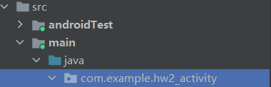

2.   不要勾选

     1.   Generate a Layout File：自动创建一个对应的布局文件
     2.   Lancher Activity：自动将创建的活动MainActivity设置为当前项目的主活动

     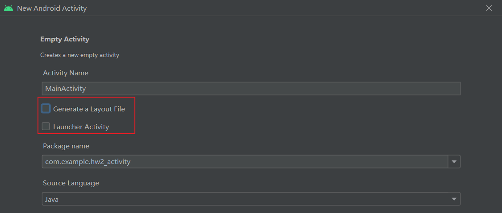

### 2.1.2	创建和加载布局

1.   在下图目录下，**右击|新建|Layout Resource File**

     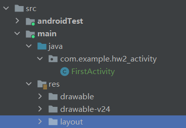

2.   布局文件的首字母要小写

     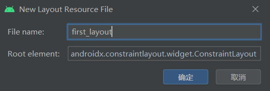

     

3.   **first_layout.xml**

     ```xml
     <?xml version="1.0" encoding="utf-8"?>
     <androidx.constraintlayout.widget.ConstraintLayout xmlns:android="http://schemas.android.com/apk/res/android"
         xmlns:tools="http://schemas.android.com/tools"
         android:layout_width="match_parent"
         android:layout_height="match_parent">
     	<!--match_parent表示让当前元素和父元素一样宽-->
         <!--wrap_content表示当前元素的高度只要能刚好包含里面的内容就可以-->
     
         <Button
             android:id="@+id/button" 
             android:layout_width="match_parent"
             android:layout_height="wrap_content"
             android:text="Button" />
         <!--@+表示在xml中定义一个id-->
     </androidx.constraintlayout.widget.ConstraintLayout>
     ```

4.   **FirstActivity.java**

     ```java
     public class FirstActivity extends AppCompatActivity {
         @Override
         protected void onCreate(Bundle savedInstanceState) {
             super.onCreate(savedInstanceState);
             setContentView(R.layout.first_layout);
         	//给当前活动加载一个布局
         }
     }
     ```

### 2.1.3	在AndroidMainfest文件中注册

```xml
<?xml version="1.0" encoding="utf-8"?>
<manifest xmlns:android="http://schemas.android.com/apk/res/android"
    xmlns:tools="http://schemas.android.com/tools"
    package="com.example.hw2_activity">

    <application
        android:allowBackup="true"
        android:dataExtractionRules="@xml/data_extraction_rules"
        android:fullBackupContent="@xml/backup_rules"
        android:icon="@mipmap/ic_launcher"
        android:label="@string/app_name"
        android:roundIcon="@mipmap/ic_launcher_round"
        android:supportsRtl="true"
        android:theme="@style/Theme.Hw2_Activity"
        tools:targetApi="31">

        <activity
            android:name=".FirstActivity"
            android:exported="true"
            android:label="This is the first activity">
            <!--注意android:exported必须为true-->
            <!--android:label是当前活动的标题-->
            <intent-filter>
                <action android:name="android.intent.action.MAIN"/>
                <category android:name="android.intent.category.LAUNCHER"/>
            </intent-filter>
        </activity>
    </application>

</manifest>
```

### 2.1.4	在活动中使用Toast

1.   Toast是Android系统提供的一种非常好的提醒方式

2.   在程序中可以使用它将一些短小的信息通知给用户，这些信息会在一段时间后自动消失，并且不会占用任何屏幕空间，

3.   我们现在就尝试一下如何在活动中使用Toast：通过Button触发Toast，修改**FirstActivity.java**

     ```java
     public class FirstActivity extends AppCompatActivity {
         @Override
         protected void onCreate(Bundle savedInstanceState) {
             super.onCreate(savedInstanceState);
             setContentView(R.layout.first_layout);
     
             Button button1 = (Button) findViewById(R.id.button);
             // 通过button的id,获取其实例
             // 这个值是在first_layout.xml中通过android:id属性指定的
             // findViewById返回的是View对象, 需要将其向下转化为Button对象
             button1.setOnClickListener(new View.OnClickListener() {
                 // 获得按钮实例后, 通过调用setOnClickListener()方法为按钮注册一个监听器
                 // 点击按钮时, 就会执行监听器中的onClick()方法
                 @Override
                 public void onClick(View view) {
                     Toast.makeText(FirstActivity.this, "You clicked Button ",Toast.LENGTH_SHORT).show();
                     // 通过静态方法makeText()创建一个Toast对象, 然后调用show()方法将其显示出来即可
                     // makeText()的三个参数:
                     // context: Toast要求的上下文, 由于活动本身就是一个Context对象, 因此这里直接传入this
                     // text: Toast显示的文本内容
                     // Toast显示的时长, 有两个选择: Toast.LENGTH_SHORT/Toast.LENGTH_LONG
                 }
             });
         }
     }
     ```

### 2.1.5	在活动中使用Menu

1.   在**res**目录下，新建一个目录**menu**

2.   **右击menu文件夹|新建|Menu Resource File**，文件名输入**main**

3.   修改**main.xml**文件

     ```xml
     <?xml version="1.0" encoding="utf-8"?>
     <menu xmlns:android="http://schemas.android.com/apk/res/android">
         <item
             android:id="@+id/add_item"
             android:title="Add"/>
     
         <item
             android:id="@+id/remove_item"
             android:title="Remove"/>
         <!--<item>标签就是用来创建具体的某一个菜单项-->
         <!--android:id表示唯一标识符-->
         <!--android:title给这个菜单项指定一个名称-->
     </menu>
     ```

4.   修改**FirstActivity.java**文件，重写**onCreateOptionMenu()**方法

     ```java
     @Override
     public boolean onCreateOptionsMenu(Menu menu) {
         getMenuInflater().inflate(R.menu.main, menu);
         // 通过getMenuInflater()方法能够得到MenuInflater对象
         // 再调用它的inflate()方法就可以给当前活动创建菜单了
         // inflate的两个参数:
         // 第一个: 指定通过哪一个资源文件来创建菜单
         // 第二个: 指定我们的菜单项将添加到哪一个Menu对象中
         return true;
         // 返回true: 表示允许创建的菜单显示出来
     }
     ```

5.   定义菜单响应事件：重写**onOptionsItemSelected**函数

     ```java
     @Override
     public boolean onOptionsItemSelected(@NonNull MenuItem item) {
         switch (item.getItemId()){ // 判断点击的是哪一个菜单项
             case  R.id.add_item:
                 Toast.makeText(this, "You clicked Add", Toast.LENGTH_SHORT).show();
                 break;
             case R.id.remove_item:
                 Toast.makeText(this, "You clicked Remove", Toast.LENGTH_SHORT).show();
                 break;
             default:
                 break;
         }
         return  true;
     }
     ```

### 2.1.6	销毁一个活动

1.   调用**Activity**类的**finish()**方法即可，修改**Button**监听器中的代码

     ```java
     button1.setOnClickListener(new View.OnClickListener() {
         @Override
         public void onClick(View view) {
             Toast.makeText(FirstActivity.this, "You clicked Button ",Toast.LENGTH_SHORT).show();
             finish();
         }
     });
     ```

## 2.2	使用Intent在活动之间穿梭

### 2.2.1	使用显式Intent

1.   **右击com.example.hw2_Activity包|新建|Activity|Empty Activity**，创建一个新活动

2.   这次勾选**Generate Layout File**，并将布局文件起名为**second_layout**，但是不要勾选**Launcher Activity**

3.   进入布局文件，新建一个**Button**控件

4.   注意：所有Activity都需要在**AndroidManifest.xml**中注册，这里系统已经帮我们注册好了

     ```xml
     <!--注册SecondActivity-->
     <activity
               android:name=".SecondActivity"
               android:exported="false" />
     
     <!--注册FirstActivity-->
     <activity
               android:name=".FirstActivity"
               android:exported="true"
               android:label="This is the first activity">
         <intent-filter>
             <action android:name="android.intent.action.MAIN" />
     
             <category android:name="android.intent.category.LAUNCHER" />
         </intent-filter>
     </activity>
     ```

5.   使用显式Intent启动活动：修改**FirstActivity.java**中的按钮点击事件

     ```java
     button1.setOnClickListener(new View.OnClickListener() {
         @Override
         public void onClick(View view) {
             Intent intent = new Intent(FirstActivity.this, SecondActivity.class);
             // 第一个参数: 启动活动的上下文
             // 第二个参数: 目标活动
             startActivity(intent);
         }
     });
     ```

### 2.2.2	使用隐式Intent

1.   相比于显式Intent，隐式Intent则含蓄了许多，它并不明确指出我们想要启动哪一个活动，而是指定了一系列更为抽象的action和category等信息，然后交由系统去分析这个Intent，并帮我们找出合适的活动去启动。

2.   什么叫作合适的活动呢？简单来说就是可以响应我们这个隐式Intent的活动。

3.   修改**AndroidManifest.xml**，让**SecondActivity**能够响应**隐式Intent**

     ```xml
     <!--注册SecondActivity-->
     <activity
               android:name=".SecondActivity"
               android:exported="false">
         <intent-filter>
             <action android:name="com.example.hw2_activity.ACTION_START"/>
             <!--指明当前活动可以响应com.example.hw2_activity.ACTION_START这个action-->
             <category android:name="android.intent.category.DEFAULT"/>
             <!--指明当前活动能够响应的Intent中还可能带有的category-->
             <!--只有<action>和<category>同时匹配上Intent中指定的action和category时,这个活动才能响应该Intent-->
         </intent-filter>
     </activity>
     ```

4.   修改**FirstActivity.java**中的按钮点击事件

     ```java
     button1.setOnClickListener(new View.OnClickListener() {
         @Override
         public void onClick(View view) {
             Intent intent = new Intent("com.example.hw2_activity.ACTION_START");
             intent.addCategory("com.example.hw2_activity.MY_CATEGORY");
             // 每个Intent只能有一个Action, 但是可以有多个Category
             // 只有当Activity同时匹配上Action和所有的Category时, 才会响应Intent
             startActivity(intent);
             // android.intent.category.DEFAULT是默认category
             // 在调用startActivity()方法时会自动将这个category添加到Intent中
         }
     });
     ```

### 2.2.3	更多隐式Intent的用法

1.   **打开网页**：修改**FirstActivity.java**中的按钮点击事件

     ```java
     button1.setOnClickListener(new View.OnClickListener() {
         @Override
         public void onClick(View view) {
             Intent intent = new Intent(Intent.ACTION_VIEW);
             // Intent.ACTION_VIEW是Android系统内置的动作
             // 其常量值为android.intent.action.VIEW
             intent.setData(Uri.parse("http://www.baidu.com"));
             // 使用Uri.parse()方法,将一个网址字符串解析成一个Uri对象
             // 调用Intent的setData()方法, 将这个Uri对象传递进去
             startActivity(intent);
         }
     });
     ```

2.   **setData()**方法：指定当前Intent正在操作的数据

     1.   与此对应,我们还可以在**< intent-filter >**标签中再配置一个**< data >**标签，用于更精确地指定当前活动能够响应什么类型的数据。**< data >**标签中主要可以配置以下内容。
          1.   **android:scheme**：用于指定数据的协议部分，如上例中的http部分
          2.   **android: host**：用于指定数据的主机名部分,如上例中的www.baidu.com部分
          3.   **android:port**：用于指定数据的端口部分，一般紧随在主机名之后
          4.   **android:path**：用于指定主机名和端口之后的部分，如一段网址中跟在域名之后的内容
          5.   **android:mimeType**：用于指定可以处理的数据类型，允许使用通配符的方式进行指定。
     2.   只有**< data >**标签中指定的内容和Intent中携带的Data完全一致时，当前活动才能够响应该Intent
     3.   不过一般在**< data >**标签中都不会指定过多的内容
          1.   如上面浏览器示例中，其实只需要指定**android:scheme为http**，就可以响应所有的http协议的Intent了

3.   写一个能够**响应打开网页**的活动

     1.   新建一个活动**ThirdActivity**
     2.   修改**AndroidManifest.xml**

     ```java
     <!-- 注册ThirdActivity -->
     <activity
     	android:name=".ThirdActivity"
     	android:exported="true">
     	<intent-filter>
     		<action android:name="android.intent.action.VIEW"/>
     		<category android:name="android.intent.category.DEFAULT"/>
     		<data android:scheme="http"/>
     	</intent-filter>
     </activity>
     ```

4.   **拨打电话**：

     ```java
     button1.setOnClickListener(new View.OnClickListener() {
         @Override
         public void onClick(View view) {
             Intent intent = new Intent(Intent.ACTION_DIAL);
             intent.setData(Uri.parse("tel:10086"));
             startActivity(intent);
         }
     });
     ```

### 2.2.4	向下一个活动传递数据

1.   给出数据：**putExtra()**方法

     ```java
     button1.setOnClickListener(new View.OnClickListener() {
         @Override
         public void onClick(View view) {
             String data = "Hello SecondActivity";
             Intent intent = new Intent(FirstActivity.this, SecondActivity.class);
             intent.putExtra("extra_data", data);
             // 第一个参数是键, 第二个参数是传递的数据
             startActivity(intent);
         }
     });
     ```

2.   接收数据：**getStringExtra()**方法

     ```java
     public class SecondActivity extends AppCompatActivity {
         @Override
         protected void onCreate(Bundle savedInstanceState) {
             super.onCreate(savedInstanceState);
             setContentView(R.layout.second_layout);
             Intent intent = getIntent();
             String data = intent.getStringExtra("extra_data");
             // 字符串型数据就是getStringExtra, 整型数据就是getIntExtra
             Log.d("SecondActivity", data);
         }
     }
     ```

### 2.2.5	返回数据给上一个活动

1.   需要返回数据的启动新活动：**startActivityForResult()**方法

     ```java
     button1.setOnClickListener(new View.OnClickListener() {
         @Override
         public void onClick(View view) {
             Intent intent = new Intent(FirstActivity.this, SecondActivity.class);
             startActivityForResult(intent, 1);
         }
     });
     ```

2.   返回数据：**setResult()**方法

     ```java
     button2.setOnClickListener(new View.OnClickListener() {
         @Override
         public void onClick(View view) {
             Intent intent = new Intent();
             intent.putExtra("data_return", "Hello FirstActivity");
             setResult(RESULT_OK, intent);
             // 第一个参数: 向上一个活动返回处理结果, 一般只使用RESULT_OK/RESULT_CANCELED
             // 第二个参数: 带有数据的Intent
             finish();
         }
     });
     ```

3.   获取返回数据：**onActivityResult()**方法

     ```java
     @Override
     protected void onActivityResult(int requestCode, int resultCode, @Nullable Intent data) {
         // requestCode: 启动新活动是传入的请求码
         // resultCode: 返回数据时传入的处理结果
         // data: 携带着返回数据的Intent
         switch (requestCode){
             case 1:
                 if(resultCode == RESULT_OK){
                     String returnedData = data.getStringExtra("data_return");
                     Log.d("FirstActivity", returnedData);
                 }
                 break;
             default:
                 break;
         }
     }
     ```

4.   按返回键返回：**onBackPressed()**方法

     ```java
     @Override
     public void onBackPressed() { // 按返回键返回
         Intent intent = new Intent();
         intent.putExtra("data_return", "Hello FirstActivity");
         setResult(RESULT_OK, intent);
         finish();
     }
     ```

## 2.3	活动的生命周期

### 2.3.1	返回栈 Back Stack

1.   其实Android是使用任务(Task)来管理活动的，一个任务就是一组存放在栈里的活动的集合，这个栈也被称作返回栈(**Back Stack**)
2.   栈是一种后进先出的数据结构，在默认情况下，每当我们启动了一个新的活动，它会在返回栈中入栈，并处于栈顶的位置。而每当我们按下Back键或调用finish()方法去销毁一个活动时，处于栈顶的活动会出栈，这时前一个入栈的活动就会重新处于栈顶的位置
3.   系统总是会显示处于栈顶的活动给用户

### 2.3.2	活动状态

1.   **运行状态**：活动位于返回栈栈顶
2.   **暂停状态**：活动不在栈顶，但是仍然可见
3.   **停止状态**：活动不在栈顶，且不可见
4.   **销毁状态**：活动不在返回栈中

### 2.3.3	活动的生命周期

#### 2.3.3.1	对应的7个回调方法

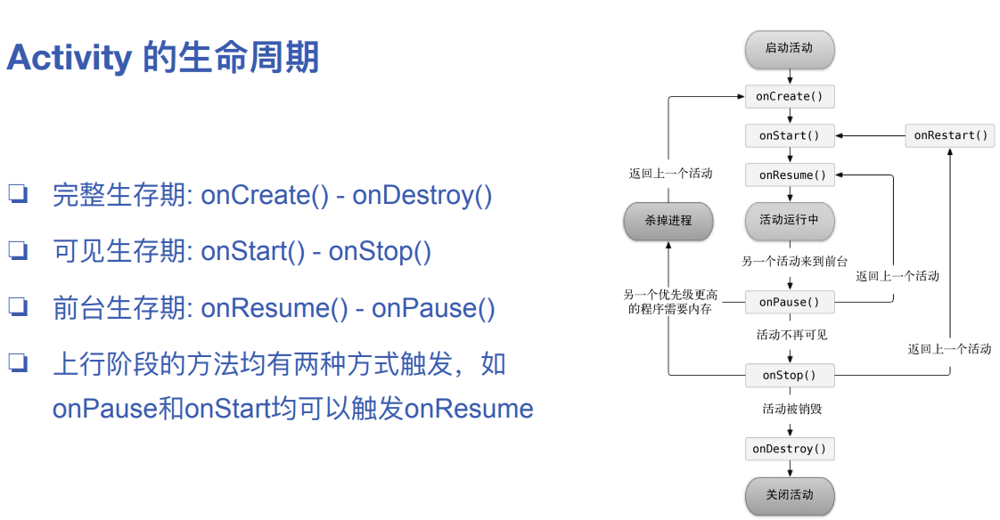

1.   **onCreate()**：它会在活动**第一次被创建**的时候调用。
     1.   你应该在这个方法中完成活动的**初始化操作**，比如说加载布局、绑定事件等
2.   **onStart()**：这个方法在活动由**不可见变为可见**的时候调用
3.   **onResume()**：这个方法在活动准备好和用户进行交互的时候调用。
     1.   此时的活动一定**位于返回栈的栈顶**，并且处于运行状态
4.   **onPause()**：这个方法在系统准备去**启动或者恢复另一个活动**的时候调用。
     1.   我们通常会在这个方法中将一些消耗CPU的资源释放掉，以及保存一些关键数据
     2.   但这个方法的执行速度一定要快，不然会影响到新的栈顶活动的使用
5.   **onStop()**：这个方法在活动**完全不可见**的时候调用。
     1.   它和**onPause()**方法的主要区别在于，如果启动的新活动是一个对话框式的活动，那么**onPause()**方法会得到执行，而**onStop()**方法并不会执行
6.   **onDestroy()**：这个方法在活动**被销毁**之前调用，之后活动的状态将变为销毁状态
7.   **onRestart()**：这个方法在活动由**停止状态变为运行状态**之前调用，也就是活动被重新启动了

#### 2.3.3.2	将活动注册为对话框

```xml
<activity
	android:name=".DialogActivity"
	android:exported="false"
	android:theme="@style/Theme.AppCompat.Dialog"/>
```

### 2.3.4	活动被回收了怎么办

1.   存储临时数据：**onSaveInstanceState()**

     ```java
     @Override
     public void onSaveInstanceState(@NonNull Bundle outState, @NonNull PersistableBundle outPersistentState) {
         super.onSaveInstanceState(outState, outPersistentState);
         String temoData = "Something you just Typed";
         outState.putString("data_key", temoData);
     }
     ```

2.   恢复临时数据：**onCreate()**中的**savedInstanceState**参数

     ```java
     protected void onCreate(Bundle savedInstanceState) {
         super.onCreate(savedInstanceState);
         Log.d(TAG,"onCreate");
         setContentView(R.layout.activity_main);
     
         if(savedInstanceState != null){
             String tempData = savedInstanceState.getString("data_key");
             Log.d(TAG, tempData);
         }
     }
     ```

## 2.4	活动的启动模式

1.   可以在**AndroidManifest.xml**中，通过给**< activity >**标签指定**android:launchMode**属性，来指定启动模式

### 2.4.1	standard

1.   默认启动模式
2.   不检查栈中有是否已有这个Activity，总会**创建⼀个新Activity**，并push到栈顶

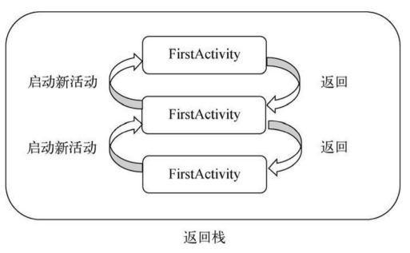

### 2.4.2	singleTop

1.   **检查栈顶**判断是否需要新建Activity
2.   ⾮栈顶的元素不会检查，所以当FirstActivity不位于栈顶时，再次startActivity(FirstActivity)还会再创建⼀个FirstActivity

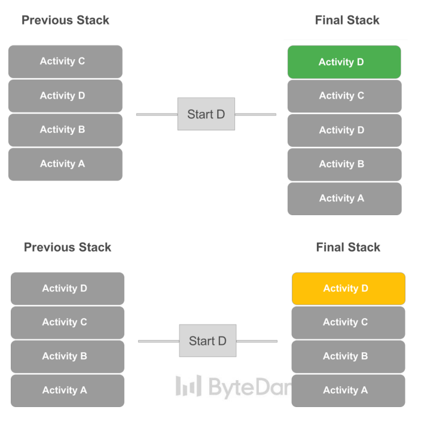

### 2.4.3	singleTask

1.   每次启动该活动时系统⾸先会**在返回栈中检查是否存在该Activity的实例**
2.   如果发现已经存在则直接使⽤该实例，并把在这个Activity之上的所有Activity统统出栈

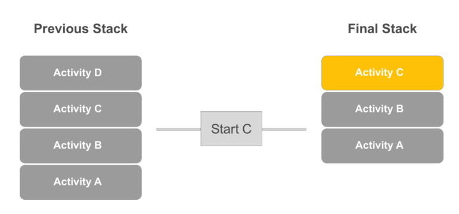

### 2.4.4	singleInstance

1.   会**启用一个新的返回栈**来管理指定为**singleInstance**的**Activity**

2.   使⽤场景：跨进程（app）间的Activity实例共享，不管是哪个应⽤程序来访问这个Activity，都共⽤同⼀个返回栈

     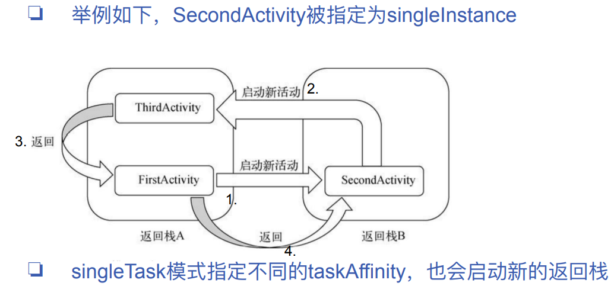

## 2.5	活动的最佳实践

### 2.5.1	知晓当前是在哪一个活动

1.   首先，新建一个**BaseActivity**类，继承自**AppCompatActivity**

2.   重写**OnCreate()**方法

     ```java
     public class BaseActivity extends AppCompatActivity {
         @Override
         protected void onCreate(@Nullable Bundle savedInstanceState) {
             super.onCreate(savedInstanceState);
             Log.d("BaseActivity", getClass().getSimpleName());
         }
     }
     ```

3.   让**BaseActivity**称为**hw2_activity**项目中所有活动的父类

     1.   修改**FirstActivity、SecondActivity、ThirdActivity**，让他们不再继承于**AppCompatActivity**，而是继承自**BaseActivity**

### 2.5.2	随时随地退出程序

1.   新建一个类**ActivityCollector**作为活动管理器

     ```java
     public class ActivityCollector {
         public static List<Activity> activities = new ArrayList<>();
     
         public static void addActivity(Activity activity){
             activities.add(activity);
         }
     
         public static void removeActivity(Activity activity){
             activities.remove(activity);
         }
     
         public static void finishAll(){
             Log.d("ActivityCollector", "finishAll"+activities.size());
             for(Activity activity : activities){
                 if(!activity.isFinishing())
                     activity.finish();
             }
             activities.clear();
     
             android.os.Process.killProcess(android.os.Process.myPid());
             // 只能杀掉当前进程
         }
     }
     ```

2.   修改**BaseActivity**中的代码

     ```java
     public class BaseActivity extends AppCompatActivity {
         @Override
         protected void onCreate(@Nullable Bundle savedInstanceState) {
             super.onCreate(savedInstanceState);
             Log.d("BaseActivity", getClass().getSimpleName());
     
             ActivityCollector.addActivity(this);
         }
     
         @Override
         protected void onDestroy() {
             super.onDestroy();
             ActivityCollector.removeActivity(this);
         }
     }
     ```

3.   在**ThirdActivity**界面中点击按钮直接退出程序

     ```java
     public class ThirdActivity extends BaseActivity {
         @Override
         protected void onCreate(Bundle savedInstanceState) {
             super.onCreate(savedInstanceState);
             setContentView(R.layout.third_layout);
     
             Button button3 = (Button) findViewById(R.id.button3);
             button3.setOnClickListener(new View.OnClickListener() {
                 @Override
                 public void onClick(View view) {
                     Log.d("ThirdActivity", "onClick: ");
                     ActivityCollector.finishAll();
                 }
             });
         }
     }
     ```

### 2.5.3	启动进程的最佳写法

1.   启动**Secondary**进程时，我们可能并不知道它需要哪些参数，要么去问负责这个活动的同学，要么自己去看代码

2.   我们只需要在**Secondary**中封装一个方法**actionStart**，即可方便的告诉大家，**Secondary**启动时需要哪些参数

     ```java
     public class SecondActivity extends BaseActivity {
         public static void actionStart(Context context, String data1, String data2){
             Intent intent = new Intent(context, SecondActivity.class);
             intent.putExtra("param1", data1);
             intent.putExtra("param2", data2);
             context.startActivity(intent);
         }
     }
     ```

# 第三章	软件也要拼脸蛋--UI开发的点点滴滴

## 3.1	控件与布局

1.   UI控件：**TextView**, **ImageView**, **Button**, **ProgressBar**
2.   UI布局：**LinearLayout**, **RelativeLayout**, **FrameLayout**,

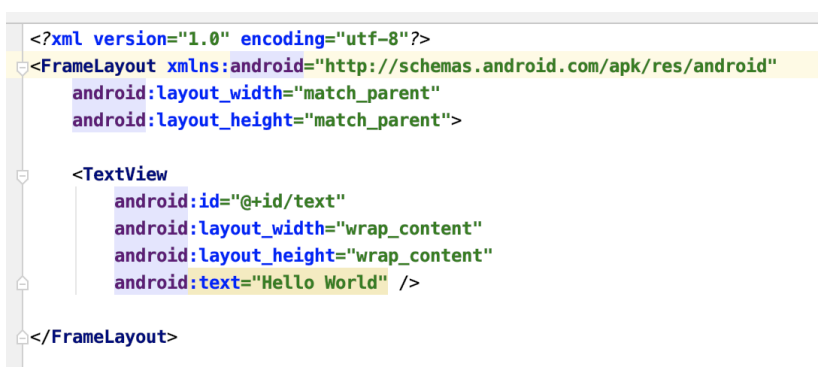

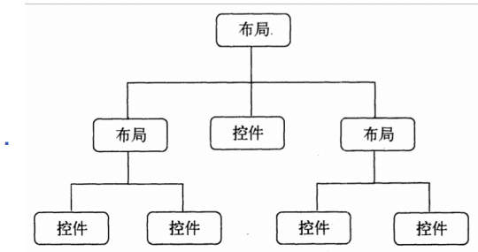

## 3.2	常用控件

### 3.2.1	TextView

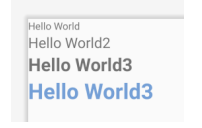

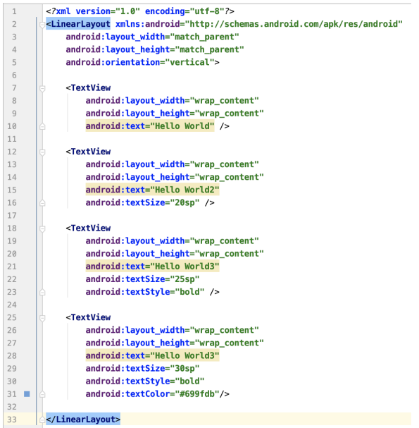

1.   **layout_width**：控件的宽
2.   **layout_height**：控件的⾼
3.   **wrap_content**：表示和⾃身内容⼀样的⻓度
4.   **match_parent**：表示和⽗组件⼀样的⻓度

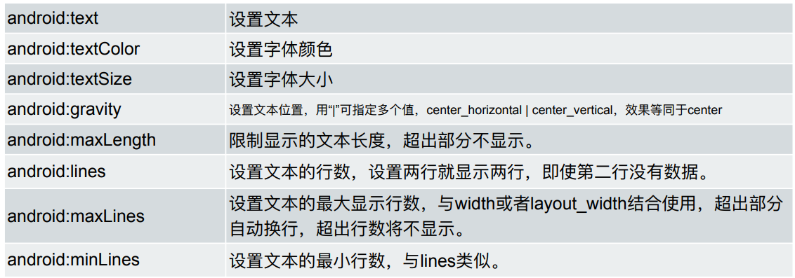

### 3.2.2	 px、dp、dpi、density 与 sp

1.   **px**：pixel，1px代表屏幕上的⼀个物理像素点
2.   **dpi**：dots per inch，对角线每英寸的像素点的个数；该值越大表示屏幕越清，$dpi=\frac{\sqrt{{height}^2+{width}^2}}{size}$
3.   **density**：$density=\frac{dpi}{60}$
4.   **dp/dip**：density-independent pixel，设备无关像素，$dp=\frac{px}{density}$
5.   **sp**：scale-independent pixel，与缩放⽆关的抽象像素
     1.   与dp近似，但除了受屏幕密度影响外，还受到⽤户字体大小影响（正相关）

### 3.2.3	EditText

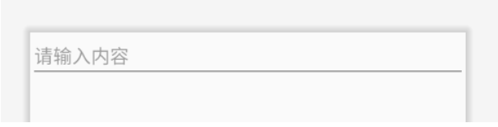

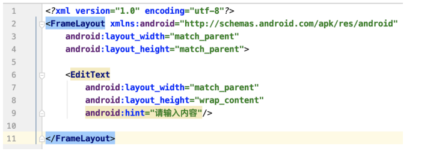

1.   监听输⼊内容变化：**TextWatcher**

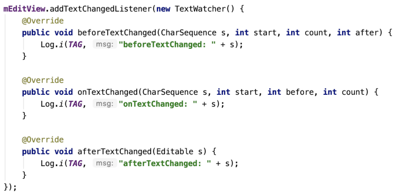

### 3.2.4	ImageView

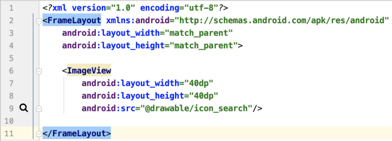

1.   静态设置 

     1.   **android:src**：指定**drawable**(本地图片)或**bitmap**资源(网络图片)
     2.   **android:background**：指定ImageView背景（如color）
     3.   **android:scaleType**：设置图片如何缩放以适应ImageView大小；
          1.   参数如center，centerCrop等

2.   动态设置

     1.   **setImageResource**：添加资源

          ```java
          mImageView.setImageResource(R.drawable.icon_search);
          ```

     2.   解析成bitmap后，setRotate设置旋转等

3.   **svg**和**png**相比有何优势

     1.   抗拉伸
     2.   适配分辨率友好
     3.   占⽤空间小

### 3.2.5	Dialogs(自学内容)

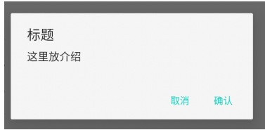

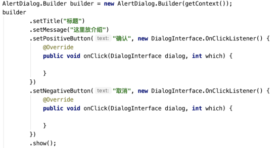

1.   https://developer.android.com/guide/topics/ui/dialogs
2.   如何生成，展示，隐藏⼀个Dialog？
3.   如何⾃定义Dialog样式，添加Button和Listener？

## 3.3	基本布局

### 3.3.1	LinearLayout

1.   **android:orientation**：表示线性布局排列⽅向

     1.   可选**vertical**或**horizontal**

2.   **android:layout_gravity**：表示指定控件在layout中的对⻬⽅式

     1.   **center_vertical**只在orientation=“**horizontal**”时⽣效
     2.   **center_horizontal**只在orientation=“**vertical**”时⽣效

     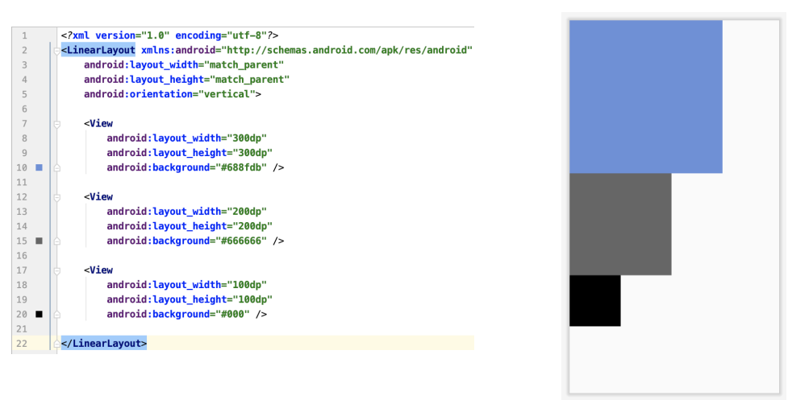

3.   **android:layout_weight**：使用**比例**的方式指定控件的大小

     1.   每个控件在排列⽅向上尺寸占比为：**self weight / total weight**
     2.   如下图两个View的weight都为1，则两个View的宽度与屏幕宽度⽐均为$\frac{1}{1+1}=\frac{1}{2}$
     3.   两个View的layout_width的规范写法为0dp
     4.   如果⼀些控件未指定weight，则这些控件按指定width或height展示。其余指定weight的控件对剩余屏幕宽度或高度进行分割

     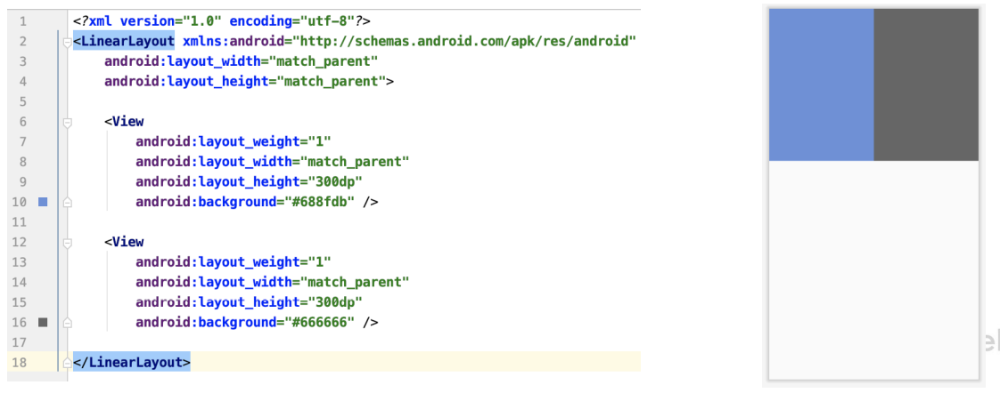

### 3.3.2	RelativeLayout

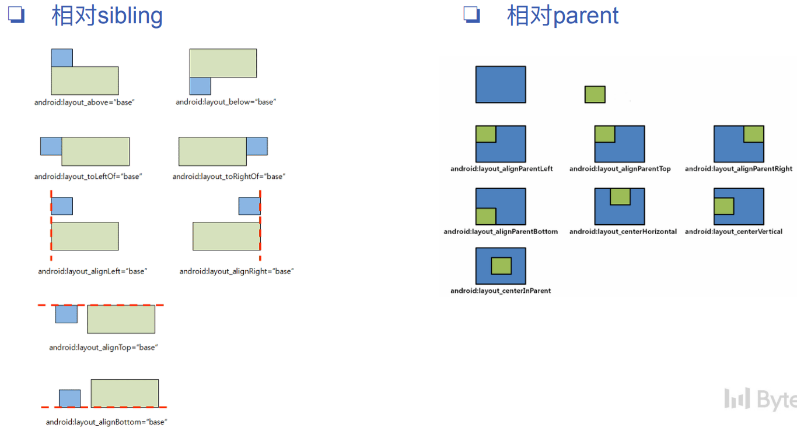

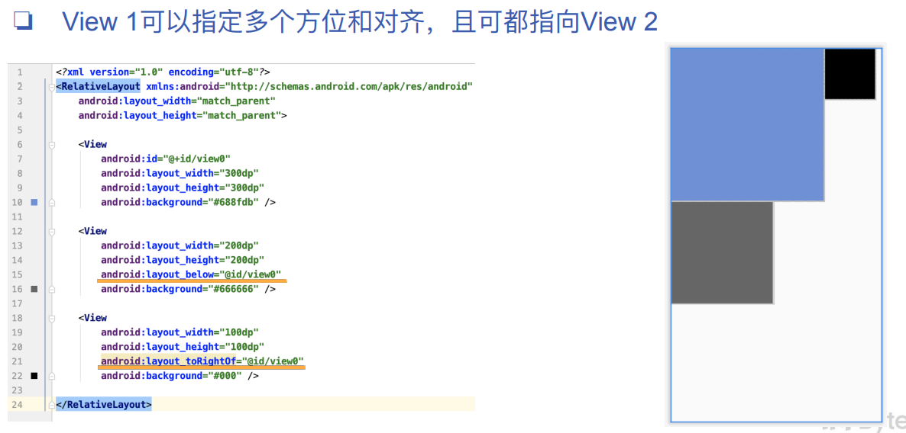

### 3.3.3	padding 与 margin

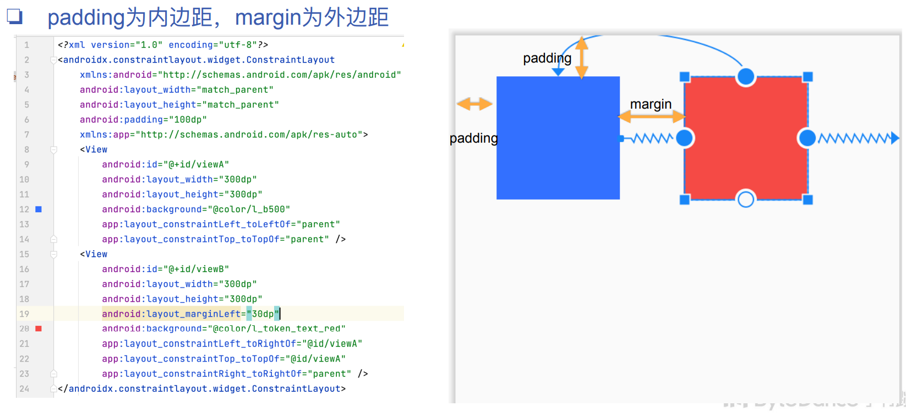

### 3.3.4	FrameLayout（自学内容）

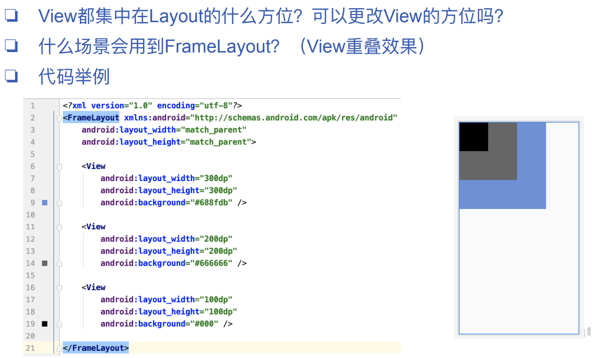

### 3.3.5	ConstraintLayout

1.   对View A在水平和垂直两个方向上指定限制，每⼀方向上⾄少指定⼀个 限制，限制标的可以是其他View或父View

     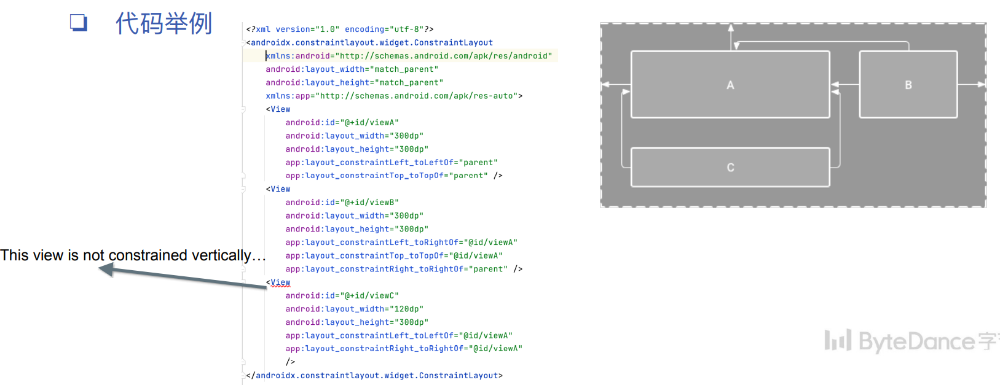

2.   如果对ViewB同时添加了app:layout_constraintRight_toRightOf=“@id/viewA”和
     app:layout_constraintLeft_toLeftOf=“@id/viewA”表示什么含义？

3.   ConstraintLayout的使⽤场景（拓展）

     1.   N等分布局
     2.   角度布局
     3.   超长限制优化

     ```groovy
     dependencies {
     	implementation "androidx.constraintlayout:constraintlayout:2.1.4"
     }
     ```

### 3.3.6	自定义控件

1.   可继承任意Android控件，在此基础上添加或重写功能

2.   更好的封装

     1.   举例：六个可输入方格、选中框、光标等

     2.   ⼀种实现：作为⼀个**EditText**，⾃定义**View(SixWordEditText)**继承**EditText**

          1.   **Override TextView**的**onDraw**⽅法，绘制每个方格样式和⽂字

          2.   **TextWatcher**监听**afterTextChanged**

          3.   **SixWorkEdtiText**在**XML**中引⽤

               ```xml
               <com.ss.meetx.roomui.widget.SixWordEditText
               	android:id="@+id/accessCodeEditText"
               	android:layout_width="wrap_content"
               	android:layout_height="wrap_content"/>
               ```

3.   提高复用性

     1.   如何在XML中实现下面的UI？使⽤什么布局和控件？层级是怎样的？

          

          1.   **input_view.xml**

          2.   构造**SearchTextLayout**

               ```java
               // constructor
               public SearchTextLayout(Context context, AttributeSet attrs) {
               	LayoutInflater.from(context).inflate(R.layout.input_view, this)
               }
               ```

          3.   引用**SearchTextLayout**

               ```xml
               <com.ss.meetx.roomui.widget.input.SearchTextLayout
               	android:id=“@+id/inputViewSearch"
               	android:layout_width=“0dp"
               	android:layout_height=“52dp"/>
               ```

## 3.4	RecyclerView

### 3.4.1	基本布局：ScrollView

1.   滚动布局，默认垂直方向滑动，也⽀持水平方向滑动HorizontalScrollView

2.   直接**子View只能有⼀个**

3.   如果⽤**ScrollView**实现右侧的滑动列表应该怎么做？

4.   开发上有什么不便？性能上有什么弊端？

     1.   重复写n个View，动态添加View比较复杂
     2.   初始化时会将所有数据项全部加载出来，没有回收和复同；导致内存占用大和OOM
     3.   用户体验是加载速度慢，卡顿

### 3.4.2	RecyclerView

1.   核心：**View Holder**， **Adapter**，**Recycler View**

2.   **Item Decorator**：Item之间Divider（分割线）

3.   **Item Animator**：添加删除Item的动画

### 3.4.3	LayoutManager

1.   **LinearLayoutManager**(左图）

     1.   线性造型，类似ListView的功能
     2.   支持上下或左右滑动，每⼀行或⼀列上仅有⼀个item

2.   **GridLayoutManager**(中图）

     1.   网格造型，每个item在滑动方向上的尺寸相同
     2.   可以通过setSpanSizeLookup和getSpanSize，指定条件（如item中text宽度，item的position等），来控制该item占几个位置（即每⼀行有几个item）

3.   **StaggeredGridLayoutManager**(右图)

     1.   瀑布流造型，每个item的尺寸可不相同，错落式布局
     2.   在其constructor中可指定滑动方向和行数（或列数）

     

4.   **自定义LayoutManager**（拓展）

     1.   继承**LayoutManager**类
     2.   重写**generateDefaultLayoutParams**⽅法，直接返回⼀个⻓宽都为**WRAP_CONTENT**的**LayoutParams**即可；
     3.   重写**onLayoutChildren**⽅法，在这⾥⾯布局**Items**（显示出来）；具体包括分离和回收有效items（detachAndScrapAttachedViews），获取需要布局的items（可见的），再通过addView将这些item添加回去。然后对其测量
          （measureChild）确定View的宽高，
     4.   使⽤**layoutDecorated**确定View摆放的位置，并设置跟随滑动放缩比例
     5.   重写**canScrollHorizontally**和**canScrollVertically**方法，使它⽀持⽔平或垂直滚动；
     6.   重写**scrollHorizontallyBy**和**scrollVerticallyBy**，并在这里处理滚动工作；

     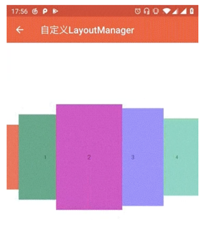

### 3.4.4	RecyclerView使用示例

#### 3.4.4.1	添加依赖

>   1.   在**app/build.gradle**中，添加**RecyclerView**的依赖

```groovy
implementation 'androidx.recyclerview:recyclerview:1.1.0'
```

#### 3.4.4.2	添加相关内容，表示RecyclerView中每一个独立的item

>   1.   创建**Java**类**ItemData**，表示每一个**item**存储的数据

```java
public class ItemData {
    private String title;
    private String link;

    public ItemData(String title, String link) {
        this.title = "  " + title;
        this.link = link;
    }

    public String getTitle() {
        return title;
    }

    public String getLink() {
        return link;
    }
}
```

>   2.   创建**layout**布局文件**recyclerview_item.xml**，表示每一个**item**的布局

```xml
<?xml version="1.0" encoding="utf-8"?>
<androidx.constraintlayout.widget.ConstraintLayout xmlns:android="http://schemas.android.com/apk/res/android"
    xmlns:app="http://schemas.android.com/apk/res-auto"
    android:layout_width="match_parent"
    android:layout_height="wrap_content"
    android:background="@drawable/text_view_shape">

    <TextView
        android:id="@+id/RecyclerView_Item"
        android:layout_width="match_parent"
        android:layout_height="wrap_content"
        android:layout_marginStart="10dp"
        android:layout_marginTop="10dp"
        android:layout_marginEnd="10dp"
        android:drawableBottom="@drawable/text_view_shape"
        android:fontFamily="sans-serif-thin"
        android:maxLines="1"
        android:text="文章的标题"
        android:textAlignment="viewStart"
        android:textColor="#000000"
        android:textSize="24sp"
        android:textStyle="bold"
        android:typeface="sans"
        app:layout_constraintEnd_toEndOf="parent"
        app:layout_constraintStart_toStartOf="parent"
        app:layout_constraintTop_toTopOf="parent" />
</androidx.constraintlayout.widget.ConstraintLayout>
```

>   3.   创建**Java**类**MyViewHolder**，用于存储每个**item**的控件，控件都有哪些，在**recyclerview_item.xml**中定义

```java
public class MyViewHolder extends RecyclerView.ViewHolder{
    public TextView textView;

    public MyViewHolder(View itemView){
        super(itemView);
        this.textView = itemView.findViewById(R.id.recyclerview_item);
    }
}
```

#### 3.4.4.3	添加RecyclerView的Adapter

>   1.   创建**Java**类**MyRecyclerViewAdapter**，为**RecyclerView**控件的**Adapter**
>        1.   这个类继承自**RecyclerView.Adapter< MyViewHolder >**
>        2.   这个类会重写**View.OnClickListener**
>   2.   类中包含了**Adapter**所在的**Context**，每个**item**包含的数据
>        1.   这些是在构造函数中需要传入的
>   3.   创建一个方法**setItem(int position, ItemData item)**，表示修改**position**地方的数据
>        1.   先修改**itemList**中的数据
>        2.   然后调用**this.notifyItemChanged(position)**方法，修改**item**的控件
>   4.   重写多个方法，实现**Adapter**的功能
>        1.   **onCreateViewHolder()**：**item**框创立时, 调用该方法
>             1.   根据**item**对应的**layout**文件**recyclerview_item.xml**，创建每个**item**对应的**View**视图
>             2.   给**View**视图设置**Listener**
>             3.   从**itemView**中获取**MyViewHolder**并返回
>        2.   **onAttachedToRecyclerView()**：将**RecycleView**附加到**Adapter**上时, 调用该方法
>             1.   设置当前**Adapter**负责的**RecyclerView**
>        3.   **onDetachedFromRecyclerView()**：将**RecycleView**从**Adapter**解除时, 调用该方法
>             1.   设置当前**Adapter**负责的**RecyclerView**
>        4.   **onBindViewHolder()**：**item**显示时, 调用该方法
>             1.   根据**item**的位置，设置当前**item**的每个组件的值
>        5.   **getItemCount()**：**item**的数量
>   5.   重写**onClick()**方法，处理**RecyclerView**的点击事件
>        1.   添加自定义接口**OnItemClickListener**，处理**item**的点击事件
>             1.   需要实现的方法：**void onItemClick(RecyclerView parent, View view, int position, ItemData data);**
>        2.   通过**recyclerView.getChildAdapterPosition()**方法，获取当前点击的**item**的位置
>        3.   执行具体实现的**onItemClick()**方法

```java
public class MyRecyclerViewAdapter
        extends RecyclerView.Adapter<MyViewHolder>
        implements View.OnClickListener{

    // 当前Activity/Fragment
    private Context context;
    // 每个item包含的数据
    private List<ItemData> itemList;
    
    // 每个item的控件
    private View itemView;
    // 被附加到Adapter上的RecyclerView控件
    private RecyclerView recyclerView;

    public MyRecyclerViewAdapter(Context context, List<ItemData> itemList) {
        this.context = context;
        this.itemList = itemList;
    }
    public void setItem(int position, ItemData item){
        itemList.set(position, item);
        this.notifyItemChanged(position);
    }

    // item框创立时, 调用该方法
    @NonNull
    @Override
    public MyViewHolder onCreateViewHolder(@NonNull ViewGroup parent, int viewType) {
        // 根据layout文件, 创建View视图
        itemView = LayoutInflater.from(context).inflate(R.layout.recyclerview_item, parent, false);
        
        // 给View视图设置Listener
        itemView.setOnClickListener(this);

        // 从itemView中获取MyViewHolder并返回
        MyViewHolder myViewHolder = new MyViewHolder(itemView);
        return myViewHolder;
    }

    // 将RecycleView附加到Adapter上时, 调用该方法
    @Override
    public void onAttachedToRecyclerView(@NonNull RecyclerView recyclerView) {
        super.onAttachedToRecyclerView(recyclerView);
        this.recyclerView = recyclerView;
    }

    // 将RecycleView从Adapter解除时, 调用该方法
    @Override
    public void onDetachedFromRecyclerView(@NonNull RecyclerView recyclerView) {
        super.onDetachedFromRecyclerView(recyclerView);
        this.recyclerView = null;
    }

    // item显示时, 调用该方法
    @Override
    public void onBindViewHolder(@NonNull MyViewHolder holder, int position) {
        // 根据item位置的数据, 设置当前item的每个组件的值
        ItemData data = itemList.get(position);
        holder.textView.setText(data.getTitle());
    }

    // item的数量
    @Override
    public int getItemCount() {
        return itemList.size();
    }


    // 在 RecyclerView 的 Adapter 中定义单击事件的回调接口
    public interface OnItemClickListener{
        //参数: 父组件, 当前单击的View, 单击的View的位置, 数据
        void onItemClick(RecyclerView parent, View view, int position, ItemData data);
    }
    private OnItemClickListener onItemClickListener;
    
    public void setOnItemClickListener(OnItemClickListener onItemClickListener) {
        this.onItemClickListener = onItemClickListener;
    }

    // RecyclerView被点击时, 调用该方法
    @Override
    public void onClick(View view) {
        //根据RecyclerView获得当前View的位置
        int position = recyclerView.getChildAdapterPosition(view);
        
        //程序执行到此，会去执行具体实现的onItemClick()方法
        if(onItemClickListener != null){
            onItemClickListener.onItemClick(recyclerView, view, position, itemList.get(position));
        }
    }
}

```

#### 3.4.4.4	在Activity中对RecyclerView控件进行相关的设置

>   1.   在**onCreate()**中调用自定义方法**setRecyclerView()**
>   2.   在**setRecyclerView()**中进行**RecyclerView**控件的初始化操作
>        1.   设置所有**item**的默认数据
>        2.   设置**RecyclerView**控件的**Adapter**
>        3.   设置**RecyclerView**控件的**LayoutManager**
>        4.   设置**RecyclerView**控件的**Adapter**的点击事件响应方法**OnItemClickListener()**

```java
public class MainActivity extends AppCompatActivity {
    private static final int CONTENT_ACTIVITY_RequestCode = 1;

    private RecyclerView recyclerView;
    private MyRecyclerViewAdapter adapter;
    private LinearLayoutManager layoutManager;
    private List<ItemData> itemList = new ArrayList<>();

    @Override
    protected void onCreate(Bundle savedInstanceState) {
        // 初始化界面的相关操作
        super.onCreate(savedInstanceState);
        setContentView(R.layout.lab5_main_layout);

        // 初始化RecyclerView
        networkResult = findViewById(R.id.recyclerView);
        setRecyclerView();
    }

    // 初始化RecyclerView
    private void setRecyclerView(){
        // 设置recyclerView中所有item的数据
        for(int i = 0; i < 20; i++){
            ItemData data = new ItemData("第 " + i +" 篇文章标题为:", "");
            itemList.add(data);
        }

        // 设置Adapter
        adapter = new MyRecyclerViewAdapter(this, itemList);
        recyclerView.setAdapter(adapter);

        // 设置LayoutManager
        layoutManager = new LinearLayoutManager(this);
        layoutManager.setOrientation(RecyclerView.VERTICAL);
        recyclerView.setLayoutManager(layoutManager);

        // 设置click事件响应
        adapter.setOnItemClickListener(new MyRecyclerViewAdapter.OnItemClickListener() {
            @Override
            public void onItemClick(RecyclerView parent, View view, int position, ItemData data) {
                // 使用WebView Activity打开网页
                String urlString = data.getLink();
                Intent intent = new Intent(MainActivity.this, WebViewActivity.class);
                intent.putExtra("url", urlString);
                startActivity(intent);
                
                 // 修改Adapter中的itemID处的文本
                    adapter = (MyRecyclerViewAdapter) recyclerView.getAdapter();
                    ItemData item = new ItemData("item " + itemID + " 已完成");
                    adapter.setItem(itemID, item);
            }
        });
    }
}
```


### 3.4.5	回收复用机制

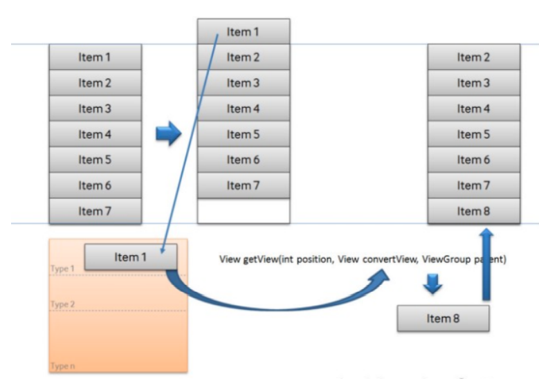
