# 目录

[TOC]

# 一、Fragment

## 1.1	Fragment的基本用法和生命周期

### 1.1.1	Fragment的优点

1.   将Activity模块化，将功能分散到小的Fragment中
2.   一个Activity可以有多个Fragment，一个Fragment也可以有多个Fragment
3.   可以重用、灵活
4.   相比View，带有声明周期的概念

### 1.1.2	静态添加Fragment

1.   定义**fragment布局文件**：**fragment_hello_layout.xml**

     ```xml
     <?xml version="1.0" encoding="utf-8"?>
     <FrameLayout
         xmlns:android="http://schemas.android.com/apk/res/android"
         android:layout_width="match_parent"
         android:layout_height="match_parent"
         android:background="@color/black">
         
         <!--显示一行文字: Hello-->
         <TextView
             android:id="@+id/tv_hello"
             android:layout_width="wrap_content"
             android:layout_height="wrap_content"
             android:layout_gravity="center"
             android:text="Hello"
             android:textSize="32sp"
             android:textColor="@color/white"/>
     </FrameLayout>
     ```

2.   定义**fragment类**：**HelloFragment.java**

     ```java
     public class HelloFragment extends Fragment {
         @Nullable
         @Override
         public View onCreateView(@NonNull LayoutInflater inflater, @Nullable ViewGroup container, @Nullable Bundle savedInstanceState) {
             return inflater.inflate(R.layout.fragment_hello_layout, container, false);
             // inflate方法的主要作用: 将xml转换成一个View对象, 用于动态的创建布局
             // 参数说明
             // 1.int resource:          布局的资源id
             // 2.ViewGroup root:        填充的根视图
             // 3.boolean attachToRoot:  是否将载入的视图绑定到根视图中
         }
     }
     ```

3.   在 **activity布局文件**中嵌入 **fragment**：

     **activity_main.xml**

     ```xml
     <?xml version="1.0" encoding="utf-8"?>
     <FrameLayout xmlns:android="http://schemas.android.com/apk/res/android"
         xmlns:app="http://schemas.android.com/apk/res-auto"
         xmlns:tools="http://schemas.android.com/tools"
         android:layout_width="match_parent"
         android:layout_height="match_parent"
         tools:context=".MainActivity">
     
         <androidx.fragment.app.FragmentContainerView
             android:id="@+id/fragment_hello"
             android:name="com.example.demo.HelloFragment"
             android:layout_width="300dp"
             android:layout_height="400dp"
             android:layout_gravity="center"/>
     </FrameLayout>
     ```

     **MainActivity.java**

     ```java
     public class MainActivity extends AppCompatActivity {
         @Override
         protected void onCreate(Bundle savedInstanceState) {
             super.onCreate(savedInstanceState);
             setContentView(R.layout.activity_main);
         }
     }
     ```

### 1.1.3	动态添加/删除Fragment

1.   在**Activity布局文件**中定义**Fragment容器**：**activity_main.xml**

     ```xml
     <?xml version="1.0" encoding="utf-8"?>
     <FrameLayout xmlns:android="http://schemas.android.com/apk/res/android"
         xmlns:app="http://schemas.android.com/apk/res-auto"
         xmlns:tools="http://schemas.android.com/tools"
         android:layout_width="match_parent"
         android:layout_height="match_parent"
         tools:context=".MainActivity">
     
         <androidx.fragment.app.FragmentContainerView
             android:id="@+id/fragment_hello"
             android:name="com.example.demo.HelloFragment"
             android:layout_width="300dp"
             android:layout_height="400dp"
             android:layout_gravity="center"/>
     
         <!--Fragment容器-->
         <FrameLayout
             android:id="@+id/fragment_container"
             android:layout_width="match_parent"
             android:layout_height="match_parent"/>
     
         <!--后续实现跳转逻辑的一个Button-->
         <Button
             android:id="@+id/btn_replace"
             android:layout_width="120dp"
             android:layout_height="60dp"
             android:layout_marginBottom="40dp"
             android:layout_gravity="bottom|center_horizontal"
             android:text="Replace"/>
     </FrameLayout>
     ```

2.   定义⼀个新的**MainFragment**：

     **fragment布局文件**：**fragment_main_layout.xml**

     ```xml
     <?xml version="1.0" encoding="utf-8"?>
     <FrameLayout xmlns:android="http://schemas.android.com/apk/res/android"
         android:layout_width="match_parent"
         android:layout_height="match_parent"
         android:background="#66CCFF">
         <!--设置背景色: android:background="#66CCFF"-->
     
         <!--显示一行文字: Replace success-->
         <TextView
             android:id="@+id/tv_replace"
             android:layout_width="wrap_content"
             android:layout_height="wrap_content"
             android:layout_gravity="center"
             android:text="Replace success"
             android:textSize="32sp"/>
     
     </FrameLayout>
     ```

     **fragment类**：**MainFragment.java**

     ```java
     public class MainFragment extends Fragment {
         @Nullable
         @Override
         public View onCreateView(@NonNull LayoutInflater inflater, @Nullable ViewGroup container, @Nullable Bundle savedInstanceState) {
             return inflater.inflate(R.layout.fragment_main_layout, container, false);
         }
     }
     ```

3.   使用**FragmentManager**添加**Fragment**：**MainActivity.java**

     ```java
     public class MainActivity extends AppCompatActivity {
     
         private static final String TAG = "MainActivity";
         private Button mReplaceButton;
     
         @Override
         protected void onCreate(Bundle savedInstanceState) {
             super.onCreate(savedInstanceState);
             setContentView(R.layout.activity_main);
     
             mReplaceButton = findViewById(R.id.btn_replace);
             mReplaceButton.setOnClickListener(v->{
                 FragmentManager fragmentManager = getSupportFragmentManager();
                 // 获取一个系统提供的FragmentManager
     
                 fragmentManager.beginTransaction().commit()
     
                 fragmentManager.beginTransaction()
                         .remove(fragmentManager.findFragmentById(R.id.fragment_hello))
                         .add(R.id.fragment_container, new MainFragment())
                         .commit();
                 // FragmentManager使用事务机制管理所有的Fragment
                 // .beginTransaction(): 开始事务, 返回类型为FragmentTransaction
                 // .remove(Fragment): 移除一个Fragment, 返回类型为FragmentTransaction
                 // .add(id, Fragment): 添加一个Fragment, 返回类型为FragmentTransaction
                 // .commit(): 将当前执行的操作提交, 返回类型为int
     
                 mReplaceButton.setVisibility(View.GONE);
                 // setVisibility(): 设置组件的是否可见
                 // 有三个参数可供选择
                 // VISIBLE:0  意思是可见的
                 // INVISIBILITY:4 意思是不可见的，但还占着原来的空间
                 // GONE:8  意思是不可见的，不占用原来的布局空间
             });
         }
     }
     ```

### 1.1.4	Fragment 生命周期

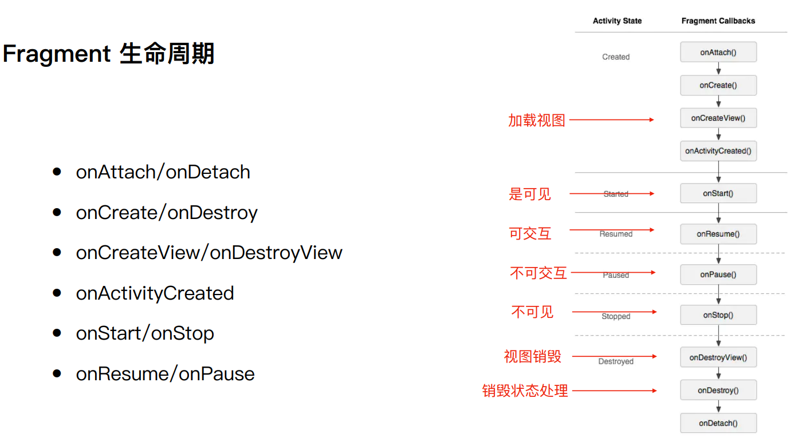

1.   **onAttach/onDetach**：Fragment与Activity绑定/解除绑定
2.   **onCreate/onDestroy**：进行与View无关的初始化才做
3.   **onCreateView/onDestroyView**：渲染出视图布局，进行与View有关的初始化才做
4.   **onActivityCreated**：宿主Activity执行onCreate后调用该方法
5.   **onStart/onStop**：可见/不可见
6.   **onResume/onPause**：可交互/不可交互

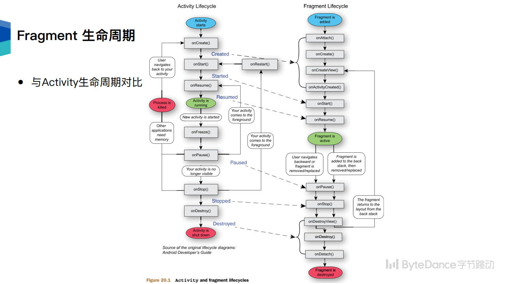

### 1.1.4	Fragment添加到返回栈

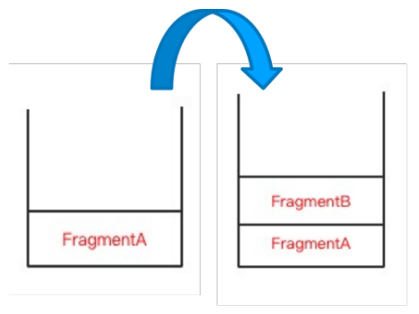

1.   **addToBackStack**：将新的Fragment添加至返回栈，**MainActivity.java**

     ```java
     public class MainActivity extends AppCompatActivity {
     
         private static final String TAG = "MainActivity";
         private Button mReplaceButton;
     
         @Override
         protected void onCreate(Bundle savedInstanceState) {
             super.onCreate(savedInstanceState);
             setContentView(R.layout.activity_main);
     
             mReplaceButton = findViewById(R.id.btn_replace);
             mReplaceButton.setOnClickListener(v->{
                 FragmentManager fragmentManager = getSupportFragmentManager();
     
                 fragmentManager.beginTransaction()
                                 .add(R.id.fragment_container, new MainFragment())
                                 .addToBackStack(null)
                                 .commit();
                 // .addToBackStack(String name): 将Fragment加入到回退栈
                 // 是否使用 取决于 是否要在回退的时候显示上一个Fragment
     
                 mReplaceButton.setVisibility(View.GONE);
             });
         }
     }
     ```

## 1.2	结合 ViewPager 创建多 Tab 界⾯

### 1.2.1	ViewPager的作用

1.   常用于实现**可滑动的多个视图**
2.   容器，类似于**RecyclerView**
3.   需要通过 **Adapter** 配置内容
4.   内容⼀般通过 **Fragment** 实现
5.   可配置 **TabLayout** 或三⽅库添加 **Title**

### 1.2.2	ViewPager + Fragment

1.   在**布局xml** 中添加**ViewPager** ：**fragment_main_layout.xml**

     ```xml
     <?xml version="1.0" encoding="utf-8"?>
     <LinearLayout
         xmlns:android="http://schemas.android.com/apk/res/android"
         android:layout_width="match_parent"
         android:layout_height="match_parent"
         android:orientation="vertical">
         <!--线性布局的对齐方式: android:orientation-->
     
         <!--添加一个ViewPager2-->
         <androidx.viewpager2.widget.ViewPager2
             android:id="@+id/view_pager_main"
             android:layout_width="match_parent"
             android:layout_height="match_parent"/>
     
     </LinearLayout>
     ```

2.   定义**Fragment**

     **fragment_view_animation.xml**

     ```xml
     <?xml version="1.0" encoding="utf-8"?>
     <FrameLayout
         xmlns:android="http://schemas.android.com/apk/res/android"
         android:layout_width="match_parent"
         android:layout_height="match_parent">
     
         <!--显示文本: values/string.xml中名为first_text的变量的值-->
         <TextView
             android:id="@+id/tv_content"
             android:layout_width="wrap_content"
             android:layout_height="wrap_content"
             android:layout_gravity="center"
             android:text="@string/first_text"
             android:textSize="28sp"/>
     
     </FrameLayout>
     ```

     
     **fragment_object_animation.xml**

     ```xml
     <?xml version="1.0" encoding="utf-8"?>
     <FrameLayout
         xmlns:android="http://schemas.android.com/apk/res/android"
         android:layout_width="match_parent"
         android:layout_height="match_parent"
         android:background="#34C724">
     
         <!--显示文本: values/string.xml中名为second_text的变量的值-->
         <TextView
             android:id="@+id/tv_content"
             android:layout_width="wrap_content"
             android:layout_height="wrap_content"
             android:layout_gravity="center"
             android:text="@string/second_text"
             android:textSize="28sp"/>
     </FrameLayout>
     ```

     **fragment_lottie_animation.xml**

     ```xml
     <?xml version="1.0" encoding="utf-8"?>
     <FrameLayout
         xmlns:android="http://schemas.android.com/apk/res/android"
         android:layout_width="match_parent"
         android:layout_height="match_parent"
         android:background="#ff0000">
     
         <!--显示文本: values/string.xml中名为third_text的变量的值-->
         <TextView
             android:id="@+id/tv_content"
             android:layout_width="wrap_content"
             android:layout_height="wrap_content"
             android:layout_gravity="center"
             android:text="@string/third_text"
             android:textSize="28sp"/>
     
     </FrameLayout>
     ```

3.   定义配置页面**Fragment**的**Adapter**：**HelloFragmentViewPagerAdapter.java**

     ```java
     public class HelloFragmentViewPagerAdapter extends FragmentStateAdapter {
         private static final int FRAGMENTS_Count = 3;
         public static final int FRAGMENT_View_Animation = 0;
         public static final int FRAGMENT_Object_Animation = 1;
         public static final int FRAGMENT_Lottie_Animation = 2;
     
         public HelloFragmentViewPagerAdapter(@NonNull Fragment fragment) {
             super(fragment);
         }
     
         // 根据position的值, 判断创建哪一个Fragment
         @NonNull
         @Override
         public Fragment createFragment(int position) {
             switch (position){
                 case FRAGMENT_View_Animation:
                     return new ViewAnimationFragment();
                 case FRAGMENT_Object_Animation:
                     return new ObjectAnimationFragment();
                 case FRAGMENT_Lottie_Animation:
                     return new LottieAnimationFragment();
                 default:
                     return new Fragment();
             }
         }
     
         // 返回当前ViewPager有多少个Fragment
         @Override
         public int getItemCount() {
             return FRAGMENTS_Count;
         }
     }
     ```

4.   为**ViewPager**设置**Adapter**：**MainFragment.java**

     ```java
     public class MainFragment extends Fragment {
         ViewPager2 mViewPager;
     
         @Nullable
         @Override
         public View onCreateView(@NonNull LayoutInflater inflater, @Nullable ViewGroup container, @Nullable Bundle savedInstanceState) {
             View view = inflater.inflate(R.layout.fragment_main_layout, container, false);
     
             mViewPager = view.findViewById(R.id.view_pager_main);
             mViewPager.setAdapter(new HelloFragmentViewPagerAdapter(this));
             return view;
         }
     }
     ```

### 4.2.3	ViewPager + TabLayout

1.   在**布局 xml** 中继续添加 **TabLayout**：**fragment_main_layout.xml**

     ```xml
     <?xml version="1.0" encoding="utf-8"?>
     <LinearLayout
         xmlns:android="http://schemas.android.com/apk/res/android"
         xmlns:app="http://schemas.android.com/apk/res-auto"
         android:layout_width="match_parent"
         android:layout_height="match_parent"
         android:orientation="vertical">
         <!--线性布局的对齐方式: android:orientation-->
     
         <com.google.android.material.tabs.TabLayout
             android:id="@+id/tab_layout"
             android:layout_width="match_parent"
             android:layout_height="40dp"
             app:tabIndicatorColor="@color/black"
             app:tabIndicatorHeight="2dp"
             app:tabIndicatorFullWidth="false"
             app:tabIndicatorGravity="bottom"
             app:tabGravity="center"
             app:layout_constraintTop_toTopOf="parent"/>
     
         <View
             android:id="@+id/divider"
             android:layout_width="match_parent"
             android:layout_height="2dp"
             android:background="#1A000000"/>
     
     
         <!--添加一个ViewPager2-->
         <androidx.viewpager2.widget.ViewPager2
             android:id="@+id/view_pager_main"
             android:layout_width="match_parent"
             android:layout_height="match_parent"/>
     
     </LinearLayout>
     ```

2.   在代码中**对 ViewPager 和 TabLayout 建立关联**：**MainFragment.java**

     ```java
     public class MainFragment extends Fragment {
         private static final String TITLE_View_Animation = "视图动画";
         private static final String TITLE_Object_Animation = "属性动画";
         private static final String TITLE_Lottie_Animation = "Lottie动画";
     
         private final String[] tabTitles = new String[3];
         private ViewPager2 mViewPager;
         private TabLayout mTabLayout;
     
         @Nullable
         @Override
         public View onCreateView(@NonNull LayoutInflater inflater, @Nullable ViewGroup container, @Nullable Bundle savedInstanceState) {
             View view = inflater.inflate(R.layout.fragment_main_layout, container, false);
     
             // 设置ViewPager的Adapter
             mViewPager = view.findViewById(R.id.view_pager_main);
             mViewPager.setAdapter(new HelloFragmentViewPagerAdapter(this));
     
             // 设置标题
             tabTitles[HelloFragmentViewPagerAdapter.FRAGMENT_View_Animation] = TITLE_View_Animation;
             tabTitles[HelloFragmentViewPagerAdapter.FRAGMENT_Object_Animation] = TITLE_Object_Animation;
             tabTitles[HelloFragmentViewPagerAdapter.FRAGMENT_Lottie_Animation] = TITLE_Lottie_Animation;
     
             // 设置TabLayout的监听器
             mTabLayout = view.findViewById(R.id.tab_layout);
             TabLayoutMediator tabLayoutMediator = new TabLayoutMediator(
                     mTabLayout,
                     mViewPager,
                     true,
                     false,
                     (tab, position) -> tab.setText(tabTitles[position]));
             tabLayoutMediator.attach();
             return view;
         }
     }

## 1.3	Fragment/Activity 之间的通信

1.   构造 Fragment 时传递参数（setArguments/getArguments）
2.   通过接口和回调

### 1.3.1	Fragment与Activity之间的通信

#### 1.3.1.1	传参

1.   在**activity_main.xml**中添加一个文本框，用于测试

     ```xml
     <?xml version="1.0" encoding="utf-8"?>
     <FrameLayout xmlns:android="http://schemas.android.com/apk/res/android"
         xmlns:app="http://schemas.android.com/apk/res-auto"
         xmlns:tools="http://schemas.android.com/tools"
         android:layout_width="match_parent"
         android:layout_height="match_parent"
         tools:context=".MainActivity">
     
         <androidx.fragment.app.FragmentContainerView
             android:id="@+id/fragment_hello"
             android:name="com.example.demo.HelloFragment"
             android:layout_width="300dp"
             android:layout_height="400dp"
             android:layout_gravity="center"/>
     
         <!--Fragment容器-->
         <FrameLayout
             android:id="@+id/fragment_container"
             android:layout_width="match_parent"
             android:layout_height="match_parent"/>
     
         <!--后续实现跳转逻辑的一个Button-->
         <Button
             android:id="@+id/btn_replace"
             android:layout_width="120dp"
             android:layout_height="60dp"
             android:layout_marginBottom="40dp"
             android:layout_gravity="bottom|center_horizontal"
             android:text="Replace"/>
     
         <!--用于测试传参的文本框-->
         <TextView
             android:id="@+id/tv_tabs_count"
             android:layout_width="wrap_content"
             android:layout_height="wrap_content"
             android:layout_marginTop="60dp"
             android:layout_gravity="center_horizontal"
             android:visibility="gone"
             android:textSize="32sp" />
     </FrameLayout>
     ```

2.   通过传参为Fragment指定⼀个背景色：**ViewAnimationFragment.java**

     1.   **Fragment**中提供实例化自身对象的静态方法
     2.   **onCreate**中处理传递的参数

     ```java
     public class ViewAnimationFragment extends Fragment {
         private static final String PARAM_Color = "param_color";
         private int mColor = Color.WHITE;
     
         public ViewAnimationFragment(){
         }
     
         public static ViewAnimationFragment newInstance(int color){
             ViewAnimationFragment fragment = new ViewAnimationFragment();
             Bundle args = new Bundle();
             args.putInt(PARAM_Color, color);
             fragment.setArguments(args);
             return fragment;
         }
     
         @Override
         public void onCreate(@Nullable Bundle savedInstanceState) {
             super.onCreate(savedInstanceState);
             if (getArguments() != null) {
                 mColor = getArguments().getInt(PARAM_Color);
             }
         }
     
         @Nullable
         @Override
         public View onCreateView(@NonNull LayoutInflater inflater, @Nullable ViewGroup container, @Nullable Bundle savedInstanceState) {
             View view = inflater.inflate(R.layout.fragment_view_animation, container, false);
             view.setBackgroundColor(mColor);
             return view;
         }
     }
     ```

#### 1.3.1.2	Listener

1.   **宿主Activity**通过**Listener**回调获取当前已创建的**tab数量**：**MainFragment.java**(省略部分见之前的MainFragment.java)

     ```java
     public class MainFragment extends Fragment {
         // ...
         
         // Fragment 中定义⼀个接⼝以及接⼝类型的成员变量
         private MainFragmentListener mListener = null;
         public interface MainFragmentListener{
             void onMultiTabsViewCreated(int tabsCount);
         }
     
         // onAttach 中获取接⼝实例
         @Override
         public void onAttach(@NonNull Context context) {
             super.onAttach(context);
             mListener = (MainFragmentListener) context;
         }
     
         @Nullable
         @Override
         public View onCreateView(@NonNull LayoutInflater inflater, @Nullable ViewGroup container, @Nullable Bundle savedInstanceState) {
             // 创建view, 见之前的MainFragment...
             
             // 按需调⽤改接⼝⽅法进⾏通信
             if(mListener != null){
                 mListener.onMultiTabsViewCreated(adapter.getItemCount());
             }
             return view;
         }
     }
     ```

2.   **宿主Activity**中实现接口方法，执行相关处理：**MainActivity.java**

     ```java
     public class MainActivity extends AppCompatActivity
         implements MainFragment.MainFragmentListener {
     
         @Override
         public void onMultiTabsViewCreated(int tabsCount) {
             TextView tv = findViewById(R.id.tv_tabs_count);
             tv.setText(tabsCount + " tabs created");
             tv.setVisibility(View.VISIBLE);
         }
     }
     ```

### 1.3.2	Master Detail(自学)

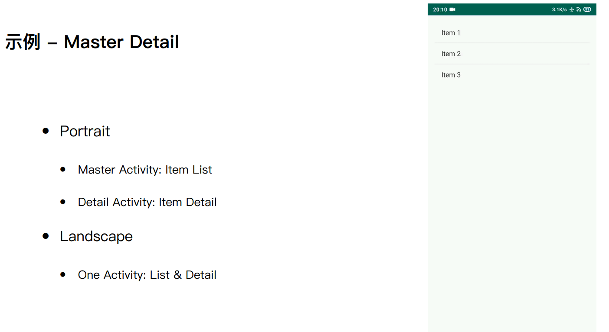

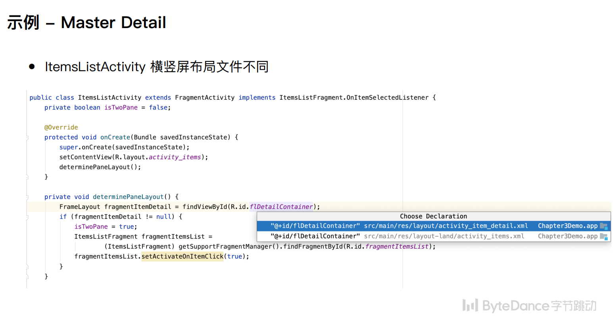

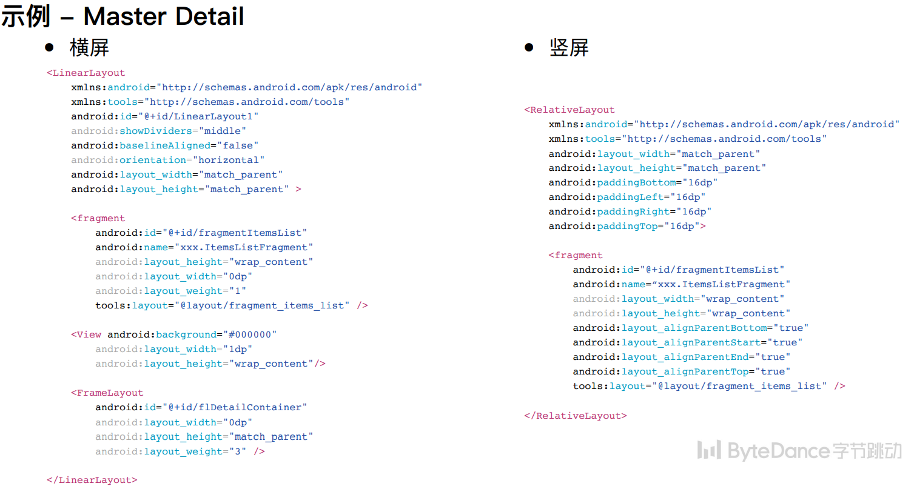

## 1.4	总结

1.   Fragment: 灵活，可重⽤，迷你 Activity
2.   生命周期、静态/动态添加⽤法
3.   ViewPager & Fragment
4.   和 Activity 通信：Argument、Listener

# 二、Animation

## 2.1	视图动画

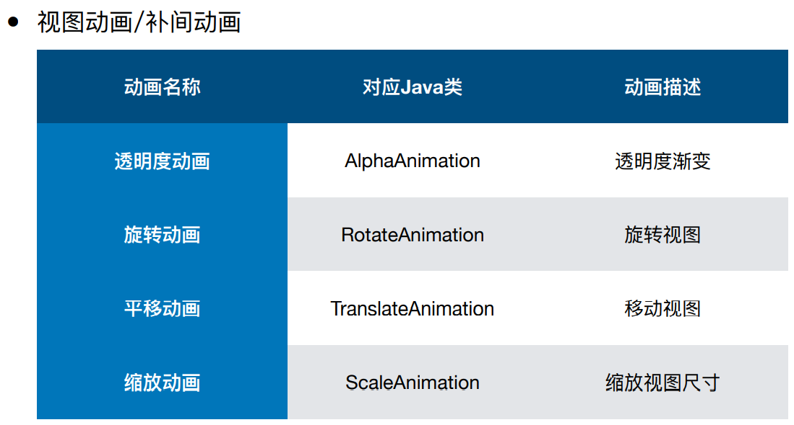

### 2.1.1	示例

1.   Java方式设置

     ```java
     private static final long ROTATE_Duration = 2000;
     private static final float ROTATE_Start_Degree = 0f;
     private static final float ROTATE_End_Degree = 360f;
     private static final float ROTATE_Pivot = 0.5f;
     
     private void initAnimation(){
         mRotateAnimation = new RotateAnimation(
             ROTATE_Start_Degree, ROTATE_End_Degree,
             Animation.RELATIVE_TO_SELF, ROTATE_Pivot, //x轴旋转中心
             Animation.RELATIVE_TO_SELF, ROTATE_Pivot  //y轴旋转中心
         );
     
         // 设置动画的持续时间, 重复次数, 重复模式
         mRotateAnimation.setDuration(ROTATE_Duration);
         mRotateAnimation.setRepeatCount(Animation.INFINITE);
         mRotateAnimation.setRepeatMode(Animation.REVERSE);
     
         // 设置监听器
         mRotateAnimation.setAnimationListener(new Animation.AnimationListener() {
             @Override
             public void onAnimationStart(Animation animation) {
                 Log.d(TAG, "onAnimationStart");
             }
     
             @Override
             public void onAnimationEnd(Animation animation) {
                 Log.d(TAG, "onAnimationEnd");
             }
     
             @Override
             public void onAnimationRepeat(Animation animation) {
                 Log.d(TAG, "onAnimationRepeat");
             }
         });
     }
     ```

     

2.   配合XML方式设置

     **fragment_view_animation.xml**

     ```xml
     <?xml version="1.0" encoding="utf-8"?>
     <FrameLayout
         xmlns:android="http://schemas.android.com/apk/res/android"
         android:layout_width="match_parent"
         android:layout_height="match_parent">
     
         <!--显示一张图片-->
         <ImageView
             android:id="@+id/iv_robot"
             android:layout_width="200dp"
             android:layout_height="200dp"
             android:layout_gravity="center"
             android:src="@mipmap/ic_launcher_round" />
     
     </FrameLayout>
     ```
     
     **ViewAnimationFragment.java**
     
     ```java
     public class ViewAnimationFragment extends Fragment {
         private static final String TAG = "ViewAnimationFragment";
     
         private static final String PARAM_Color = "param_color";
         private static final long ROTATE_Duration = 2000;
         private static final float ROTATE_Start_Degree = 0f;
         private static final float ROTATE_End_Degree = 360f;
         private static final float ROTATE_Pivot = 0.5f;
     
         private int mColor = Color.WHITE;
         private ImageView mRobot;
     
         // 动画部分: 旋转动画
         private RotateAnimation mRotateAnimation;
     
         public ViewAnimationFragment(){
         }
     
         public static ViewAnimationFragment newInstance(int color){
             ViewAnimationFragment fragment = new ViewAnimationFragment();
             Bundle args = new Bundle();
             args.putInt(PARAM_Color, color);
             fragment.setArguments(args);
             return fragment;
         }
     
         @Override
         public void onCreate(@Nullable Bundle savedInstanceState) {
             super.onCreate(savedInstanceState);
             Bundle args = getArguments();
             if(args != null){
                 int givenColor = args.getInt(PARAM_Color);
                 mColor = (givenColor != 0) ? givenColor : mColor;
             }
         }
     
         @Nullable
         @Override
         public View onCreateView(@NonNull LayoutInflater inflater, @Nullable ViewGroup container, @Nullable Bundle savedInstanceState) {
             View view = inflater.inflate(R.layout.fragment_view_animation, container, false);
             view.setBackgroundColor(mColor);
             mRobot = view.findViewById(R.id.iv_robot);
             return view;
         }
     
         @Override
         public void onResume() {
             super.onResume();
             // 启动动画
             initAnimation();
             if(mRobot != null){
                 mRobot.startAnimation(mRotateAnimation);
             }
         }
     
         @Override
         public void onPause() {
             super.onPause();
             // 动画不为空, 且动画已经启动, 则停止动画
             if(mRotateAnimation != null && mRotateAnimation.hasStarted()){
                 mRotateAnimation.cancel();
             }
         }
     
         private void initAnimation(){
             mRotateAnimation = new RotateAnimation(
                     ROTATE_Start_Degree, ROTATE_End_Degree,
                     Animation.RELATIVE_TO_SELF, ROTATE_Pivot, //x轴旋转中心
                     Animation.RELATIVE_TO_SELF, ROTATE_Pivot  //y轴旋转中心
             );
     
             // 设置动画的持续时间, 重复次数, 重复模式
             mRotateAnimation.setDuration(ROTATE_Duration);
             mRotateAnimation.setRepeatCount(Animation.INFINITE);
             mRotateAnimation.setRepeatMode(Animation.REVERSE);
     
             // 设置监听器
             mRotateAnimation.setAnimationListener(new Animation.AnimationListener() {
                 @Override
                 public void onAnimationStart(Animation animation) {
                     Log.d(TAG, "onAnimationStart");
                 }
     
                 @Override
                 public void onAnimationEnd(Animation animation) {
                     Log.d(TAG, "onAnimationEnd");
                 }
     
                 @Override
                 public void onAnimationRepeat(Animation animation) {
                     Log.d(TAG, "onAnimationRepeat");
                 }
             });
         }
     }
     ```

### 2.1.2	视图动画的属性

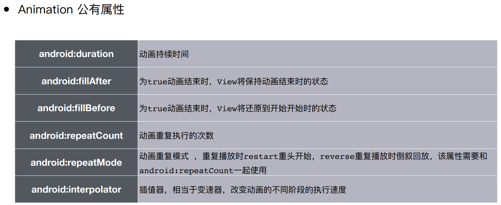

## 2.2	属性动画

### 2.2.1	属性动画 vs 视图动画

1.   属性动画：**android.animation**
     1.   基于属性的动画
     2.   ⼀切可以连续变化的属性都是动画的元素
     3.   实现⼀种复杂动画，就是将动画拆解成不同属性组合的过程
2.   视图动画：**android.view.animation**
     1.   只能对 View 做动画
     2.   只能对 View 的某些绘制属性做动画
     3.   只是视觉效果

### 2.2.2	属性动画的角色构成

1.   **Property**：alpha, scaleX, scaleY, rotation, translationX, translationY
2.   **参数**：StartValue, EndValue, Duration
3.   **RepeatCount**：number, infinite
4.   **RepeatMode**：restart, reverse
5.   **TypeEvaluator**：IntEvaluator, ArgbEvaluator
6.   **Interpolator**：linear/accelerate/decelerate

### 2.2.3	Animator：单个属性动画

#### 2.2.3.1	fragment_object_animation.xml

```xml
<?xml version="1.0" encoding="utf-8"?>
<FrameLayout
    xmlns:android="http://schemas.android.com/apk/res/android"
    android:layout_width="match_parent"
    android:layout_height="match_parent"
    android:background="#34C724">

    <!--显示一张图片-->
    <ImageView
        android:id="@+id/iv_robot"
        android:layout_width="200dp"
        android:layout_height="200dp"
        android:layout_gravity="center"
        android:src="@mipmap/ic_launcher_round"/>
</FrameLayout>
```

#### 2.2.3.2	ObjectAnimationFragment.java

```java
public class ObjectAnimationFragment extends Fragment {
    private static final String PARAM_Color = "param_color";
    private int mColor = Color.WHITE;

    private ImageView mRobot;

    // 属性动画类
    private ObjectAnimator mAnimator;
    // 当前播放的时哪一个动画
    private int mAnimationType = ALPHA_Animation_Type;
    // 每个动画的重复次数, 持续时间
    private static final int ANIMATION_Repeat_Count = 1;
    private static final long ANIMATION_Duration = 2000;
    // 透明度动画
    private static final int ALPHA_Animation_Type = 0;
    private static final float ALPHA_Start = 1f;
    private static final float ALPHA_End = 0f;

    public ObjectAnimationFragment(){
    }


    // ObjectAnimationFragment加载视图时调用
    @Nullable
    @Override
    public View onCreateView(@NonNull LayoutInflater inflater, @Nullable ViewGroup container, @Nullable Bundle savedInstanceState) {
        View view = inflater.inflate(R.layout.fragment_view_animation, container, false);
        mRobot = view.findViewById(R.id.iv_robot);
        return view;
    }

    // ObjectAnimationFragment可交互时调用
    @Override
    public void onResume() {
        super.onResume();
        startAnimation();
    }
    // 创建动画类,并开始动画
    private void startAnimation(){
        // 如果图片不存在, 则直接返回
        if(mRobot == null) return;
        initAlphaAnimation();
        mAnimator.start();
    }
    // 初始化动画类
    private void initAlphaAnimation(){
        // 设置属性动画的相关参数
        mAnimator = ObjectAnimator.ofFloat(
                mRobot, "alpha",
                ALPHA_Start, ALPHA_End, ALPHA_Start);

        mAnimator.setDuration(ANIMATION_Duration);
        mAnimator.setRepeatCount(ANIMATION_Repeat_Count);
        mAnimator.setRepeatMode(ValueAnimator.RESTART);
    }

    // ViewAnimationFragment不可交互时调用
    @Override
    public void onPause() {
        super.onPause();
        cancelAnimation();
    }
    // 将所有动画类删除
    private void cancelAnimation(){
        // 动画不为空, 且动画已经启动, 则停止动画
        if(mAnimator != null && mAnimator.isRunning()){
            mAnimator.cancel();
        }
    }
}
```

### 2.2.4	AnimatorSet：多个属性动画之间的切换

```java
public class ObjectAnimationFragment extends Fragment {
    private static final String PARAM_Color = "param_color";
    private int mColor = Color.WHITE;

    private ImageView mRobot;

    // 属性动画类
    private AnimatorSet mAnimatorSet;
    // 当前播放的时哪一个动画
    private int mAnimationType = ROTATE_Animation_Type;
    // 每个动画的重复次数, 持续时间
    private static final int ANIMATION_Repeat_Count = 1;
    private static final long ANIMATION_Duration = 2000;
    // 透明度动画
    private ObjectAnimator mAlphaAnimator;
    private static final int ALPHA_Animation_Type = 0;
    private static final float ALPHA_Start = 1f;
    private static final float ALPHA_End = 0f;
    // 旋转动画
    private ObjectAnimator mRotateAnimator;
    private static final int ROTATE_Animation_Type = 1;
    private static final float ROTATE_Start_Degree = 0f;
    private static final float ROTATE_End_Degree = 360f;
    // 移动动画
    private ObjectAnimator mTranslateXAnimator;
    private static final int TRANSLATE_Animation_Type = 2;
    private static final float TRANSLATE_XDelta_Start = 0f;
    private static final float TRANSLATE_XDelta_End = 100f;
    // 缩放视图动画
    private ObjectAnimator mScaleXAnimator;
    private static final int SCALE_Animation_Type = 3;
    private static final float SCALE_X_Start = 1f;
    private static final float SCALE_X_End = 1.5f;

    public ObjectAnimationFragment(){ }

    // ObjectAnimationFragment加载视图时调用
    @Nullable
    @Override
    public View onCreateView(@NonNull LayoutInflater inflater, @Nullable ViewGroup container, @Nullable Bundle savedInstanceState) {
        View view = inflater.inflate(R.layout.fragment_view_animation, container, false);
        mRobot = view.findViewById(R.id.iv_robot);
        return view;
    }

    // ObjectAnimationFragment可交互时调用
    @Override
    public void onResume() {
        super.onResume();
        startAnimation();
    }
    // 创建AnimatorSet,并开始动画
    private void startAnimation(){
        // 如果图片不存在, 则直接返回
        if(mRobot == null) return;
        // 创建动画类
        initAlphaAnimation();
        initRotateAnimation();
        initTranslateXAnimation();
        initScaleXAnimation();
        // 创建AnimatorSet
        mAnimatorSet = new AnimatorSet();
        mAnimatorSet.playSequentially(mAlphaAnimator, mRotateAnimator, mTranslateXAnimator, mScaleXAnimator);
        mAnimatorSet.start();
        mAnimatorSet.addListener(new Animator.AnimatorListener() {
            @Override
            public void onAnimationStart(Animator animator) { }

            @Override
            public void onAnimationEnd(Animator animator) {
                // 动画序列结束后, 重新开始播放动画序列
                mAnimatorSet.start();
            }

            @Override
            public void onAnimationCancel(Animator animator) { }

            @Override
            public void onAnimationRepeat(Animator animator) { }
        });
    }
    // 初始化动画类
    private void initAlphaAnimation(){
        // 设置属性动画的相关参数
        mAlphaAnimator = ObjectAnimator.ofFloat(
                mRobot, "alpha",
                ALPHA_Start, ALPHA_End, ALPHA_Start);

        mAlphaAnimator.setDuration(ANIMATION_Duration);
        mAlphaAnimator.setRepeatCount(ANIMATION_Repeat_Count);
        mAlphaAnimator.setRepeatMode(ValueAnimator.RESTART);
        mAlphaAnimator.setInterpolator(new LinearInterpolator());
    }
    private void initRotateAnimation(){
        mRotateAnimator = ObjectAnimator.ofFloat(
                mRobot, "rotation",
                ROTATE_Start_Degree, ROTATE_End_Degree, ROTATE_Start_Degree);

        mRotateAnimator.setDuration(ANIMATION_Duration);
        mRotateAnimator.setRepeatCount(ANIMATION_Repeat_Count);
        mRotateAnimator.setRepeatMode(ValueAnimator.RESTART);
        mRotateAnimator.setInterpolator(new LinearInterpolator());
    }
    private void initTranslateXAnimation(){
        mTranslateXAnimator = ObjectAnimator.ofFloat(
                mRobot, "translationX",
                TRANSLATE_XDelta_Start, TRANSLATE_XDelta_End, TRANSLATE_XDelta_Start);

        mTranslateXAnimator.setDuration(ANIMATION_Duration);
        mTranslateXAnimator.setRepeatCount(ANIMATION_Repeat_Count);
        mTranslateXAnimator.setRepeatMode(ValueAnimator.RESTART);
        mTranslateXAnimator.setInterpolator(new LinearInterpolator());
    }
    private void initScaleXAnimation(){
        mScaleXAnimator = ObjectAnimator.ofFloat(
                mRobot, "scaleX",
                SCALE_X_Start, SCALE_X_End, SCALE_X_Start);

        mScaleXAnimator.setDuration(ANIMATION_Duration);
        mScaleXAnimator.setRepeatCount(ANIMATION_Repeat_Count);
        mScaleXAnimator.setRepeatMode(ValueAnimator.RESTART);
        mScaleXAnimator.setInterpolator(new LinearInterpolator());
    }

    // ViewAnimationFragment不可交互时调用
    @Override
    public void onPause() {
        super.onPause();
        cancelAnimation();
    }
    // 将所有动画类删除
    private void cancelAnimation(){
        // 动画不为空, 且动画已经启动, 则停止动画
        mAnimatorSet.cancel();
        if(mAlphaAnimator != null && mAlphaAnimator.isRunning()){
            mAlphaAnimator.cancel();
        }
        if(mRotateAnimator != null && mRotateAnimator.isRunning()){
            mRotateAnimator.cancel();
        }
        if(mTranslateXAnimator != null && mTranslateXAnimator.isRunning()){
            mTranslateXAnimator.cancel();
        }
        if(mScaleXAnimator != null && mScaleXAnimator.isRunning()){
            mScaleXAnimator.cancel();
        }
    }
}
```


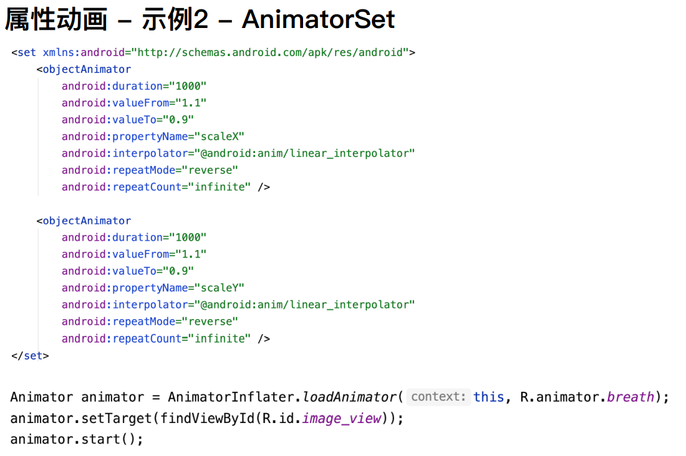

### 2.2.5	特点，xml语法

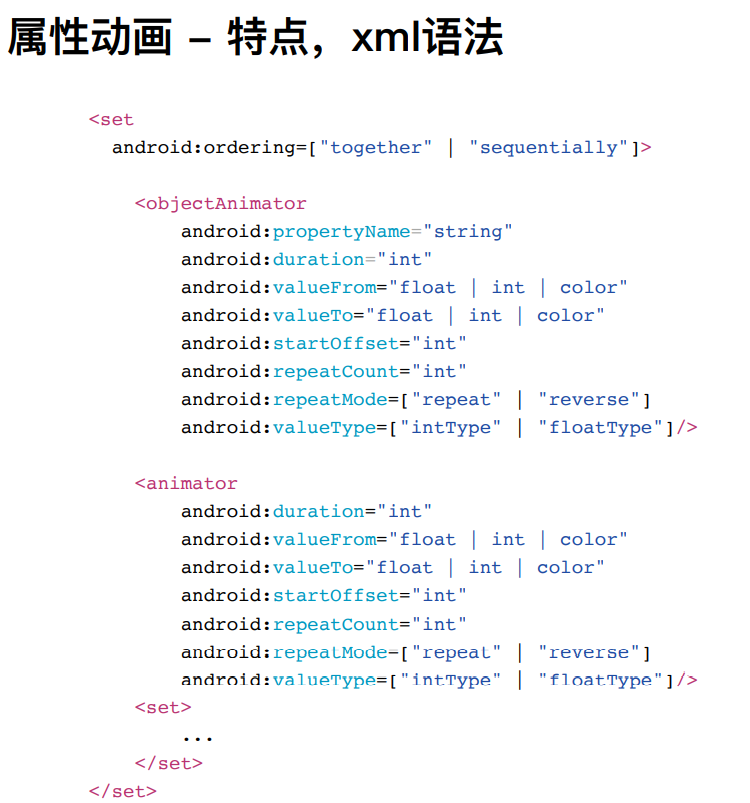

### 2.2.6	属性动画核心 - ValueAnimator

1.   控制某个数值，在某个时间内，在某个区间内进行规律变化

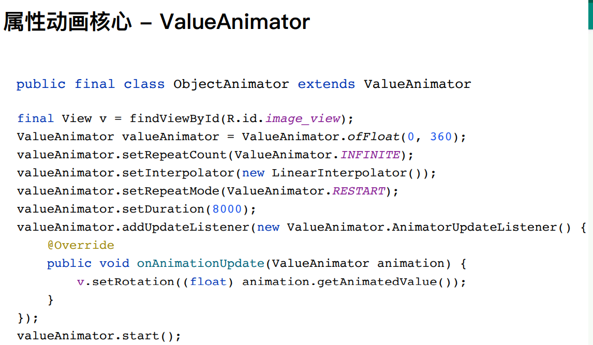

### 2.2.7	属性动画原理

1.   插值器：决定变化的规律

2.   估值器：决定变化的具体数值

     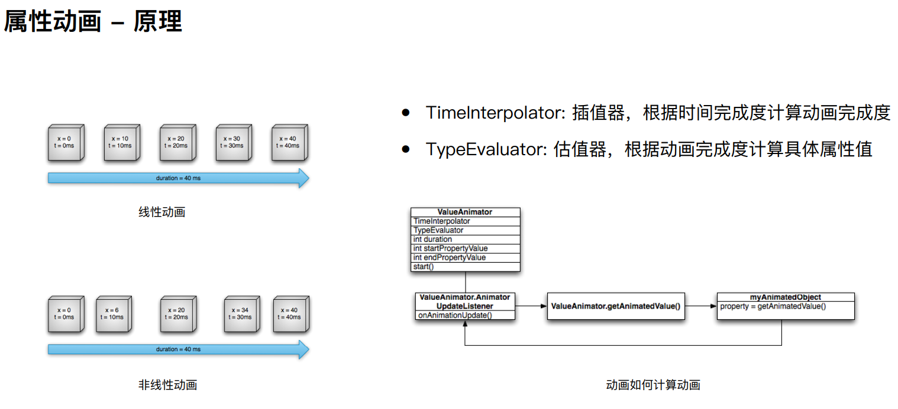

3.   常用系统内置插值器

     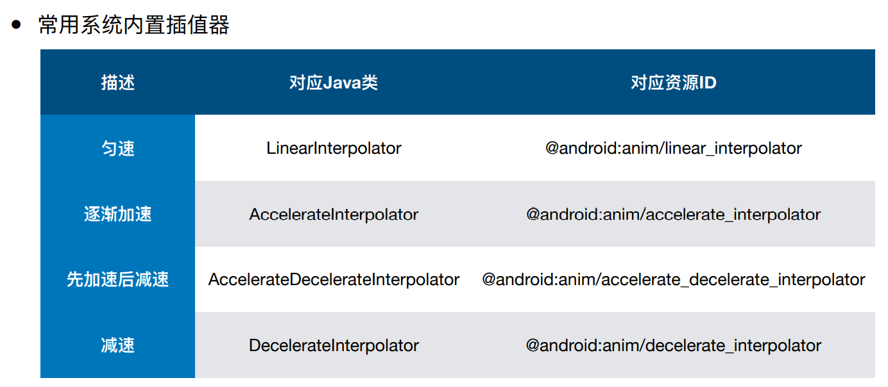

### 2.2.8	属性动画 - 注意

1.   使用ObjectAnimator 时，⽬标属性必须同时具备getter()及setter() ⽅法
2.   ObjectAnimator 操作对象宿主⻚⾯退出前台或销毁时，需保证动画任务得到妥善处理，防⽌内存泄漏

### 2.2.9	属性动画 - 自定义属性

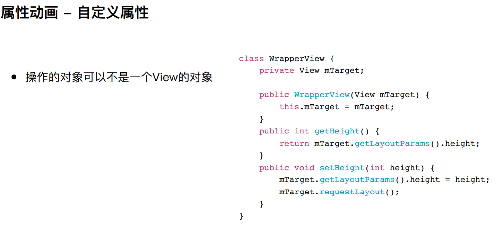

## 2.3	Activity 切换动画

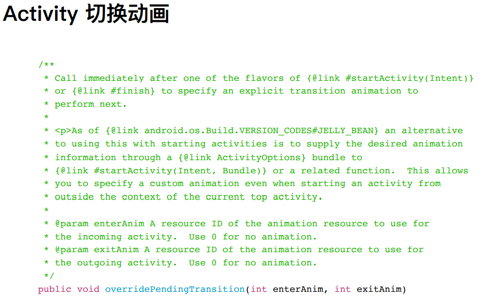

### 2.3.1	示例 FadeInOut

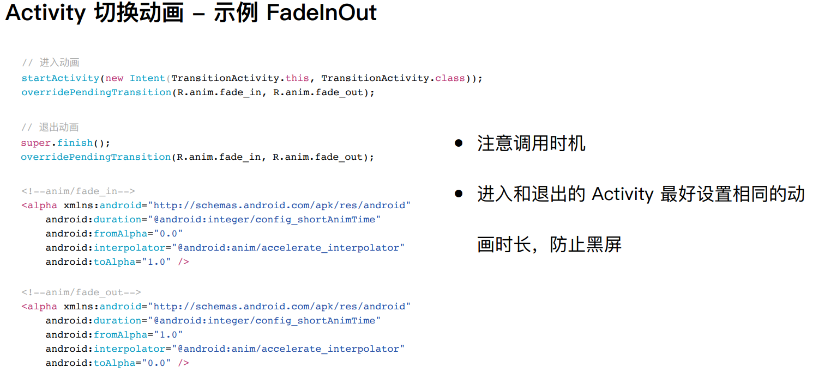

## 2.4	逐帧动画/Drawable 动画

1.   逐帧动画可以被当作⼀种特殊的drawable对象
2.   逐帧动画会按次序播放⼀系列图⽚
3.   逐帧动画会⼀次性将所有图⽚加载到内存中，会有OOM⻛险

### 2.4.1	示例 AnimationDrawable

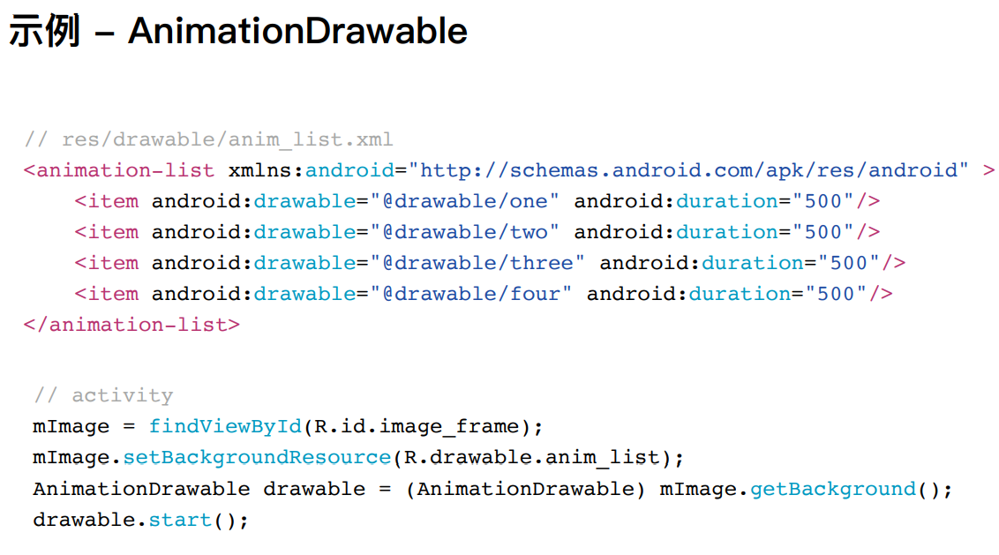

## 2.5	Lottie

1.   airbnb公司的开源库
2.   可以直接导入AE制作的动画素材
3.   本质是将所有动画元素抽象成绘制属性

### 2.5.1	示例

1.   在**app/build.gradle**中，添加依赖

     ```groovy
     dependencies {
         //...
     	implementation 'com.airbnb.android:lottie:3.4.2'
     }
     ```

2.   添加资源**raw/lottie_raw_rocket.json**

     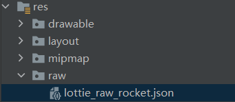

3.   修改**fragment_lottie_animation.xml**

     ```xml
     <?xml version="1.0" encoding="utf-8"?>
     <FrameLayout
         xmlns:android="http://schemas.android.com/apk/res/android"
         xmlns:app="http://schemas.android.com/apk/res-auto"
         android:layout_width="match_parent"
         android:layout_height="match_parent"
         android:background="#ff0000">
     
         <com.airbnb.lottie.LottieAnimationView
             android:id="@+id/lottieView"
             android:layout_width="200dp"
             android:layout_height="200dp"
             android:layout_gravity="center"
             app:lottie_rawRes="@raw/lottie_raw_rocket"
             app:lottie_autoPlay="true"
             app:lottie_loop="true"/>
     
     </FrameLayout>
     ```

4.   修改**LottieAnimationFragment.java**

     ```java
     public class LottieAnimationFragment extends Fragment {
         private static final String PARAM_Color = "param_color";
     
         public LottieAnimationFragment(){
         }
     
     
         @Nullable
         @Override
         public View onCreateView(@NonNull LayoutInflater inflater, @Nullable ViewGroup container, @Nullable Bundle savedInstanceState) {
             return inflater.inflate(R.layout.fragment_lottie_animation, container, false);
         }
     }
     ```

# 三、总结

1.   动画意义
2.   属性动画
     1.   ObjectAnimator & AnimatorSet 
     2.   原理 
     3.   vs 视图动画 
3.   Lottie