# 目录

[TOC]

# 一、进程与线程

## 1.1	进程、线程

1.   进程：资源分配的最小单位 ==> 一个软件
     1.   如一辆列车
2.   线程：CPU调度的最小单位 ==> 一个软件的各个功能
     1.   如一辆列车的列车长
3.   主要区别：
     1.   一个进程可以有多个线程
     2.   同一个进程的多个线程，共享进程的资源

## 1.2	Android中的主线程

1.   启动应用时，系统会为该应用创建⼀个称为“main”（主线程）的执行线程。这个线程负责所有和UI界⾯有关的显示、以及响应UI事件监听任务，因此又称座UI线程。
2.   划重点：所有跟**ui相关的操作**都必须放在**主线程**

## 1.3	ANR 拓展

**ANR**：Application Not Responding

1.   程序中所有的组件都会运行在UI线程中，所以必须保证该线程的⼯作效率
2.   UI线程⼀旦出现问题，就会降低⽤户体验
3.   如在UI线程中进行耗时操作，如下载文件、查询数据库等就会阻塞UI线程，长时间⽆法响应UI交互操作，给用户带来“卡屏”、“死机”的感觉

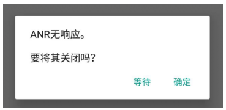

# 二、Handler机制

## 2.1	Handler机制

Handler机制为Android系统解决了以下两个问题：

1.   任务调度
2.   线程通信

## 2.2	Handler的使用场景

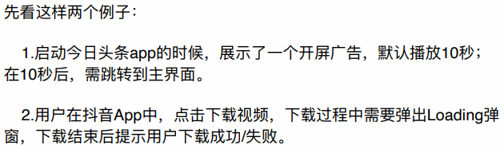

## 2.3	Handler机制简介

本质是消息机制，负责消息的分发以及处理

1.   通俗点来说，每个线程都有⼀个“流⽔线”，我们可往这条流⽔线上放“消息”，流⽔线的末端有⼯作⼈员会去处理这些消息。因为流⽔线是单线的，所有消息都必须按照先来后到的形式依次处理
2.   放什么消息以及怎么处理消息，是需要我们去⾃定义的。Handler机制相当于提供了这样的⼀套模式，我们只需要“放消息到流⽔线上”，“编写这些消息的处理逻辑”就可以了，流⽔线会源源不断把消息运送到末端处理。
3.   最后注意重点：每个线程只有⼀个“流⽔线”，他的基本范围是线程，负责线程内的通信以及线程间的通信。
4.   **每个线程可以看成⼀个厂房，每个厂房只有⼀个生产线。**

## 2.4	Handler原理：UI线程与消息队列机制

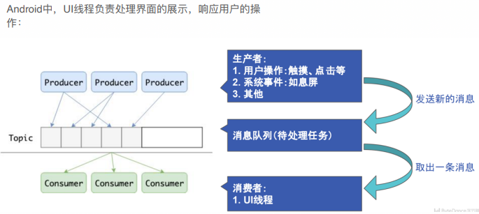

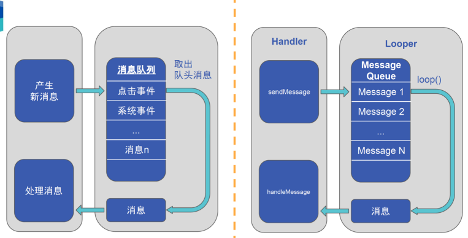

1.   **Message**：消息，由MessageQueue统⼀队列，然后交由Handler处理
2.   **MessageQueue**：消息队列，⽤来存放Handler发送过来Message，并且按照先⼊先出的规则执⾏
3.   **Handler**：处理者，负责发送和处理Message每个Message必须有⼀个对应的Handler
4.   **Looper**：消息轮询器，不断的从MessageQueue中抽取Message并执⾏

## 2.5	Handler常用方法

```java
// ⽴即发送消息
public final boolean sendMessage(Message msg)
public final boolean post(Runnable r);

// 延时发送消息: 马上发送消息, 但是会延迟处理
public final boolean sendMessageDelayed(Message msg, long delayMillis)
public final boolean postDelayed(Runnable r, long delayMillis);

// 定时发送消息
public boolean sendMessageAtTime(Message msg, long uptimeMillis);
public final boolean postAtTime(Runnable r, long uptimeMillis);
public final boolean postAtTime(Runnable r, Object token, long uptimeMillis);

// 移除消息
public final void removeCallbacks(Runnable r);
public final void removeMessages(int what); // what字段:给消息的命名
public final void removeCallbacksAndMessages(Object token); // token=null: 表示移除所有消息
```

## 2.6	Handler的使用

1.   **调度Message**：
     1.   建⼀个**Handler**，实现**handleMessage()**⽅法
     2.   在适当的时候给上面的Handler发送消息
2.   **调度Runnable**：
     1.   建⼀个**Handler**，然后直接调度**Runnable**即可
3.   **取消调度**：
     1.   通过**Handler取消**已经发送过的**Message/Runnable**

## 2.7	Handler的使用举例

### 2.7.1	发送Runnable对象

>1.   新建一个**Handler**对象：new Handler()
>2.   新建一个**Runnable**对象
>     1.   重写**run()**方法，表示该**Runnable**对象要做什么事情
>3.   调用**Handler**对象的**post()**方法，将**Runnable**对象发送出去

启动今日头条app的时候，展示了一个开屏广告，默认播放3秒；在3秒后，需跳转到主界面

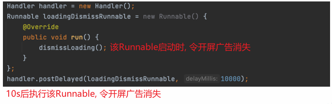

如果用户点击了跳过，则应该直接进入主界面

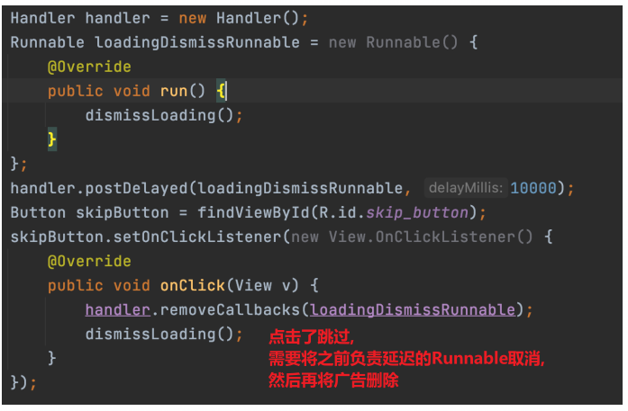

### 2.7.2	发送Message对象

>1.   新建一个**Handler**对象：new Handler(Looper.getMainLopper())
>     1.   重写**handlerMessage()**方法，表示收到不同**Message**时做出的反应
>2.   调用**Handler**对象的**post()**方法，将**Message**对象发送出去
>     1.   可以直接发送msg.what，来代表一个msg

用户在抖音App中，点击下载视频，下载过程中需要弹出Loading窗，下载结束后提示用户下载成功/失败

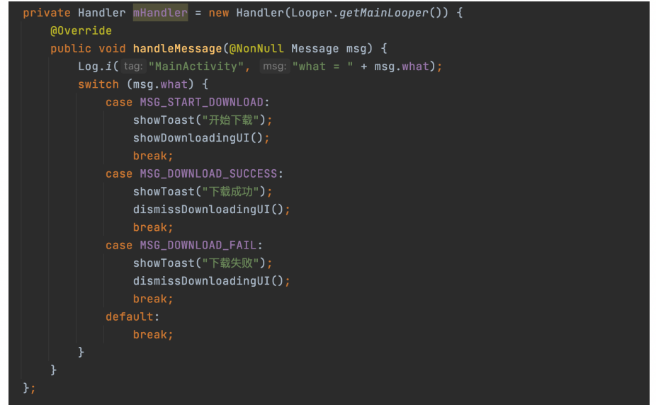

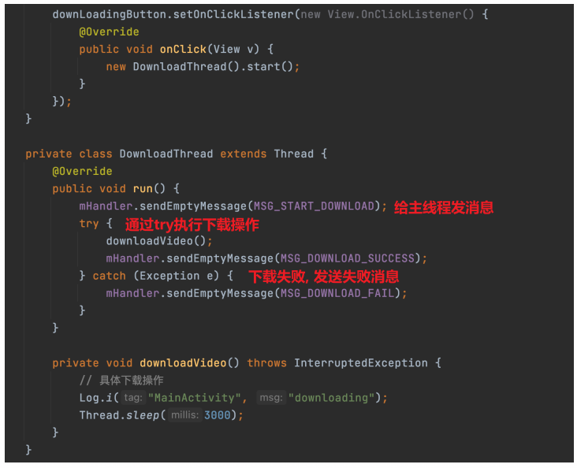

### 2.7.3	辨析Runnable与Message

1. Runnable会被打包成Message，所以实际上Runnable也是Message
2. 没有明确的界限，取决于使⽤的⽅便程度

以下两段代码等价

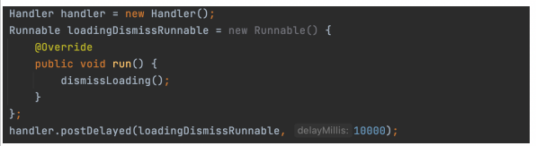

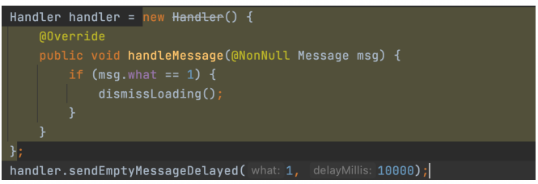

## 2.8	Handler总结

1.   **Handler**就是**Android**中的消息队列机制的⼀个应用，可理解为是⼀种⽣产者消费者的模型，解决了**Android**中的线程内&线程间的任务调度问题
2.   **Handler**机制的本质就是⼀个死循环，待处理的**Message**加到队列⾥⾯，**Looper**负责轮询执⾏
3.   掌握**Handler**的基本⽤法：立即/延时/定时发送消息、取消消息

# 三、Android中的多线程

## 3.1	Thread

>1.   新建一个类，继承**Thread**，重写其**run()**方法
>2.   调用时，先新建一个实例
>     1.   可以传入一个String参数，表示线程的名字
>3.   调用**tread.start()**方法，开启线程

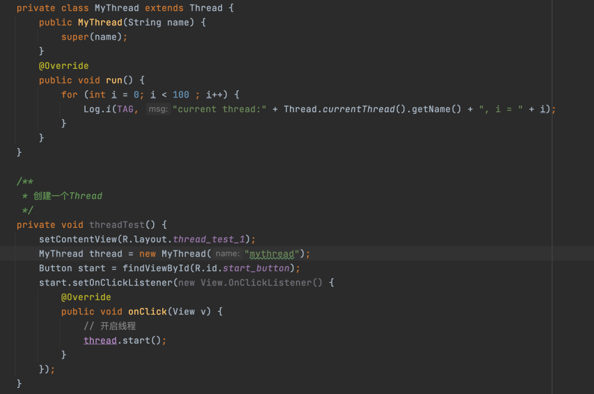

## 3.2	ThreadPool

### 3.2.1	为什么要使用线程池

1. 线程的创建和销毁的开销都比较⼤，降低资源消耗
2. 线程是可复用的，提⾼响应速度
3. 对多任务多线程进行管理，提高线程的可管理性

### 3.2.2	几种常用的线程池

1.   单个任务处理时间比较短且任务数量很大（多个线程的线程池）：
     1.   **FixedThreadPool** 定长线程池
     2.   **CachedThreadPool** 可缓存线程池
2.   执行定时任务（定时线程池）：
     1.   **ScheduledThreadPool** 定时任务线程池
3.   特定单项任务（单线程线程池）：
     1.   **SingleThreadPool** 只有⼀个线程的线程池

### 3.2.3	使用示例

1.   接口**Java.util.concurrent.ExecutorService**表述了异步执行的机制，并且可以让任务在⼀组线程内执行
2.   重要函数：
     1.   **execute(Runnable)**：向线程池提交⼀个任务
     2.   **submit(Runnbale/Callable)**：有返回值（Future），可以查询任务的执行状态和执行结果
     3.   **shutdown()** ：关闭线程池

>   1.   创建一个线程池**ExecutorService**的示例
>   2.   创建一个**Runnable**对象，并编写其业务逻辑
>   3.   通过**service.execute()**方法，向线程池提交任务

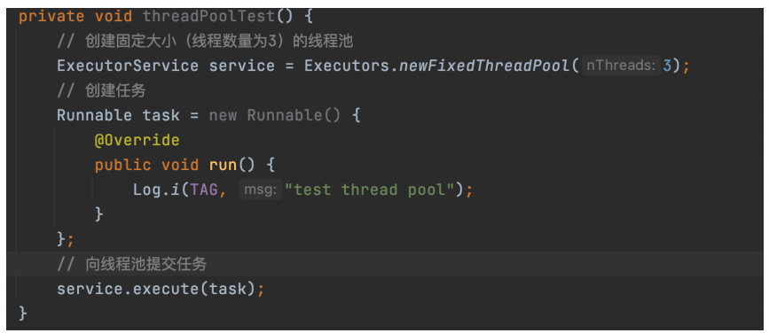

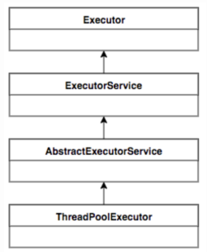

## 3.3	AsyncTask(已弃用)

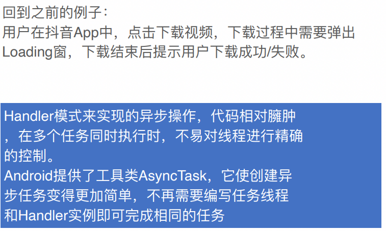

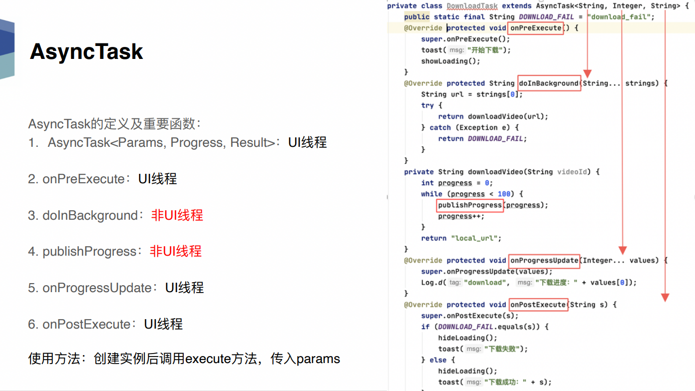

## 3.4	HandlerThread

1.   **HandlerThread**的本质：继承**Thread**类 & 封装**Handler**类
     1.   试想⼀款股票交易App：
          1.   由于因为股票的行情数据都是实时变化的
          2.   所以我们软件需要每隔⼀定时间向服务器请求行情数据
     2.   该轮询调度需要放到**子线程**，由Handler + Looper去处理和调度
2.   **HandlerThread**是Android API提供的⼀个⽅便、便捷的类，使用它我们可以快速的创建⼀个**带有Looper的线程**。**Looper**可以用来创建Handler实例

>   1.   创建一个**HandlerThread**对象
>   2.   使用**handlerThread.start()**方法，运行线程
>   3.   通过**handlerThread.getLooper()**方法，获取该线程的**Looper**
>   4.   通过**Looper**实例创建**Handler**，将**Handler**与该线程关联

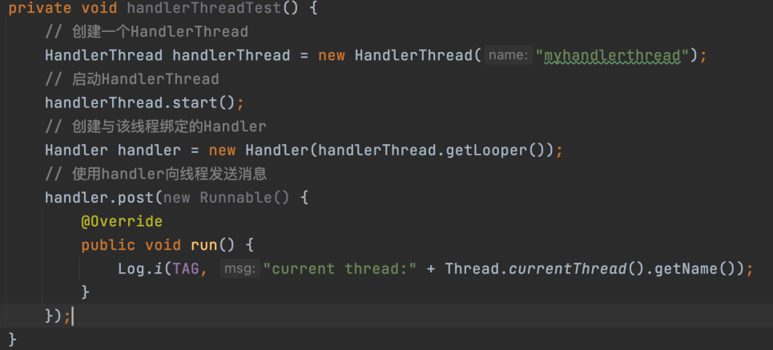

>   **HandlerThread**的源码
>
>   1.   **onLooperPrepared()**：
>   2.   **run()**：运行该线程
>   3.   **getThreadHandler()**：
>   4.   **quit()**和**quitSafely()**：停止该线程

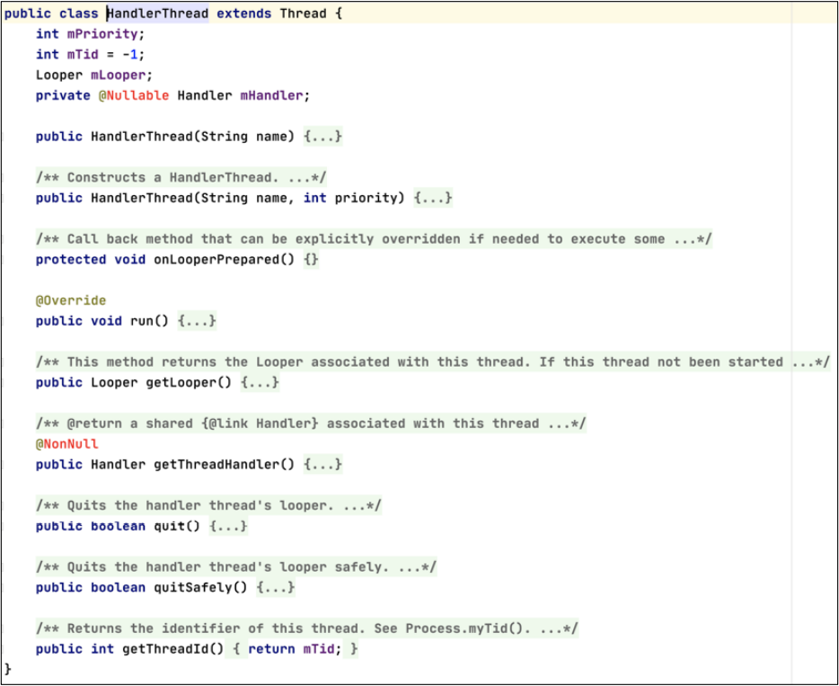

## 3.5	IntentService(不常用, 自学)

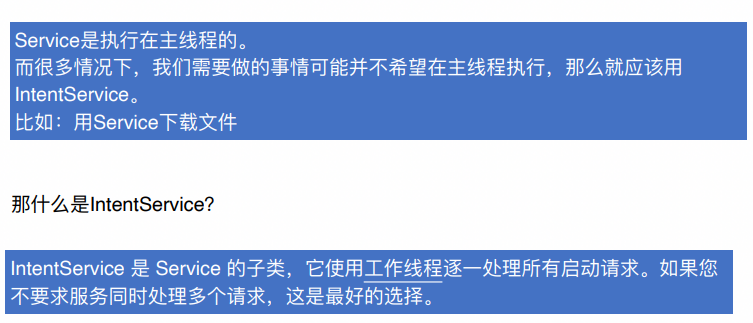

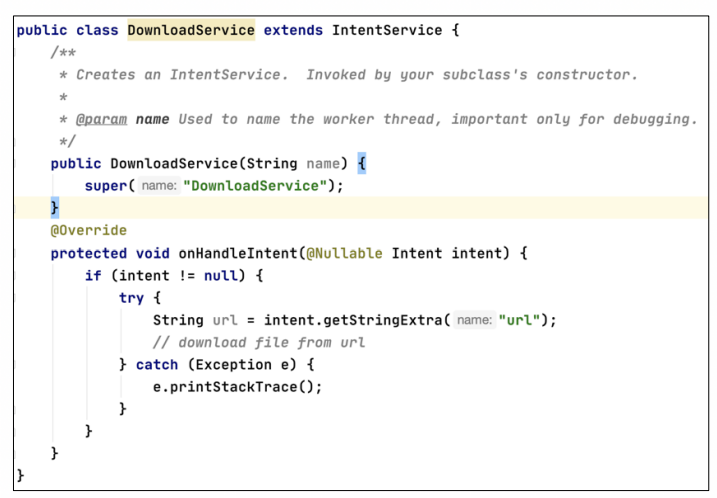

## 3.6	Android多线程总结

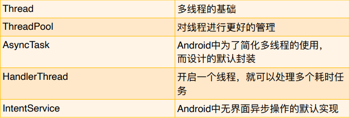

# 四、自定义View

## 4.1	View绘制的三个重要步骤

1.   **Measure**：测量宽高
2.   **Layout**：确定位置
3.   **Draw**：绘制形状
4.   举例说明： 
     1.   首先画⼀个100 x 100的照片框，需要尺子测量出宽高的长度（measure过程）
     2.   然后确定照片框在屏幕中的位置（layout过程）
     3.   最后借助尺子用手画出我们的照片框（draw过程）

## 4.2	绘制流程

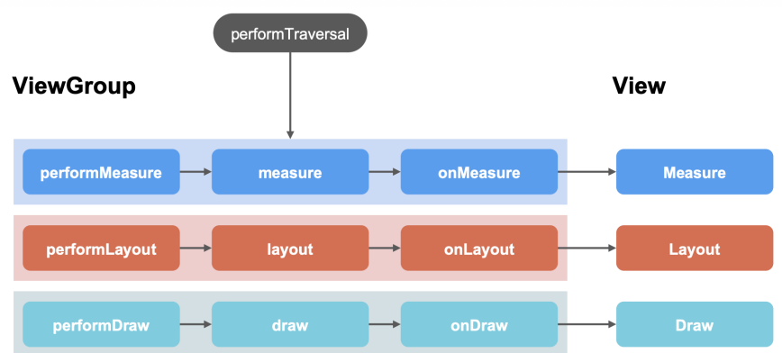

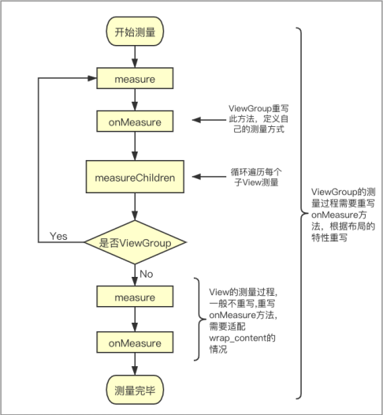

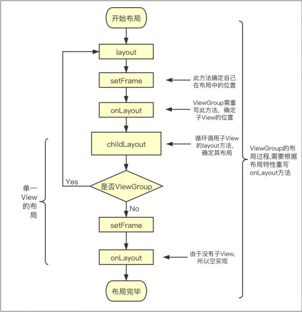

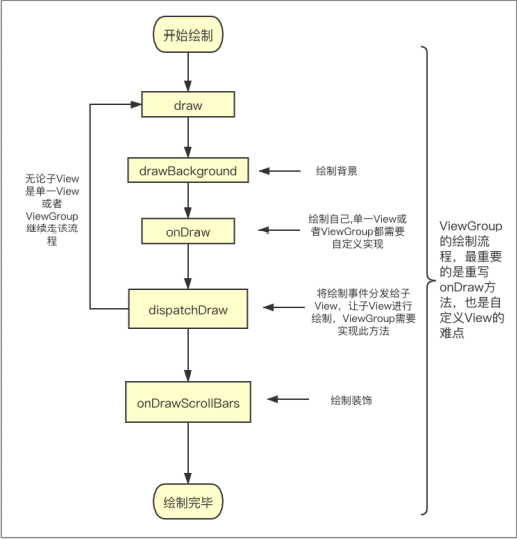

## 4.3	自定义View：重写onDraw

1.   **Canvas**：画布
2.   **Paint**：画笔
3.   **坐标轴**：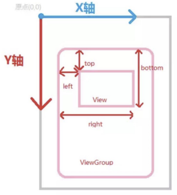

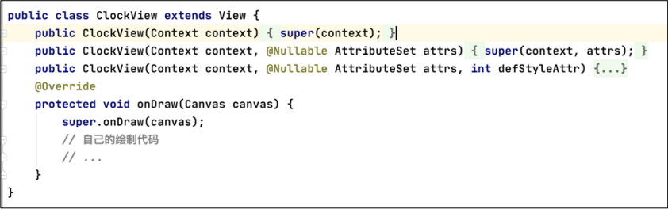

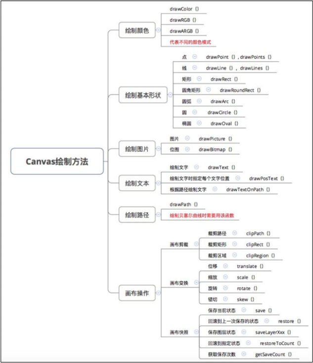

### 4.3.1	画点

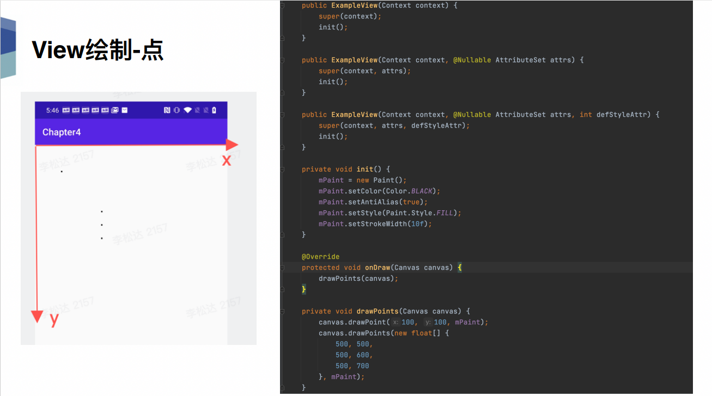

### 4.3.2	画线

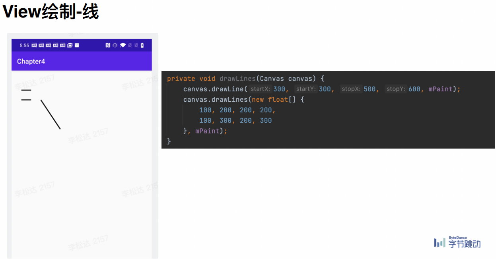

### 4.3.3	画圆

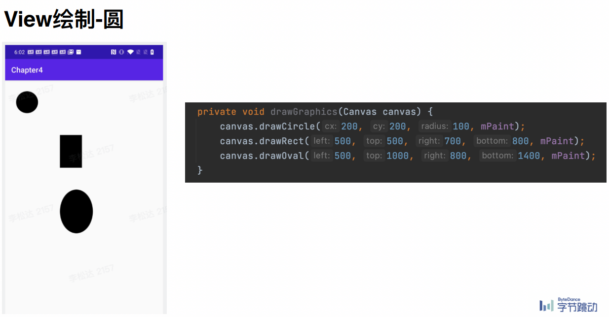

### 4.3.4	填充

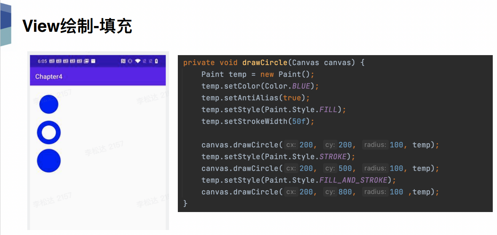

### 4.3.5	不规则图形

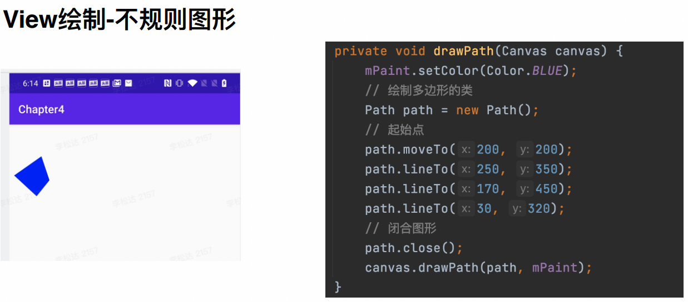

### 4.3.6	画文本

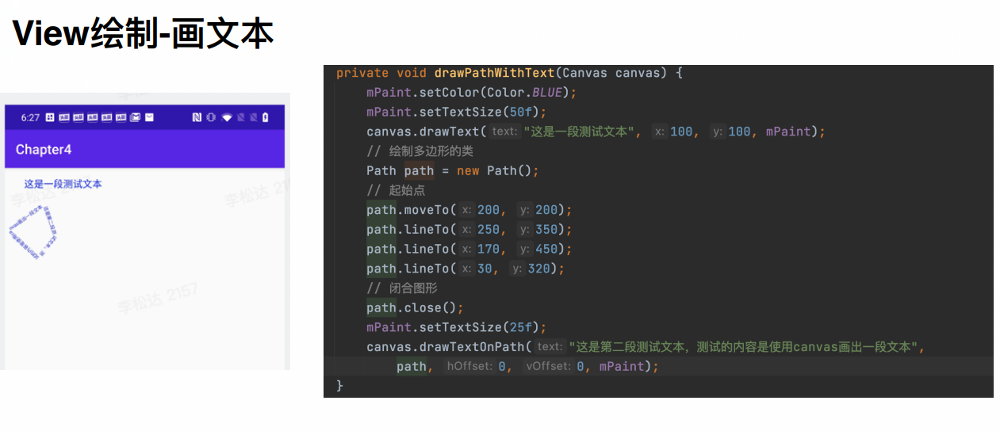

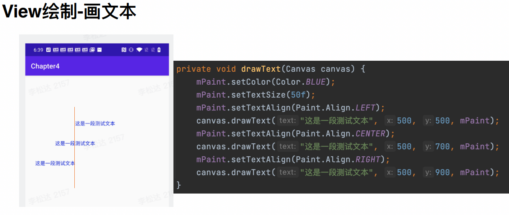

## 4.4	自定义View总结

1.   重要绘制流程：
     1.   **Measure**：测量
     2.   **Layout**：布局
     3.   **Draw**：绘制
2.   以及几个重要函数：
     1.   **invalidate**
     2.   **requestLayout**
3.   理解**ViewTree** 及 **ViewGroup** 的**Measure / Layout / Draw**的流程
4.   View自定义绘制：
     1.   绘制图形：点、线、圆形、椭圆、矩形、圆⻆矩形
     2.   绘制文字