# 目录

[TOC]

# 一、网络基础知识

## 1.1	网络分层模型

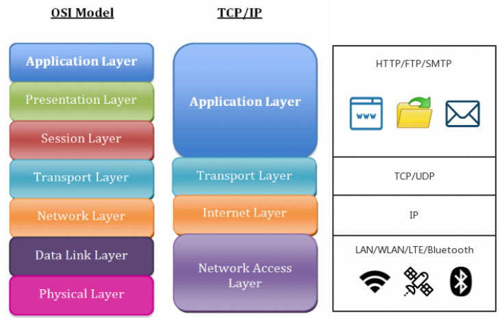

1.   应用层**Application Layer**：互联网上的各种应用
     1.   如：看网页、发邮件
     2.   如：HTTP/FTP/SMTP协议
2.   传输层**Transport Layer**
3.   网络层**Internet Layer**

## 1.2	HTTP协议

1.   HTTP是一个**client-server**协议，只能由**client**主动发起请求，**server**进行响应

     1.   用户发出请求，服务端进行相应

2.   一个HTTP请求一定要包含**Method**和**URL**

     1.   **Method**：要做什么，如GET、PUT、HEAD、POST、DELETE、TRACE、OPTIONS、CONNETC
     2.   **URL**：

3.   **Request**格式：

     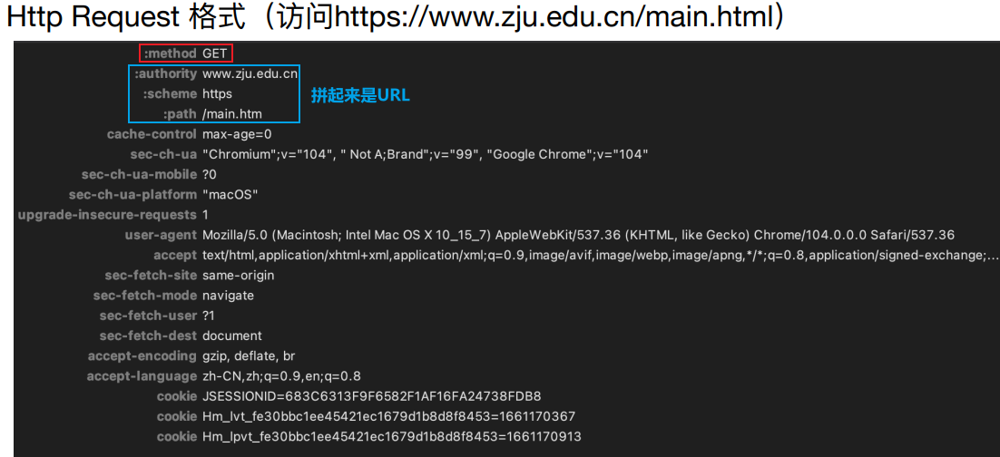

4.   **Response**格式：

     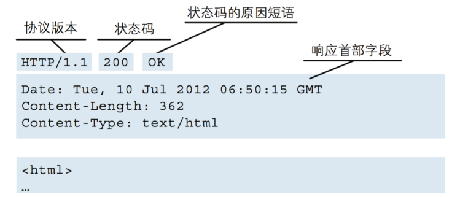

5.   **HTTP**状态码：

     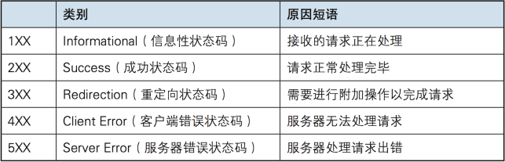

     1.   **4XX**：服务器正常，但客户段出错
     2.   **404**：服务器正常，但服务不存在
     3.   **5XX**：服务器不正常，无法处理请求(请求过多)

## 1.3	RESTful API

### 1.3.1	API

**API**：Application Programming Interface 应用程序接口

1.   **用户端**使用固定的方式发起请求
2.   **服务端**提供服务，响应该请求
3.   使用一个固定的方式，保证不同模块之间进行通信，提高兼容性
4.   略去不同模块之间的区别，找到共同的部分

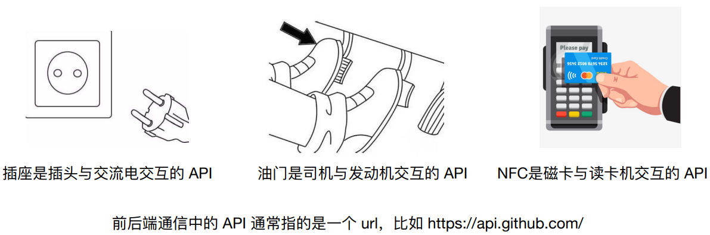

### 1.3.2	RESTful API

**RESTful API**：Resource Epresentational State Transfer (资源)表现层状态转换

1.   API 是面向资源的，资源表达的形式可以是json或者xml，它的url中不包含动词，而是通过HTTP动词表达想要的动作
2.   资源：一段文本、一张图片、一首歌曲
3.   表现形式：json、xml
4.   状态变化：通过HTTP动词实现
5.   目的：看 URL 就知道要什么，看HTTP method 就知道干什么

>   **RESTful** 只是一种规范，并不是标准

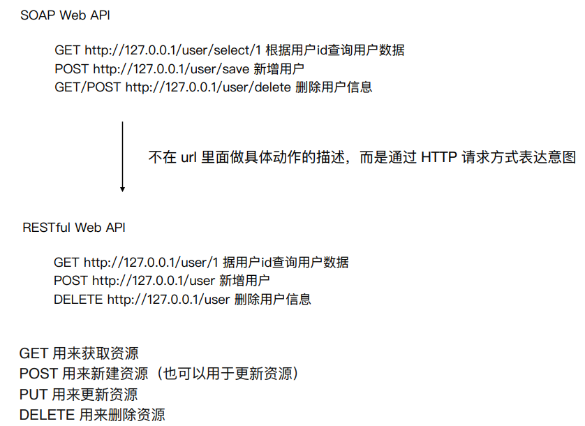

## 1.4	数据传输格式

>   后端与前端/客户端需要约定数据传输的格式，以json为例
>
>   1.   每一组数据都是键值对
>   2.   {}括起的数据：单个值
>   3.   []括起的数据：数组值

```json
{
    "name" : "中国",
    "provinces" : [{
        "name" : "黑龙江",
        "cities" : {
            "city" : ["哈尔滨", "大庆"]
        }
    },{
        "name" : "广东",
        "cities" : {
            "city" : ["广州", "深圳", "珠海"]
        }
    }]
}
```

### 1.4.1	JSON解析器：gson

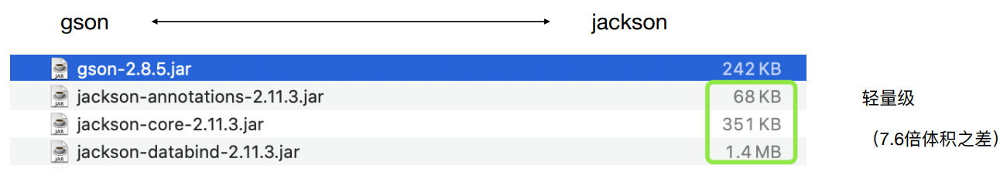

>   常用**API**

```java
// 将对象转化成Json
public <T> toJson(Object src);
// 从Json中提取对象
public <T> fromJson(String json, Class<T> classOfT);
public <T> fromJson(Reader json, Type typeOfT);
```

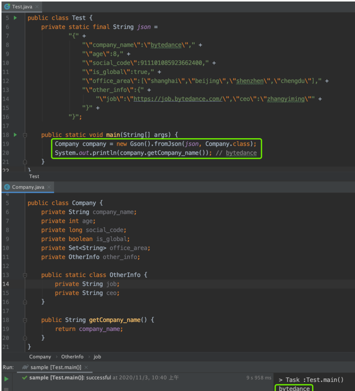

### 1.4.2	下划线命名 vs 驼峰命名

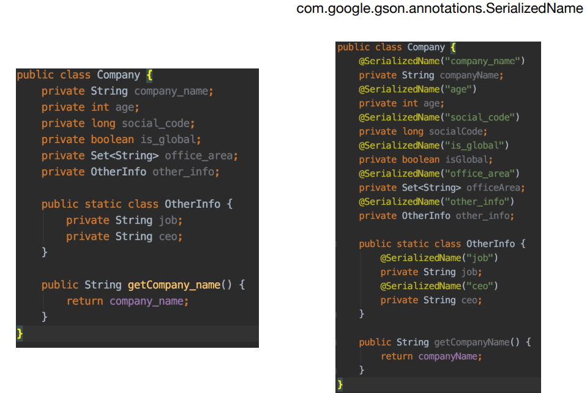

## 1.5	实用工具

### 1.5.1	JSON相关

1.   [JSON 在线辅助网站](https://www.sojson.com/)：转 JavaBean；合法性校验；压缩；优化预览 
2.   GsonFormatPlus：IDEA 插件，JSON 转 JavaBean 
3.   JSON：维基百科，了解 JSON 的来⻰去脉

### 1.5.2	抓包工具 Charles

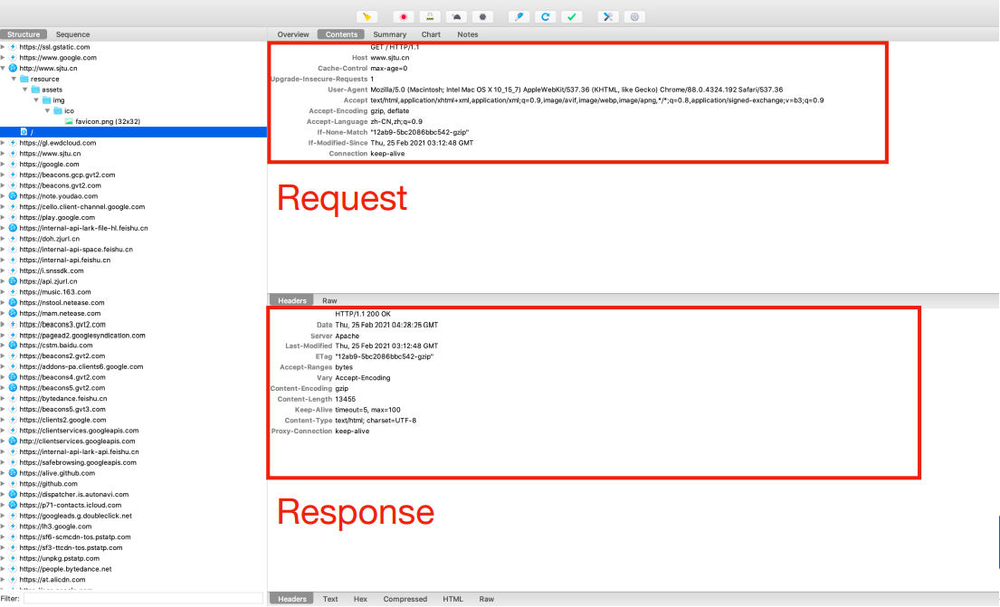

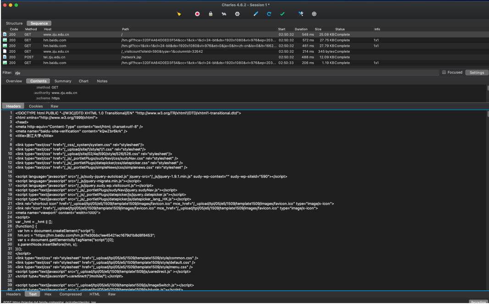

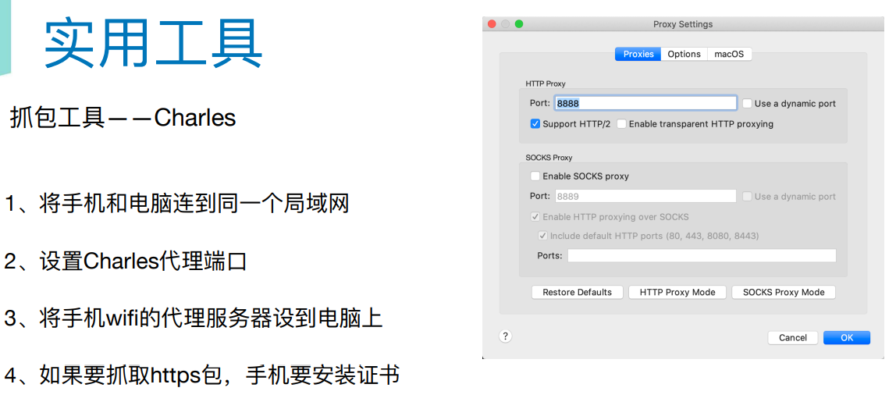

### 1.5.3	抓包工具 Postman–轻松创建请求

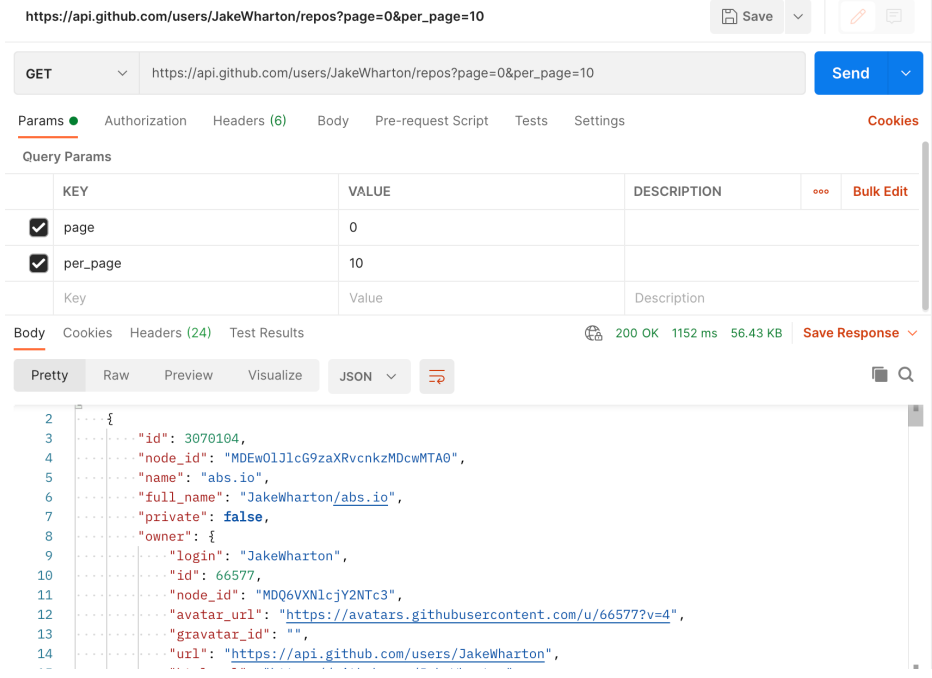

# 二、Android网络通信基础实现

## 2.1	添加网络权限

>   在**AndroidManifest.xml**中，添加网络权限**uses-permission**

```xml
<?xml version="1.0" encoding="utf-8"?>
<manifest>
    <uses-permission android:name="android.permission.INTERNET" />
    <uses-permission android:name="android.permission.ACCESS_NETWORK_STATE" />
    ......
</manifest>
```

## 2.2	获取网络中的数据

>   1.   新建一个线程**HandlerThread**，用于执行与网络有关的任务
>   2.   新建一个任务**Handler**，用于从**url**中获取数据
>        1.   在**run()**方法中
>        2.   调用自定义的**getDataFromNetwork()**方法，获取数据
>        3.   然后根据得到的数据，调用自定义的**showDataFromNetwork()**方法，刷新界面

```java
@Override
protected void onCreate(Bundle savedInstanceState) {
    // 初始化界面的相关操作
    super.onCreate(savedInstanceState);
    setContentView(R.layout.lab5_main_layout);
    networkResult = findViewById(R.id.Lab5_NetworkResult);

    // 执行从网络中获取数据的操作
    runGetDataFromNetwork("https://www.wanandroid.com/article/list/0/json/");
}

// 新建线程, 执行从网络中获取数据的操作
private void runGetDataFromNetwork(String urlString){
    // 新建一个线程, 用于执行与网络有关的任务
    HandlerThread handlerThread = new HandlerThread("Networking");
    handlerThread.start();

    // 新建一个Handler, 用于从url中获取数据
    Handler networkingHandler = new Handler(handlerThread.getLooper());
    Runnable networkingRunnable = new Runnable() {
        @Override
        public void run() {
            Log.d(TAG, "run networking Runnable: 从url中获取数据");
            // 调用getDataFromNetwork()方法, 获取数据
            ArrayList<Lab5_NetworkData> result = getDataFromNetwork(urlString);

            // 根据得到的数据, 刷新界面
            if(result != null && !result.isEmpty()){
                Log.d(TAG, "run networking Runnable: 从url中获取数据为:" + "not null");
                showDataFromNetwork(result);
            }else{
                Log.d(TAG, "run networking Runnable: 从url中获取数据为:" + "null");
            }
        }
    };
    networkingHandler.post(networkingRunnable);
}
```

>   1.   获取数据：**getDataFromNetwork(String urlString)**方法
>        1.   将传入的**urlString**转化为**URL**
>        2.   使用**HttpURLConnection**建立连接
>             1.   创建实例**connection**
>        3.   从**connection**中获取数据
>             1.   先获取为**InputStream**
>             2.   然后转化为**BufferedReader**
>             3.   最后，通过**BufferedReader.readLine()**方法，将其中的数据转化为**JSONObject**
>        4.   解析**JSON**：从**JSONObject**中，读取出所有**data.datas[].title/link**
>             1.   根据目标**JSON**文件的结构，反复调用**getJSONObject()**、**getJSONArray()**方法
>             2.   如果当前到达了最低层，则调用**getString()**方法，获取**String**类型的数据
>             3.   将数据存放入一个**ArrayList**中
>        5.   将读取到的**ArrayList**返回
>   2.   注意要使用**try**，防止操作出现异常

```java
// 从网络中获取数据
// 返回一个List, 存放解析出的Json数据
private ArrayList<Lab5_NetworkData> getDataFromNetwork(String urlString){
    Log.d(TAG, "getDataFromNetwork: 从网络中获取数据, 返回List");
    ArrayList<Lab5_NetworkData> result = new ArrayList<Lab5_NetworkData>();
    // 通过try, 防止获取数据出现问题
    try{
        // 将urlString转化为URL
        URL url = new URL(urlString);
        
        // 使用HttpURLConnection建立连接
        HttpURLConnection connection = (HttpURLConnection) url.openConnection();
        connection.setConnectTimeout(6000);
        connection.connect();

        // 获取数据, 并将其转化为JSONObject
        InputStream inputStream = connection.getInputStream();
        BufferedReader reader = new BufferedReader(new InputStreamReader(inputStream, StandardCharsets.UTF_8));
        JSONObject resultJson = new JSONObject(reader.readLine());

        // 从JSONObject中, 读取出所有data.datas[].title/link
        JSONObject data = resultJson.getJSONObject("data");
        JSONArray datas = data.getJSONArray("datas");
        for(int index = 0; index < datas.length(); index++){
            JSONObject item = datas.getJSONObject(index);
            String title = item.getString("title");
            String link = item.getString("link");
            result.add(new Lab5_NetworkData(title, link));
        }

        // 关闭BufferedReader, InputStream, 取消HttpURLConnection的连接
        reader.close();
        inputStream.close();
        connection.disconnect();
        return result;
    } catch (Exception e) {
        e.printStackTrace();
    }
    return null;
}
```

## 2.3	使用WebView打开网页

>   1.   新建一个**Activity**，其中有**WebView**控件

```java
<?xml version="1.0" encoding="utf-8"?>
<androidx.constraintlayout.widget.ConstraintLayout xmlns:android="http://schemas.android.com/apk/res/android"
    xmlns:app="http://schemas.android.com/apk/res-auto"
    xmlns:tools="http://schemas.android.com/tools"
    android:layout_width="match_parent"
    android:layout_height="match_parent"
    tools:context=".Lab5_WebViewActivity">

    <WebView
        android:id="@+id/Lab5_WebView"
        android:layout_width="match_parent"
        android:layout_height="match_parent"/>

</androidx.constraintlayout.widget.ConstraintLayout>
```

>   2.   切换至**WebViewActivity**时，将**urlString**作为参数，添加进**intent**中

```java
// 使用单个从网络中获取的数据
private void useDataFromNetwork(Lab5_NetworkData data){
    // 使用WebView Activity打开网页
    String urlString = data.getLink();
    Intent intent = new Intent(this, Lab5_WebViewActivity.class);
    intent.putExtra("url", urlString);
    startActivity(intent);
}
```

>   3.   在**WebViewActivity**初始化时，获取**urlString**参数，打开网页
>        1.   由于现在的网页包含的内容过多，因此要进行一系列设置，才能正常读取页面的数据

```java
public class Lab5_WebViewActivity extends AppCompatActivity {
    private WebView webView;
    private WebSettings webSettings;
    private String urlString;

    @Override
    protected void onCreate(Bundle savedInstanceState) {
        super.onCreate(savedInstanceState);
        setContentView(R.layout.lab5_webview_layout);

        // 获取WebView控件, 传入的url字符串, WebSettings属性
        webView = findViewById(R.id.Lab5_WebView);
        urlString = getIntent().getStringExtra("url");
        webSettings = webView.getSettings();

        // 设置WebView的属性
        webSettings.setJavaScriptEnabled(true);
        webSettings.setJavaScriptCanOpenWindowsAutomatically(true);
        webSettings.setSupportZoom(true);
        webSettings.setBuiltInZoomControls(true);
        webSettings.setLoadWithOverviewMode(true);
        webSettings.setAppCacheEnabled(true);
        webSettings.setDomStorageEnabled(true);

        // 使用WebView控件, 打开对应网页
        webView.loadUrl(urlString);
    }
}
```

# 三、进阶实现：Retrofit(自学)

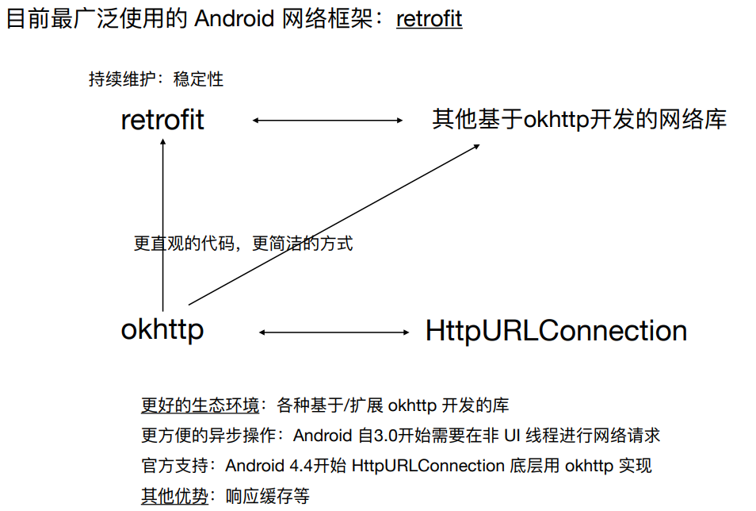

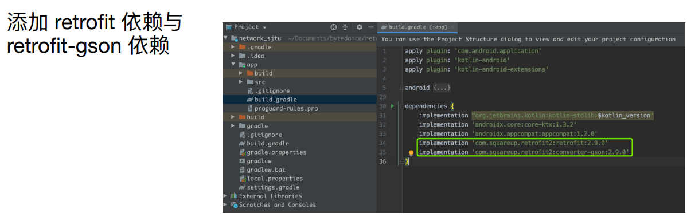

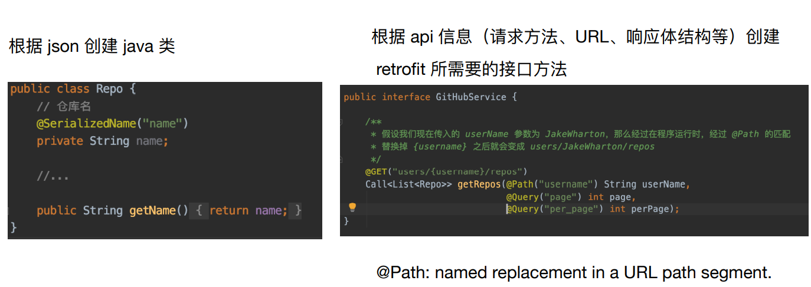

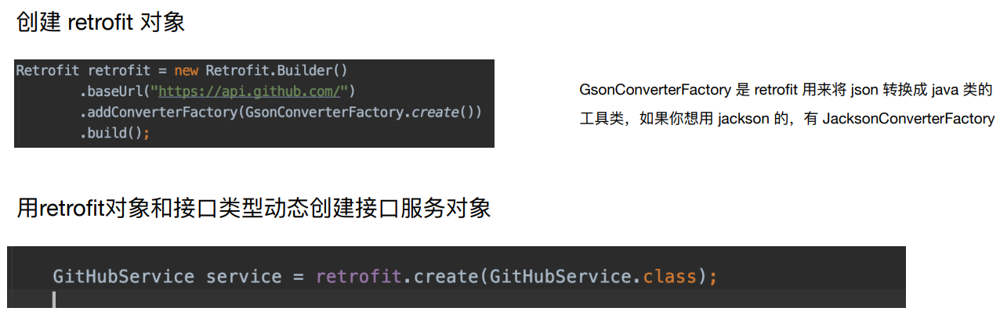

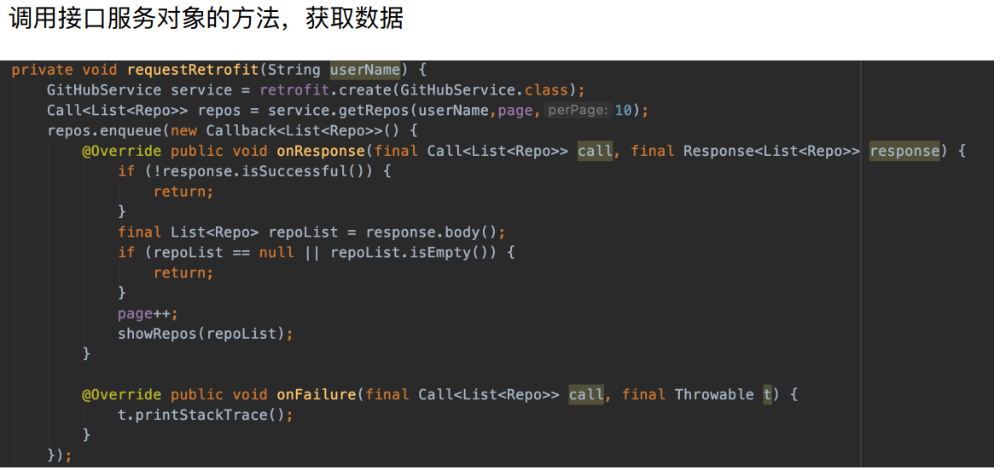