# 目录

[TOC]

# 一、存储空间概览

## 1.1	存储空间的区分

1.   **Internal Storage**：是系统分配给应用的专属内部存储空间
     1.   APP专有的
     2.   用户不可以直接读取(root用户除外)
     3.   应用卸载时自动清空
     4.   有且仅有一个
2.   **External Storage**：是系统外部存储空间，如 SD卡
     1.   所有用户均可访问
     2.   不保证可用性(可挂载/物理移除)
     3.   可以卸载后仍保留
     4.   可以有多个

## 1.2	存储目录

1.   **Internal Storage**：/

     1.   APP专用：
          1.   data/data/{your.package.name}/ files、cache、db...

2.   **External Storage**：

     1.   APP专用：
          1.   /storage/emulated/0/Android/data/{your.package.name}/ files、cache
     2.   公共文件夹：./ 
          1.   \ --- Standard: DCIM、Download、Movies 
          2.   \ --- Others

     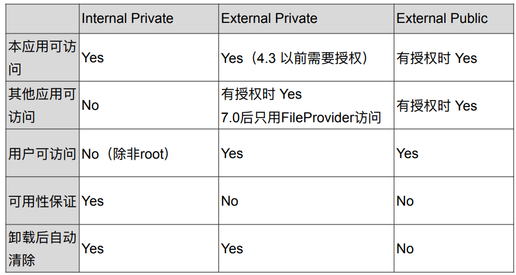

## 1.3	Internal目录的获取

1.   file目录：**context.getFilesDir()**
2.   cache目录：**context.getCacheDir()**
3.   自定义目录：**context.getDir(name, mode_private)**

## 1.4	External目录的获取

### 1.4.1	获取授权

>   **AndroidManifest.xml**中声明权限

```xml
<uses-permission android:name="android.permission.WRITE_EXTERNAL_STORAGE" />
<uses-permission android:name="android.permission.READ_EXTERNAL_STORAGE" />
```

>   请求授权（**Android 6.0**及以上）

```java
private final static int CODE_REQUEST_PERMISSION = 1;
if (ContextCompat.checkSelfPermission(this, Manifest.permission.READ_CALENDAR) 
		!= PackageManager.PERMISSION_GRANTED) {
	ActivityCompat.requestPermissions(this, 
		new String[] {Manifest.permission.READ_EXTERNAL_STORAGE}, 
		CODE_REQUEST_PERMISSION);
}
```

>   在 **Activity** 的 **onRequestPermissionsResult** 方法中获取授权结果

```java
@Override
public void onRequestPermissionsResult(int requestCode, @NonNull String[] permissions, @NonNull int[] grantResults) {
	super.onRequestPermissionsResult(requestCode, permissions, grantResults);
	
	if (requestCode == CODE_REQUEST_PERMISSION) {
		if (grantResults.length > 0 && 
			grantResults[0] == PackageManager.PERMISSION_GRANTED) {
			// ⽤户已授权
		} else {
			// ⽤户拒绝了授权
		}
	}
}
```

### 1.4.2	Environment APIs

>   提供了访问**环境变量**的方法

```java
public class Environment extends Object{};
android.os.Environment;
```

### 1.4.3	检查外置存储器的可用性

>   通过**Environment.getExternalStorageState();**调⽤获取当前外部存储的状态，并以此判断外部存储是否可⽤

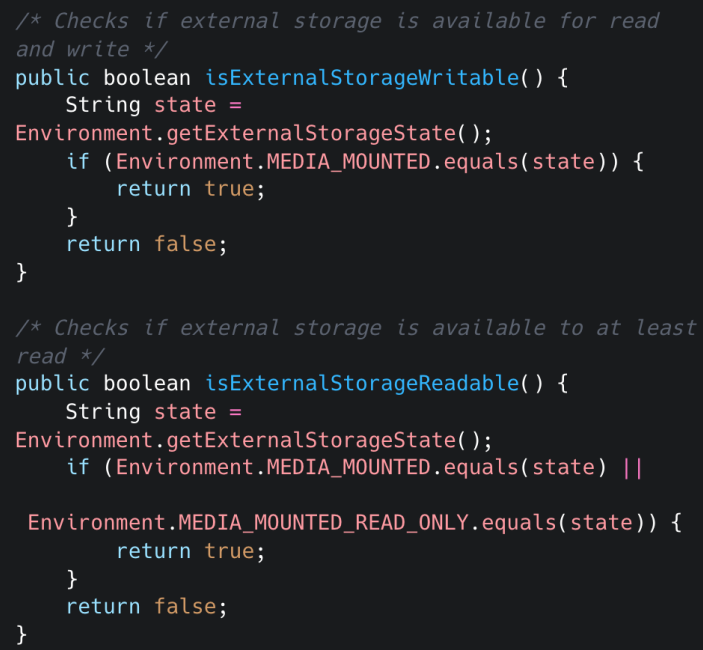

### 1.4.4	External目录的获取

1.   应用私有目录：
     1.   **file**目录：**context.getExternalFilesDir(String type)**
     2.   **cache**目录：**context.getExternalCacheDir()**
2.   公共目录：
     1.   标准目录：**Environment.getExternalStoragePublicDirectory(String type)**
     2.   根目录：**Environment.getExternalStorageDirectory()**
3.   标准目录：
     1.   **DIRECTORY_ALARMS**
     2.   **DIRECTORY_DCIM**
     3.   **DIRECTORY_DOCUMENTS**
     4.   **DIRECTORY_DOWNLOADS**
     5.   **DIRECTORY_MOVIES**

### 1.5	注意事项

1.   如果用户卸载应⽤，系统会移除保存在应⽤专属存储空间中的⽂件
2.   由于这⼀行为，不应使用此存储空间保存⽤户希望独例于应用而保留的任何内容
     1.   例如，如果应用允许用户拍摄照片，用户会希望即使卸载应⽤后仍可访问这些照⽚
     2.   因此，应改为使用共享存储空间将此类文件保存到适当的媒体集合中。

更多信息可参考：https://developer.android.com/guide/topics/data?hl=zh-cn

# 二、键值对


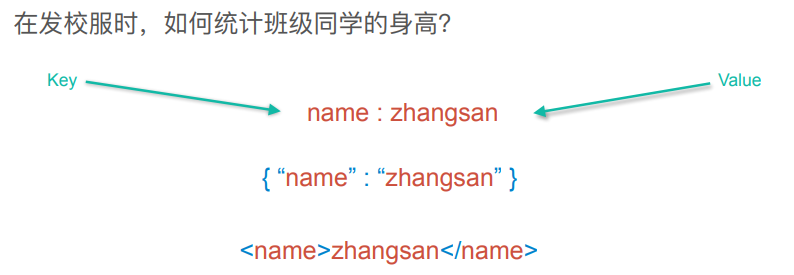

# 三、SharedPreferences

## 3.1	介绍

1.   **SharedPreference** 就是 **Android** 提供的数据持久化的⼀个方式，适合单进程，小批量的数据存储和访问。基于 **XML** 进行实现，本质上还是⽂件的读写，**API** 相较 **File** 更简单。
2.    以“键-值”对的方式保存数据的**xml**⽂件，其文件保存在**/data/data/[packageName]/shared_prefs**目录下

## 3.2	获取SharedPreferences

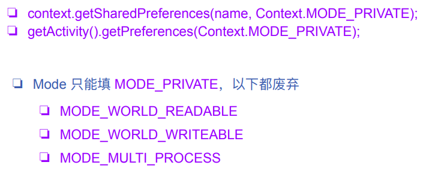

## 3.3	读取SharedPreferences

>   通过**getxxx()**方法获取，需要传入(**key**，**defaultValue**)

```java
private static final String SP_NAME = "Lab6_SharedPreference";
private static final String SAVE_KEY  = "Lab6_Text";
// 从内存中读取EditText的文本
private String readTextFromStorage(){
    SharedPreferences sp = Lab6_SharedPreference.this.getSharedPreferences(SP_NAME, Context.MODE_PRIVATE);
    String text = sp.getString(SAVE_KEY,"记录一些文字");
    return text;
}
```

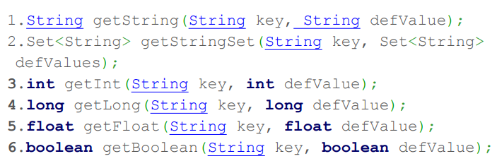

## 3.4	写SharedPreferences

>   通过**Editor**类来提交修改

```java
private static final String SP_NAME = "Lab6_SharedPreference";
private static final String SAVE_KEY  = "Lab6_Text";
// 将当前EditText的文本保存到内存中
private void saveTextToStorage(String text){
    SharedPreferences sp = Lab6_SharedPreference.this.getSharedPreferences(SP_NAME, Context.MODE_PRIVATE);
    SharedPreferences.Editor editor = sp.edit();
    editor.putString(SAVE_KEY, text);
    editor.commit();
    // 或者调用apply方法
    // editor.apply();
}
```

## 3.5	SharedPreferences的原理

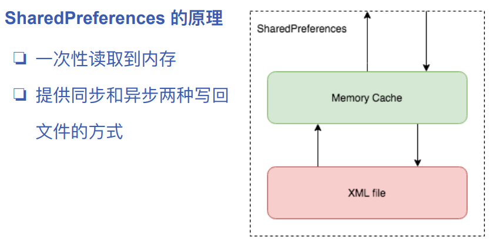

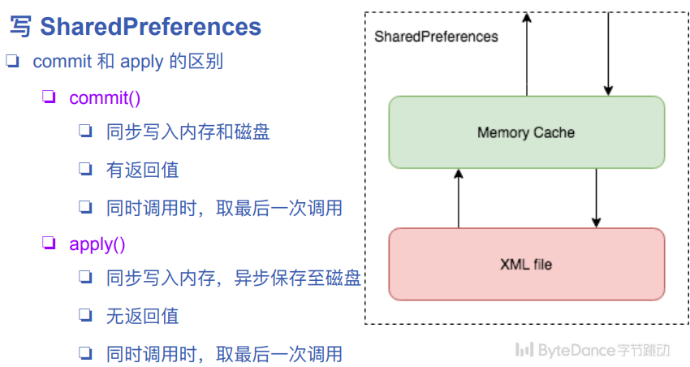

## 3.6	注意事项

1.   SharedPreference 适合场景：小数据
2.   SharedPreference 每次写入均为全量写入
3.   禁止大数据存储在 SharedPreference 中，导致 ANR

官方推荐的DataStore：https://developer.android.com/topic/libraries/architecture/datastore

# 四、文件File

## 4.1	流

都是相对调用者而言的

1.   按流向分为： 
     1.   输⼊流 
     2.   输出流 
2.   按传输单位分为： 
     1.   字节流：**InputStream** 和 **OutputStream** 基类 
     2.   字符流：**Reader** 和 **Writer** 基类

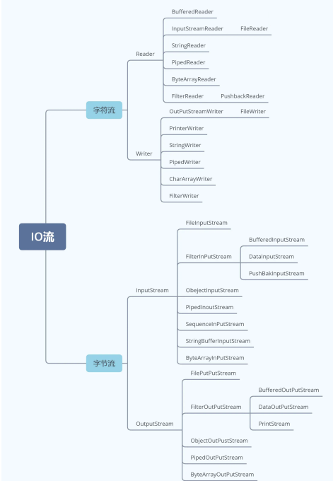

## 4.2	API

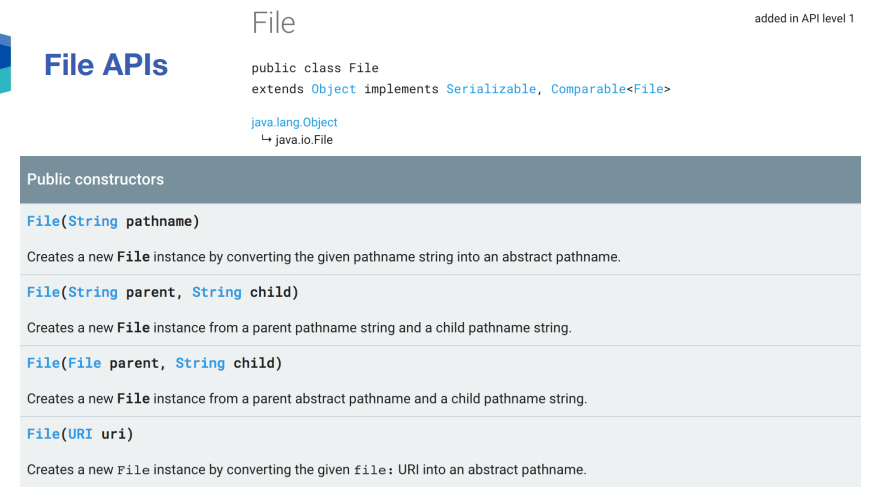

## 4.3	文件操作


## 4.4	文件IO读写操作示例

>   1.   创建 File 对象，通过构造函数：
>        1.   **new File()** 
>   2.   创建输⼊输出流对象：
>        1.   **new FileReader()** 
>        2.   **new FileWriter()** 
>   3.   读取 or 写⼊
>        1.   **read** 方法 
>        2.   **write** f昂发 
>   4.   关闭资源 
>        1.   有借有还，再借不难

```java
public class Lab6_FileIO extends AppCompatActivity {
    private static final String TAG = "Lab6_FileIO";
    private static final String SAVE_FILE_NAME = "Lab6_FileIO";
    private static final String SAVE_KEY  = "Lab6_Text";
    private EditText editText;
    private Button saveButton;
    private String fileName = null;
    @Override
    protected void onCreate(Bundle savedInstanceState) {
        super.onCreate(savedInstanceState);
        setContentView(R.layout.lab6_text_memo);

        fileName = getFilesDir().getAbsolutePath() + File.separator + SAVE_FILE_NAME;

        editText = findViewById(R.id.Lab6_EditText);
        readTextFromStorage();

        saveButton = findViewById(R.id.Lab6_Save_Button);
        saveButton.setOnClickListener(new View.OnClickListener() {
            @Override
            public void onClick(View view) {
                saveTextToStorage(editText.getText().toString());
            }
        });
    }

    // 从内存中读取EditText的文本
    private void readTextFromStorage(){
        new Thread(new Runnable() {
            @Override
            public void run() {
                File file = new File(fileName);
                // 文件不存在, 则新建一个文件
                if(!file.exists()){
                    try{
                        boolean isSuccess = file.createNewFile();
                        if(!isSuccess) throw new IOException("create file exception");
                    }
                    catch (IOException e) {
                        Log.e(TAG, "readTextFromStorage: 创建文件失败");
                        e.printStackTrace();
                    }
                }
                // 文件存在
                try {
                    // 创建文件输入流
                    FileInputStream inputStream = new FileInputStream(file);
                    byte[] bytes = new byte[1024];
                    final StringBuffer buffer = new StringBuffer();
                    // 读取数据, 存入buffer中
                    while (inputStream.read(bytes) != -1){
                        buffer.append(new String(bytes));
                    }
                    // 在UI线程中修改editText的值
                    runOnUiThread(new Runnable() {
                        @Override
                        public void run() {
                            String text = buffer.toString();
                            text = text.trim();
                            if(text.equals("")) text = new String("记录一些文字");
                            editText.setText(text);
                        }
                    });
                }
                catch (IOException e) {
                    Log.e(TAG, "readTextFromStorage: 文件读取失败");
                    e.printStackTrace();
                }
            }
        }).start();
    }

    // 将当前EditText的文本保存到内存中
    private void saveTextToStorage(String text){
        new Thread(new Runnable() {
            @Override
            public void run() {
                File file = new File(fileName);
                // 文件不存在, 则新建一个文件
                if(!file.exists()){
                    try{
                        boolean isSuccess = file.createNewFile();
                        if(!isSuccess) throw new IOException("create file exception");
                    } catch (IOException e) {
                        Log.e(TAG, "saveTextToStorage: 创建文件失败");
                        e.printStackTrace();
                    }
                }
                // 文件存在
                FileOutputStream outputStream = null;
                try {
                    outputStream = new FileOutputStream(file);
                    outputStream.write(text.getBytes());
                }
                catch (IOException e){
                    Log.e(TAG, "saveTextToStorage: 创建文件失败");
                    e.printStackTrace();
                }
                finally { // 将文件输出流关闭
                    try{
                        if(outputStream != null)
                            outputStream.close();
                    }
                    catch (IOException e){
                        Log.e(TAG, "saveTextToStorage: 文件输出流关闭失败");
                        e.printStackTrace();
                    }
                }
            }
        }).start();
    }
}
```

## 4.7	拓展：OkIO

1.   是在**JavaIO**基础上再次进行封装的**IO**框架
2.   https://square.github.io/okio/

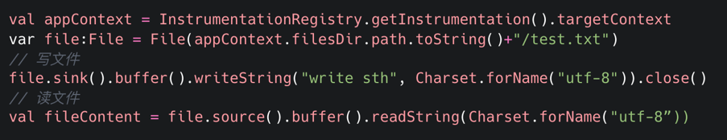

# 五、数据库

## 5.1	使用场景

1.   重复的数据
2.   结构化的数据
3.   关系型数据

## 5.2	数据库的设计

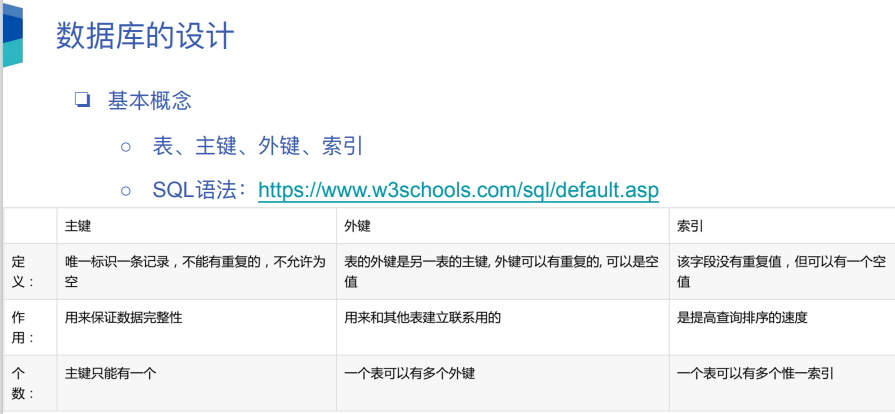

## 5.3	SQL

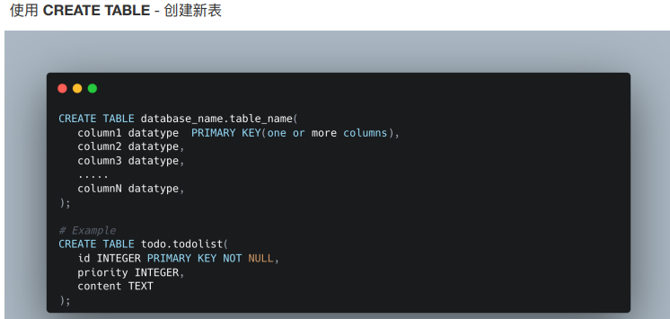

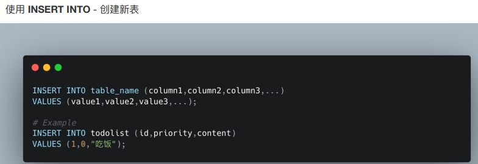

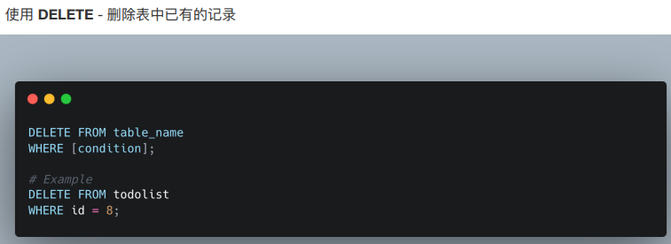

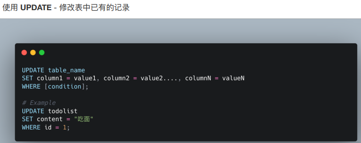

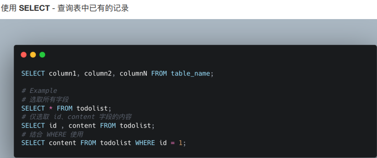

## 5.4	使用示例：Todo List App

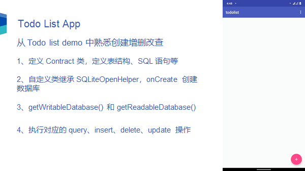

### 5.4.1	定义Contract类

>   定义表结构、SQL语句

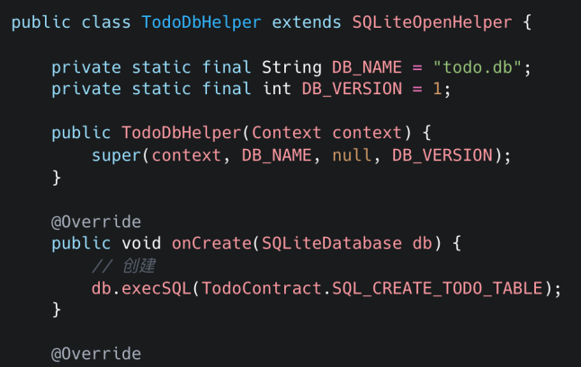

### 5.4.2	继承SQLiteOpenHelper

>   执行**Create** 和 **Delete** 操作

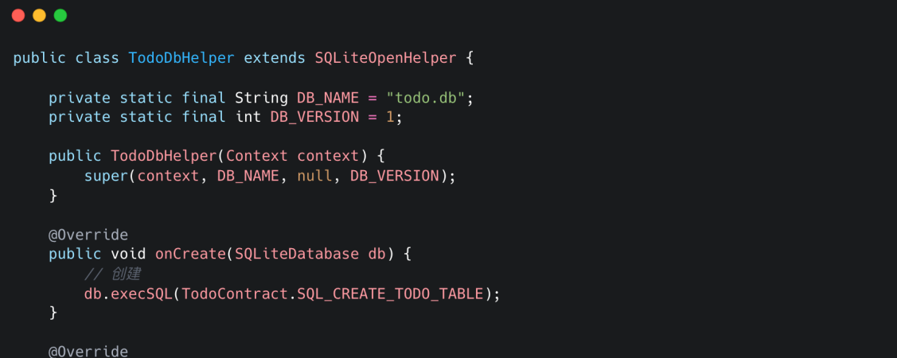

### 5.4.3	获取SQLLiteDatabase

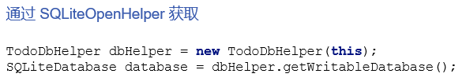

### 5.4.4	Insert

>   通过**ContentValues**进行插⼊操作

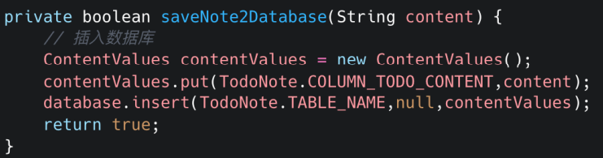

### 5.4.5	Query

>   调用**query()**方法，返回 **Cursor** ，对应查询结果集合
>
>   当**moveToNext**返回 -1时，遍历结束

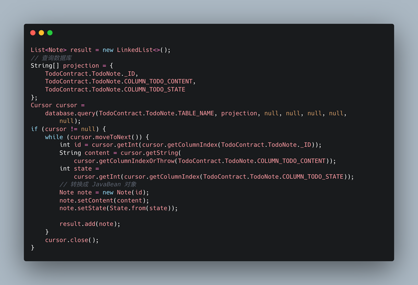

### 5.4.6	Delete

>   删除数据库中对应 id 的数据

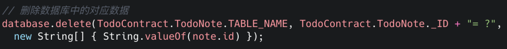

### 5.4.7	Update

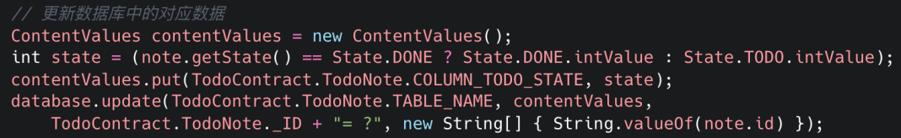

### 5.4.8	Debug

>   adb + sqlite3：http://www.sqlite.org/cli.html

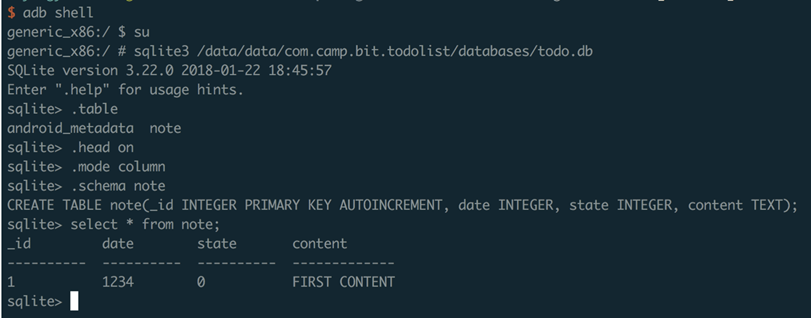

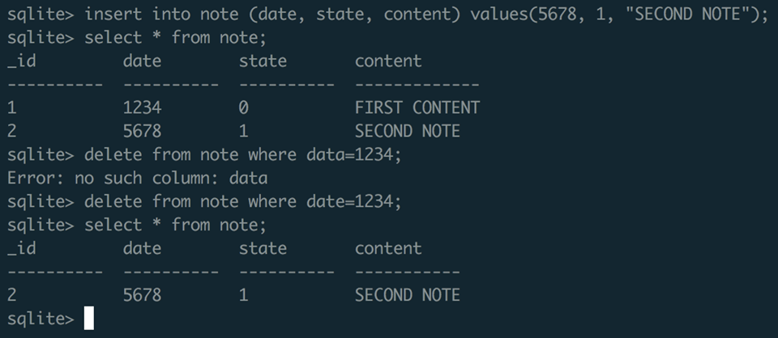

### 5.4.8	注意事项

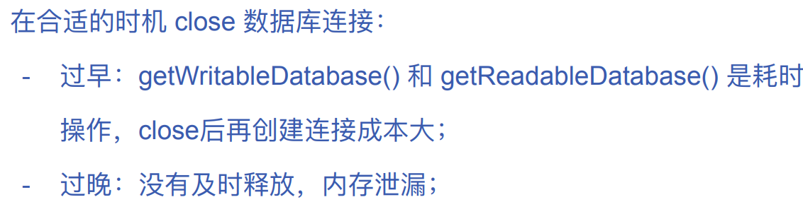

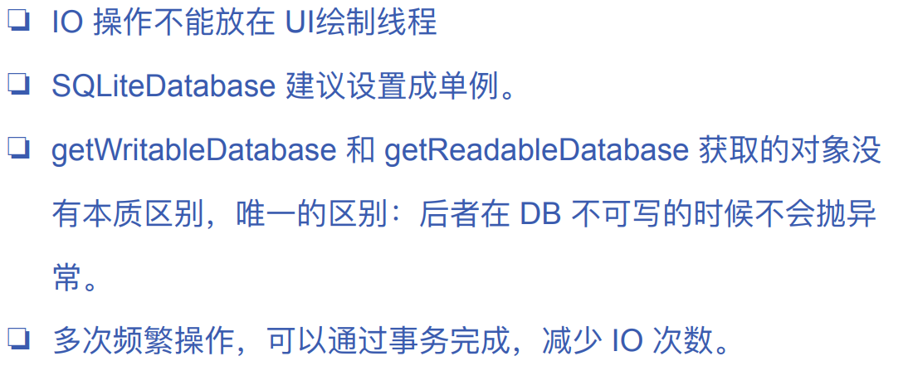

## 5.5	Room Library

https://developer.android.com/jetpack/androidx/releases/room

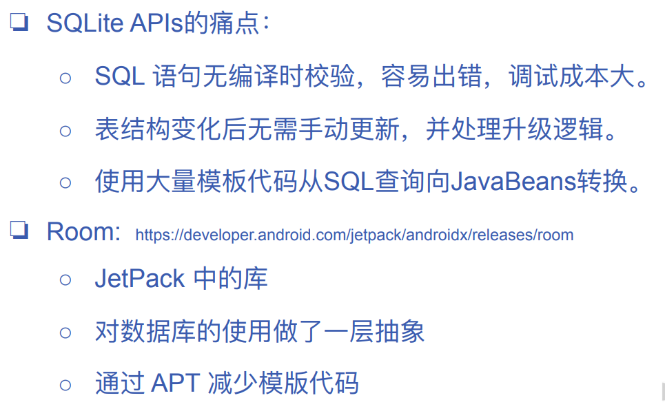

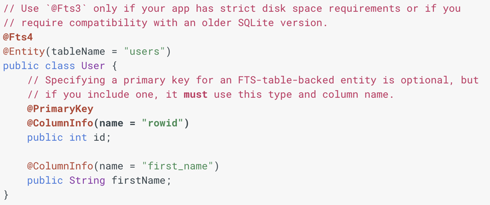

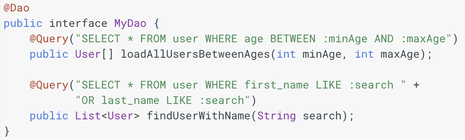

# 六、Content Provider

## 6.1	定义

1.   当我们需要在应⽤间共享数据时，**ContentProvider** 就是⼀个非常值得使用的组件
2.   四大组件之⼀，**ContentProvider** 是⼀种 **Android** 数据共享机制，无论其内部数据以什么样的方式组织，对外都是提供统⼀的接口
3.   通过 **ContentProvider**可以获取系统的媒体、联系⼈、⽇程等数据

https://developer.android.com/reference/android/content/ContentProvider

## 6.2	Content Provider架构

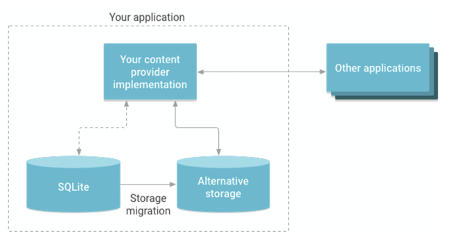

## 6.3	优点

1.   跨应用分享数据
     1.   系统的 **providers** 有联系人等
2.   是对数据层的良好抽象
3.   支持精细的权限控制

# 七、URI

## 7.1	URI介绍

**URI**：Uniform Resource Indentifier，唯一标识ContentProvider的数据

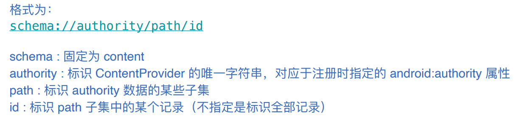

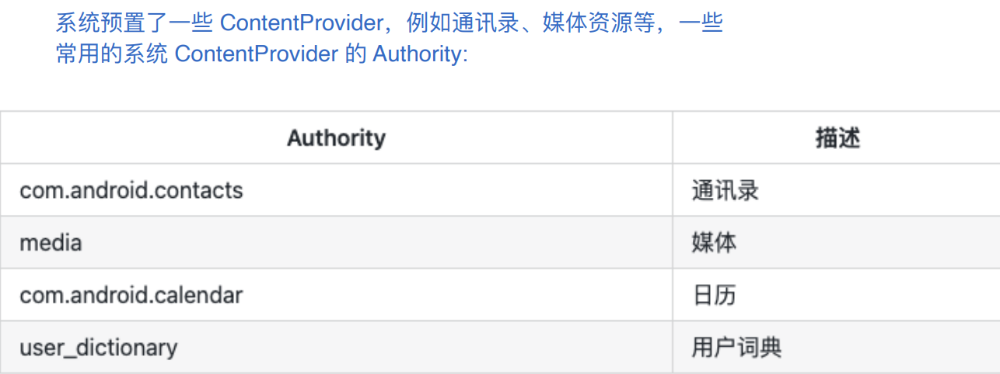

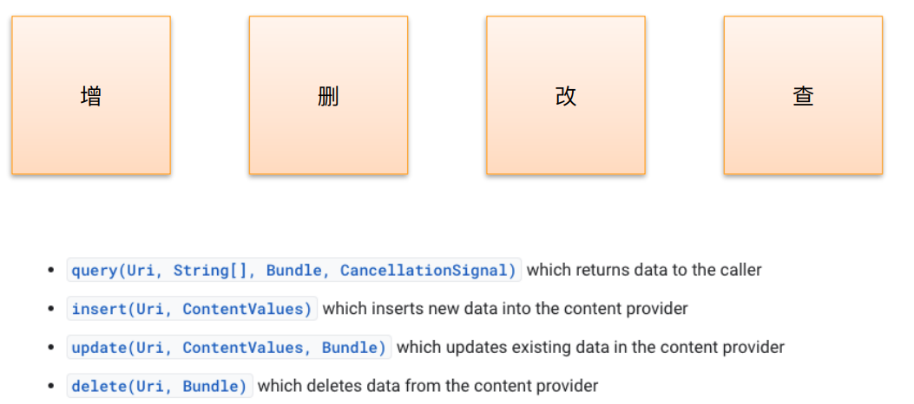

## 7.2	URI使用示例

### 7.2.1	查询：获取联系人数据

>   1.   **AndroidManifest** 权限声明

```groovy
<uses-permission android:name="android.permission.READ_CONTACTS" />
```

>   2.   在程序中动态请求权限

```java
if (ContextCompat.checkSelfPermission(this, Manifest.permission.READ_CONTACTS)
    	!= PackageManager.PERMISSION_GRANTED) {
    ActivityCompat.requestPermissions(this, new String[] {
        Manifest.permission.READ_CONTACTS
    }, 1);
}
```

>   3.   通过**ContentResolver** 查询对应的**ContentProvider**

```JAVA
// 获取 ContentResolver 对象
ContentResolver contentResolver = this.getContentResolver();
Cursor cursor =	contentResolver.query(ContactsContract.Contacts.CONTENT_URI, null, null, null, null);
```

>   4.   遍历**cursor**，获取对应字段的值

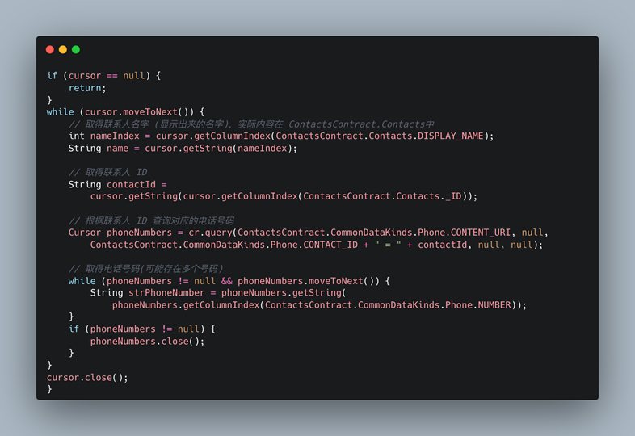


### 7.2.2	查询：获取系统相册中的视频文件

>   1.   **AndroidManifest** 权限声明

```groovy
<uses-permission android:name="android.permission.READ_EXTERNAL_STORAGE" />
```

>   2.   在程序中动态请求权限

```java
if (ContextCompat.checkSelfPermission(this, Manifest.permission.READ_EXTERNAL_STORAGE)
    	!= PackageManager.PERMISSION_GRANTED) {
    ActivityCompat.requestPermissions(this, new String[] {
        Manifest.permission.READ_EXTERNAL_STORAGE
    }, 1);
}
```

>   3.   通过**ContentResolver**查询

```java
// 获取 ContentResolver 对象
ContentResolver contentResolver = this.getContentResolver();
Cursor cursor = contentResolver.query(MediaStore.Video.Media.EXTERNAL_CONTENT_URI, null, null, null,null);

```

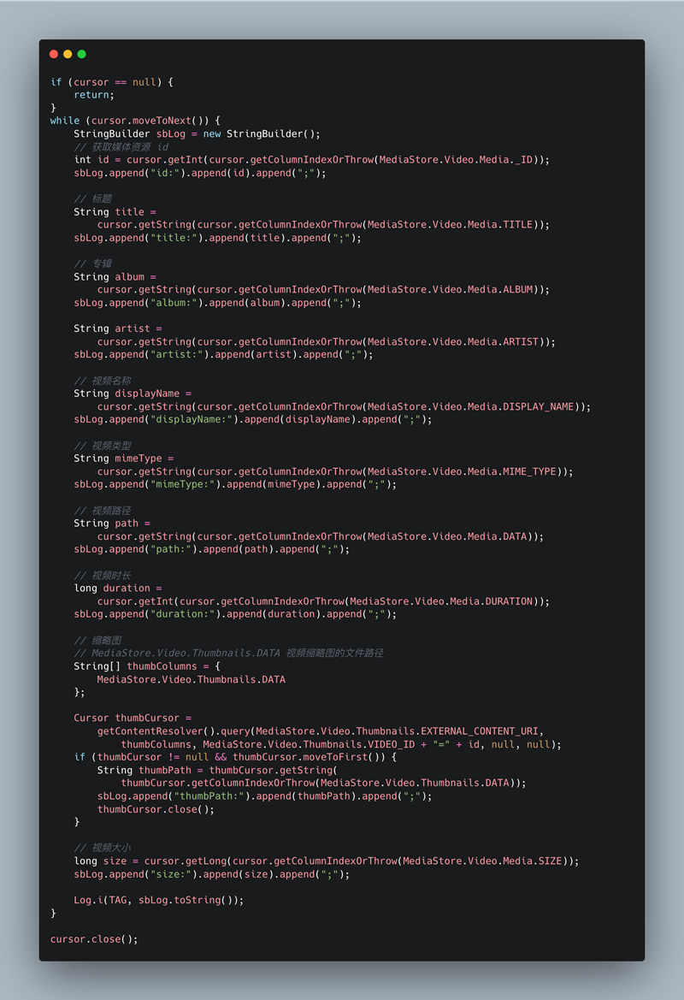

### 7.2.2	读取URI对应的图片到ImageView中

>   1.   **AndroidManifest** 权限声明

```groovy
<uses-permission android:name="android.permission.READ_EXTERNAL_STORAGE" />
```

>   2.   在程序中动态请求权限
>   2.   重写**onRequestPermissionsResult()**方法，定义授权后的操作

```java
@Override
public View onCreateView(LayoutInflater inflater, ViewGroup container,
                         Bundle savedInstanceState) {
    // Inflate the layout for this fragment
    View view = inflater.inflate(R.layout.fragment_my_settings, container, false);

    userIcon = view.findViewById(R.id.icon_my_setting_user_info);
    
    // 进行一个判断，是否已经有访问权限，如果没有先获取
    if(ContextCompat.checkSelfPermission(getContext(), Manifest.permission.READ_EXTERNAL_STORAGE)
       		!= PackageManager.PERMISSION_GRANTED){
        
        ActivityCompat.requestPermissions(getActivity(), 
            new String[]{Manifest.permission.READ_EXTERNAL_STORAGE}, 1);
        
        Toast.makeText(getActivity(),"请授予权限", Toast.LENGTH_SHORT);
    }else{
        // 已经有权限了, 直接执行操作
        readImageFromStorage();
    }
    
    userIcon.setOnClickListener(new View.OnClickListener() {
        @Override
        public void onClick(View view) {
            // 点击后打开本地图库选择照片
            Intent intent = new Intent(Intent.ACTION_PICK, null);
            intent.setDataAndType(MediaStore.Images.Media.EXTERNAL_CONTENT_URI, "image/*");
            startActivityForResult(intent, 1);
        }
    });
    return view;
}

@RequiresApi(api = Build.VERSION_CODES.O)
@Override
public void onRequestPermissionsResult(int requestCode, @NonNull String[] permissions, @NonNull int[] grantResults) {
    super.onRequestPermissionsResult(requestCode, permissions, grantResults);
    if(requestCode == 1){
        if(grantResults.length > 0 && grantResults[0] == PackageManager.PERMISSION_GRANTED){
            readImageFromStorage();
        }
    }else{
        Toast.makeText(getActivity(), "授权失败", Toast.LENGTH_SHORT);
    }
}
```

>   3.   自定义**readImageFromStorage()**方法通过URI读取图片
>   4.   自定义**saveImageToStorage()**方法保存URI

```java
public class Constants {
    // 本地用户的图标
    public static final String USER_ICON_SAVE_SP = "USER_ICON";
    public static final String USER_ICON_SAVE_KEY = "user_icon";
}


@RequiresApi(api = Build.VERSION_CODES.O)
public void readImageFromStorage(){
    SharedPreferences sp = getActivity().getSharedPreferences(Constants.USER_ICON_SAVE_SP, Context.MODE_PRIVATE);
    String uriString = sp.getString(Constants.USER_ICON_SAVE_KEY, null);
    if(uriString == null) return;

    Uri uri = Uri.parse(uriString);
    userIcon.setImageURI(uri);
}

public void saveImageToStorage(Uri uri){
    String uriString = uri.toString();
    SharedPreferences sp = getActivity().getSharedPreferences(Constants.USER_ICON_SAVE_SP, Context.MODE_PRIVATE);
    SharedPreferences.Editor editor = sp.edit();
    editor.putString(Constants.USER_ICON_SAVE_KEY, uriString);
    editor.commit();
}
```

>   
