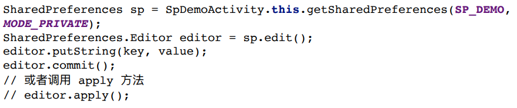
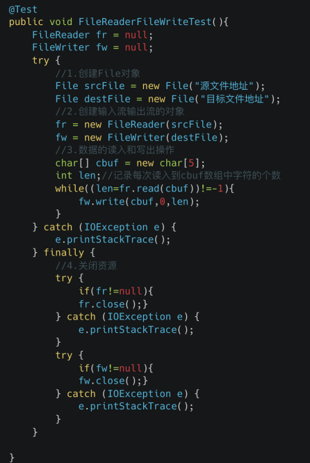
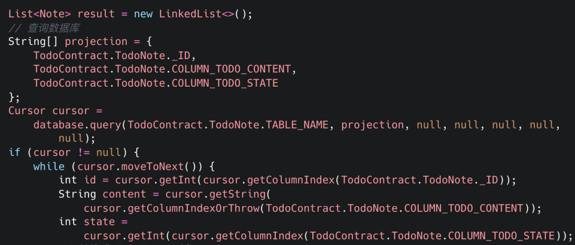
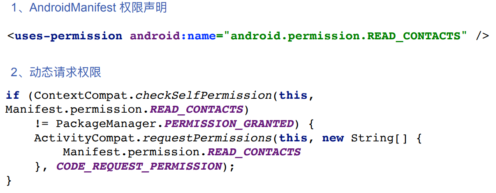
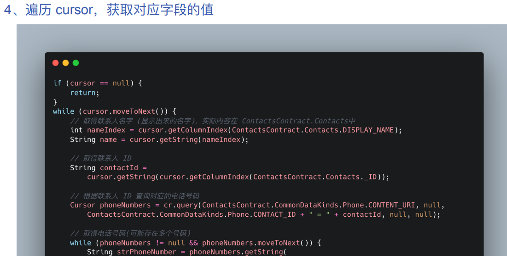
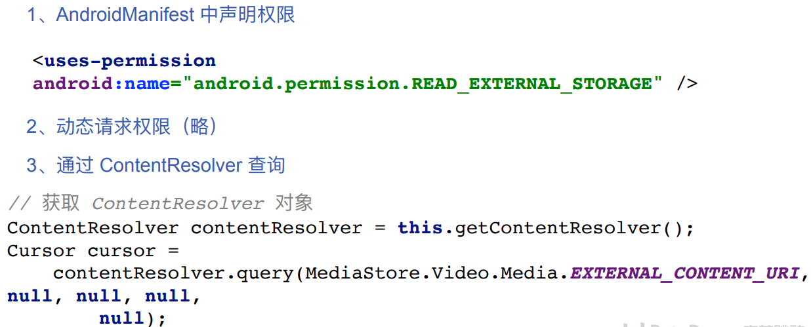
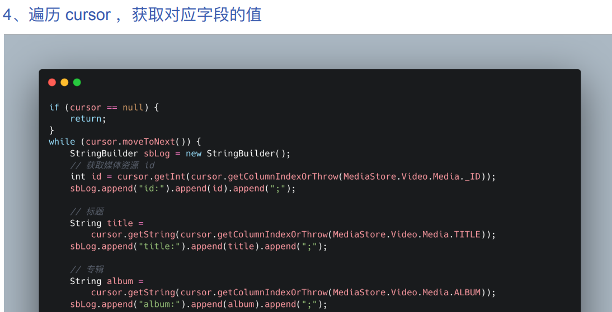

# 目录

[TOC]

# 一、存储空间概览

## 1.1	存储空间的区分

1.   **Internal Storage**：是系统分配给应用的专属内部存储空间
     1.   APP专有的
     2.   用户不可以直接读取(root用户除外)
     3.   应用卸载时自动清空
     4.   有且仅有一个
2.   **External Storage**：是系统外部存储空间，如 SD卡
     1.   所有用户均可访问
     2.   不保证可用性(可挂载/物理移除)
     3.   可以卸载后仍保留
     4.   可以有多个

## 1.2	存储目录

1.   **Internal Storage**：/

     1.   APP专用：
          1.   data/data/{your.package.name}/ files、cache、db...

2.   **External Storage**：

     1.   APP专用：
          1.   /storage/emulated/0/Android/data/{your.package.name}/ files、cache
     2.   公共文件夹：./ 
          1.   \ --- Standard: DCIM、Download、Movies 
          2.   \ --- Others

     

## 1.3	Internal目录的获取

1.   file目录：**context.getFilesDir()**
2.   cache目录：**context.getCacheDir()**
3.   自定义目录：**context.getDir(name, mode_private)**

## 1.4	External目录的获取

### 1.4.1	获取授权

>   **AndroidManifest.xml**中声明权限

```xml
<uses-permission android:name="android.permission.WRITE_EXTERNAL_STORAGE" />
<uses-permission android:name="android.permission.READ_EXTERNAL_STORAGE" />
```

>   请求授权（**Android 6.0**及以上）

```java
private final static int CODE_REQUEST_PERMISSION = 1;
if (ContextCompat.checkSelfPermission(this, Manifest.permission.READ_CALENDAR) 
		!= PackageManager.PERMISSION_GRANTED) {
	ActivityCompat.requestPermissions(this, 
		new String[] {Manifest.permission.READ_EXTERNAL_STORAGE}, 
		CODE_REQUEST_PERMISSION);
}
```

>   在 **Activity** 的 **onRequestPermissionsResult** 方法中获取授权结果

```java
@Override
public void onRequestPermissionsResult(int requestCode, @NonNull String[] permissions, @NonNull int[] grantResults) {
	super.onRequestPermissionsResult(requestCode, permissions, grantResults);
	
	if (requestCode == CODE_REQUEST_PERMISSION) {
		if (grantResults.length > 0 && 
			grantResults[0] == PackageManager.PERMISSION_GRANTED) {
			// ⽤户已授权
		} else {
			// ⽤户拒绝了授权
		}
	}
}
```

### 1.4.2	Environment APIs

>   提供了访问**环境变量**的方法

```java
public class Environment extends Object{};
android.os.Environment;
```

### 1.4.3	检查外置存储器的可用性

>   通过**Environment.getExternalStorageState();**调⽤获取当前外部存储的状态，并以此判断外部存储是否可⽤


### 1.4.4	External目录的获取

1.   应用私有目录：
     1.   **file**目录：**context.getExternalFilesDir(String type)**
     2.   **cache**目录：**context.getExternalCacheDir()**
2.   公共目录：
     1.   标准目录：**Environment.getExternalStoragePublicDirectory(String type)**
     2.   根目录：**Environment.getExternalStorageDirectory()**
3.   标准目录：
     1.   **DIRECTORY_ALARMS**
     2.   **DIRECTORY_DCIM**
     3.   **DIRECTORY_DOCUMENTS**
     4.   **DIRECTORY_DOWNLOADS**
     5.   **DIRECTORY_MOVIES**

### 1.5	注意事项

1.   如果用户卸载应⽤，系统会移除保存在应⽤专属存储空间中的⽂件
2.   由于这⼀行为，不应使用此存储空间保存⽤户希望独例于应用而保留的任何内容
     1.   例如，如果应用允许用户拍摄照片，用户会希望即使卸载应⽤后仍可访问这些照⽚
     2.   因此，应改为使用共享存储空间将此类文件保存到适当的媒体集合中。

更多信息可参考：https://developer.android.com/guide/topics/data?hl=zh-cn

# 二、键值对


# 三、SharedPreferences

## 3.1	介绍

1.   SharedPreference 就是 Android 提供的数据持久化的⼀个方式，适合单进程，小批量的数据存储和访问。基于 XML 进行实现，本质上还是⽂件的读写，API 相较 File 更简单。
2.    以“键-值”对的方式保存数据的xml⽂件，其文件保存在**/data/data/[packageName]/shared_prefs**目录下

## 3.2	获取SharedPreferences


## 3.3	读取SharedPreferences


## 3.4	写SharedPreferences

>   通过**Editor**类来提交修改



## 3.5	SharedPreferences的原理


## 3.6	注意事项

1.   SharedPreference 适合场景：小数据
2.   SharedPreference 每次写入均为全量写入
3.   禁止大数据存储在 SharedPreference 中，导致 ANR

官方推荐的DataStore：https://developer.android.com/topic/libraries/architecture/datastore

# 四、文件File

## 4.1	流

都是相对调用者而言的

1.   按流向分为： 
     1.   输⼊流 
     2.   输出流 
2.   按传输单位分为： 
     1.   字节流：**InputStream** 和 **OutputStream** 基类 
     2.   字符流：**Reader** 和 **Writer** 基类


## 4.2	API


## 4.3	文件操作


## 4.4	文件IO读写操作示例

>   1.   创建 File 对象，通过构造函数：
>        1.   **new File()** 
>   2.   创建输⼊输出流对象：
>        1.   **new FileReader()** 
>        2.   **new FileWriter()** 
>   3.   读取 or 写⼊
>        1.   **read** 方法 
>        2.   **write** f昂发 
>   4.   关闭资源 
>        1.   有借有还，再借不难



## 4.7	？拓展：OkIO

1.   是在**JavaIO**基础上再次进行封装的**IO**框架
2.   https://square.github.io/okio/

# 五、数据库

## 5.1	使用场景

1.   重复的数据
2.   结构化的数据
3.   关系型数据

## 5.2	数据库的设计


## 5.3	SQL


## 5.4	使用示例：Todo List App

### 5.4.1	定义Contract类

>   定义表结构、SQL语句


### 5.4.2	继承SQLiteOpenHelper

>   执行**Create** 和 **Delete** 操作


### 5.4.3	Insert

>   通过**ContentValues**进行插⼊操作


### 5.4.4	Query

>   调用**query** ⽅法，返回 **Cursor** ，对应查询结果集合



### 5.4.5	Delete

>   删除数据库中对应 id 的数据


### 5.4.6	Update


### 5.4.7	？Debug

>   adb + sqlite3：http://www.sqlite.org/cli.html

### 5.4.8	注意事项


## 5.5	？Room Library

https://developer.android.com/jetpack/androidx/releases/room


# 六、Content Provider

## 6.1	定义

1.   当我们需要在应⽤间共享数据时，**ContentProvider** 就是⼀个非常值得使用的组件
2.   四大组件之⼀，**ContentProvider** 是⼀种 **Android** 数据共享机制，无论其内部数据以什么样的方式组织，对外都是提供统⼀的接口
3.   通过 **ContentProvider**可以获取系统的媒体、联系⼈、⽇程等数据

https://developer.android.com/reference/android/content/ContentProvider

## 6.2	Content Provider架构


## 6.3	优点

1.   跨应用分享数据
     1.   系统的 **providers** 有联系人等
2.   是对数据层的良好抽象
3.   支持精细的权限控制

## 6.4	URI

**URI**：Uniform Resource Indentifier，唯一标识ContentProvider的数据


## 6.5	URI使用示例

### 6.5.1	查询：获取联系人数据





### 6.5.2	查询：获取系统相册中的视频文件





